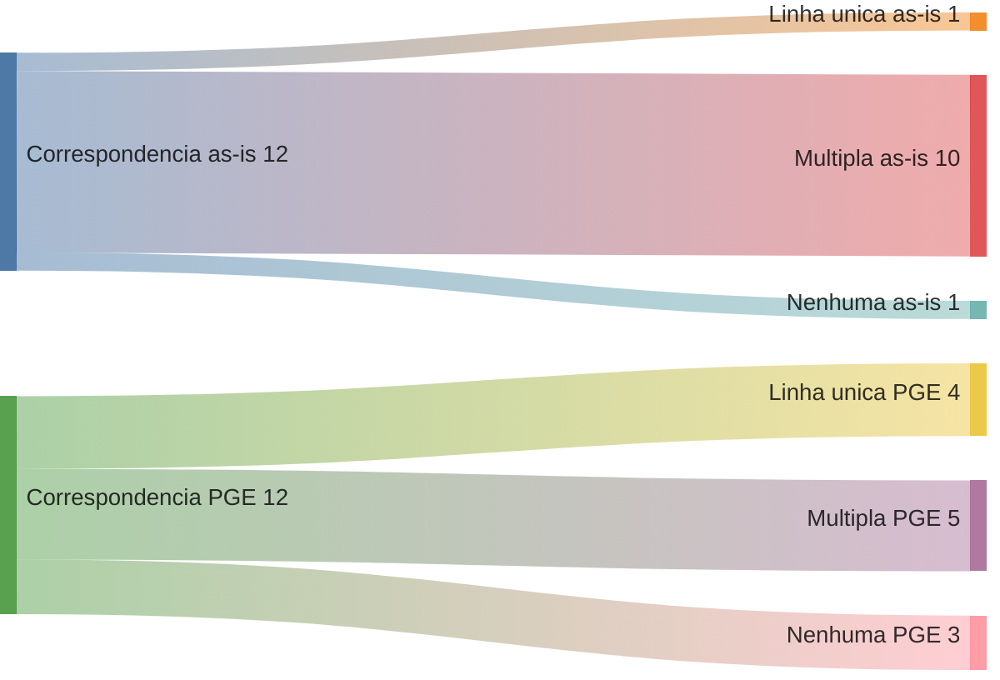
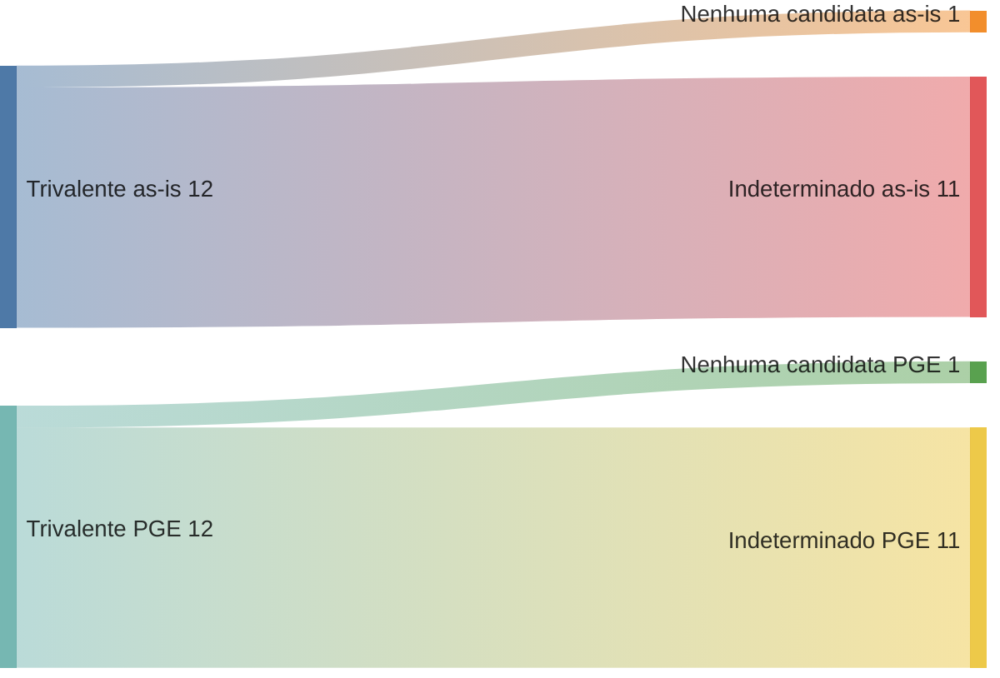
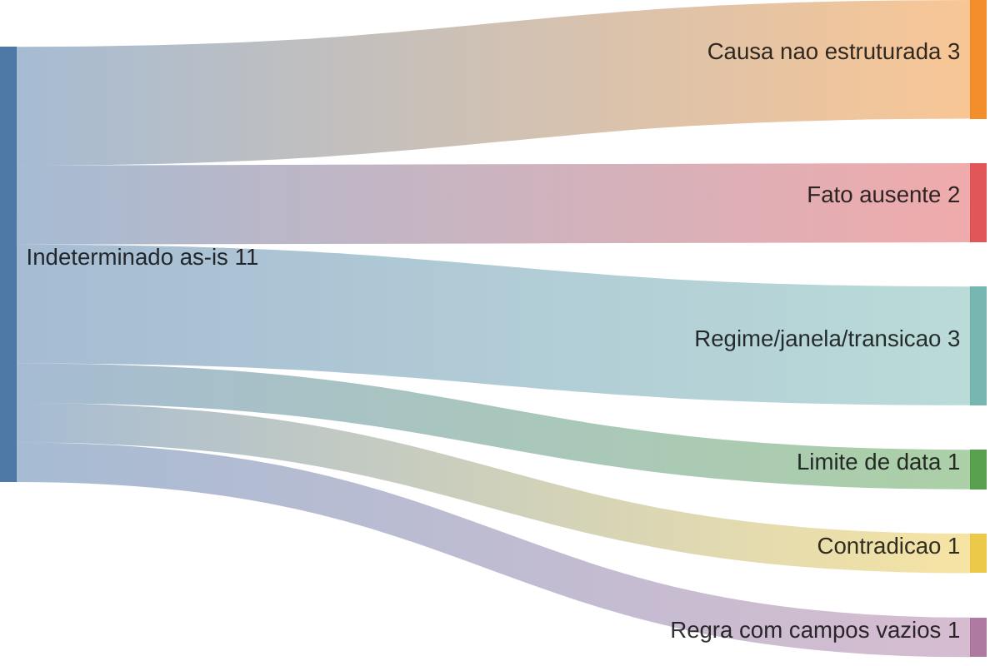

# Piloto executado — seleção explicável, invalidez / incapacidade permanente

> **Nota:** Relatório de apoio à decisão, gerado por IA. **Não é artefato
> oficial**, **não altera nenhuma regra/achado/dado/CSV** e **não implementa
> motor**. Executa à mão o modelo da
> [RFC 0002](../rfc/0002-selecao-explicavel-pos-anamnese.md) sobre **casos
> inteiramente sintéticos**. Cada caso é processado **em separado** contra o
> as-is e contra a PGE, e cada modelo é reportado em **duas etapas**:
> **correspondência tabular** (qual(is) linha(s) o caso casa) e **avaliação
> trivalente** (o resultado, sujeito às pendências). Onde há pendência capaz
> de mudar a seleção, o resultado trivalente correto é **`indeterminado`** —
> nunca uma conclusão jurídica.

## 1. Regra de decisão (formal, RFC 0002 §4)

- **`compatível`** — todos os critérios relevantes conhecidos e satisfeitos,
  **sem** desconhecido capaz de mudar a seleção.
- **`incompatível`** — critério confirmado exclui.
- **`indeterminado`** — há pendência (fato/semântica/mapeamento/verificação)
  capaz de alterar o resultado.

**Correspondência tabular ≠ avaliação trivalente.** Estreitar até **uma única
linha** da planilha PGE **não** significa `compatível`: a hipótese pode ter
correspondência única e permanecer trivalentemente `indeterminado` por
pendência temporal (Q1/Q2), jurídica (causa→cálculo, Q6) ou por não estar
validada (`Validação PGE`/`Validação Presidência` = `False` em toda a
planilha).

Confrontado: **11 regras as-is** (0001, 0002, 0004, 0006–0009, 0019–0022) e as
**8 hipóteses PGE** (P1–P7, P9 — ver
[`reconciliacao-invalidez-incapacidade.md`](reconciliacao-invalidez-incapacidade.md)).

## 2. Corpus sintético (12 casos): correspondência × avaliação, as-is e PGE

> **Volumes sintéticos.** As contagens e Sankeys contam apenas estes 12 casos
> inventados. **Não** representam frequência real de requerimentos.

| Caso | Fatos do requerente (sintéticos)                                                  | Correspondência as-is             | Trivalente as-is  | Correspondência tabular PGE | Trivalente PGE    | Comparação                                                                       | Lacuna revelada                               |
| ---- | --------------------------------------------------------------------------------- | --------------------------------- | ----------------- | --------------------------- | ----------------- | -------------------------------------------------------------------------------- | --------------------------------------------- |
| C1   | benefício = **pensão por morte**                                                  | nenhuma                           | **nenhuma**       | nenhuma                     | **nenhuma**       | ambos excluem por modalidade                                                     | —                                             |
| C2   | invalidez; ingresso 2010; direito 2015; causa **comum não catalogada**            | 0006, 0007 (múltipla)             | **indeterminado** | **P2 (linha única)**        | **indeterminado** | PGE estreita a 1 linha (P2); as-is nem estreita — mas ambos seguem indeterminado | causa não é campo no as-is                    |
| C3   | invalidez; ingresso 2001; direito 2015; causa **acidente em serviço**             | 0008, 0009 (múltipla)             | **indeterminado** | **P4 (linha única)**        | **indeterminado** | PGE estreita a P4 (com tensão III 2ª parte); trivalente pendente                 | causa; equivalência de cálculo                |
| C4   | invalidez; ingresso 2010; direito 2023; causa acidente                            | 0006, 0007, 0021, 0022 (múltipla) | **indeterminado** | **P7 (linha única)**        | **indeterminado** | PGE estreita a P7 por regime+causa; as-is nem separa o regime                    | janela as-is não codifica regime              |
| C5   | invalidez; ingresso **exatamente 31/12/2003**; causa qualificada                  | múltipla (até/após)               | **indeterminado** | P3/P4 ou P1 (múltipla)      | **indeterminado** | limite ambíguo nos dois                                                          | semântica de limite (Q1/Q2)                   |
| C6   | invalidez; ingresso 2015; direito 2023; **causa não informada**                   | 0021, 0022 (múltipla)             | **indeterminado** | P6/P7/P9 (múltipla)         | **indeterminado** | fato causa ausente nos dois                                                      | fato ausente (não é lacuna do modelo)         |
| C7   | invalidez; ingresso 2015; direito 2023; laudo **acidente** mas ficha proporcional | 0021, 0022 (múltipla)             | **indeterminado** | P6/P7/P9 (múltipla)         | **indeterminado** | contradição nos dois                                                             | dado contraditório                            |
| C8   | invalidez; ingresso 2020; direito 2024; causa **doença grave**                    | 0021, 0022 (múltipla)             | **indeterminado** | **P6 (linha única)**        | **indeterminado** | PGE estreita a P6 (base copiada da P5); as-is barra em 0021 contraditória        | causa; 0021 contraditória; P6 base copiada    |
| C9   | invalidez; ingresso 1995 (pré-EC 20); incap. 2022; causa doença grave             | 0001, 0002 (múltipla)             | **indeterminado** | nenhuma hipótese            | **indeterminado** | ambos indeterminado — legado; PGE sem hipótese não prova extinção                | PGE não modela regimes antigos                |
| C10  | invalidez; ingresso 2001; direito 2023; causa qualificada                         | 0008, 0019 (múltipla)             | **indeterminado** | P4/P5 (múltipla)            | **indeterminado** | transição de regime irresolvida nos dois                                         | regra de transição não codificada             |
| C11  | invalidez; ingresso 2010; direito 2016; **doença catalogada = desconhecida**      | 0006, 0007 (múltipla)             | **indeterminado** | P1/P2 (múltipla)            | **indeterminado** | fato "catalogada" ausente; PGE tem o eixo, falta o fato                          | fato ausente                                  |
| C12  | invalidez; ingresso 2000; direito 2001 (regime EC 20)                             | **0004 (linha única)**            | **indeterminado** | nenhuma hipótese            | **indeterminado** | as-is estreita a 0004, mas 0004 tem campos vazios; PGE não modela EC 20          | 0004 vazia (as-is); EC 20 fora do to-be (PGE) |

## 3. Contagens — duas medidas distintas, por modelo

A contagem única da versão anterior foi removida. São **duas** medidas: quão
longe cada modelo **estreita** (correspondência tabular) e qual o **resultado**
(avaliação trivalente).

### 3.1 Correspondência tabular (poder de estreitamento)

| Correspondência | **as-is** | **PGE**                            |
| --------------- | --------- | ---------------------------------- |
| linha única     | 1 (C12)   | **4** (C2→P2, C3→P4, C4→P7, C8→P6) |
| múltipla        | 10        | 5                                  |
| nenhuma         | 1 (C1)    | 3 (C1, C9, C12)                    |

### 3.2 Avaliação trivalente (resultado)

| Resultado         | **as-is** | **PGE** |
| ----------------- | --------- | ------- |
| compatível        | 0         | **0**   |
| incompatível      | 0         | 0       |
| nenhuma candidata | 1 (C1)    | 1 (C1)  |
| indeterminado     | **11**    | **11**  |

**Leitura corrigida:** a **PGE não decide** nenhum caso — trivalentemente ela
**empata** com o as-is (1 nenhuma, 11 indeterminado). O que a PGE faz de
diferente é **estreitar**: por ter o eixo **causa**, ela reduz 4 casos a uma
**única linha** (onde o as-is reduz só 1, a 0004 de campos vazios). Mas essa
linha única **permanece `indeterminado`** — pendem a semântica de data (Q1/Q2),
a confirmação jurídica da relação causa→cálculo (Q6) e a própria validação da
hipótese (`Validação PGE/Presidência` = `False`). O ganho da PGE é de
**estreitamento, não de decisão**. Nenhum dos dois resolve limite (C5),
transição (C10), fato ausente (C6, C11), contradição (C7) nem o legado
(C9, C12).

## 4. Diagramas do piloto (derivados de §3)

### 4.1 Sankey de **correspondência tabular** (poder de estreitamento)

Deriva de §3.1. Mostra o achado: a PGE estreita mais casos a uma linha única,
porque tem o eixo causa que o as-is não tem.

### 4.2 Sankey de **avaliação trivalente** (resultado)

Deriva de §3.2. Os dois modelos empatam: nenhum produz `compatível`.

### 4.3 Sankey — de onde vem o `indeterminado` as-is (11 casos)

*(Renderização de `sankey-beta`: **verificado em 2026-07-21 — renderiza no
GitHub deste repo**; ver RFC 0002 §5.6.)*

## 5. Nomes propostos (derivados dos cenários)

Os cenários confirmam que os nomes atuais falham: 5 pares de **nome idêntico**
(0001≡0002, 0006≡0007, 0008≡0009, 0019≡0020, 0021≡0022), distinguíveis só pela
causa. Exemplos **para decisão humana** — não alterações:

| Regra | Nome atual (resumido)                                    | Nome proposto (exemplo)                                                                                   | Fato discriminante    | Confundível com | Informação que o catálogo **não** representa                         |
| ----- | -------------------------------------------------------- | --------------------------------------------------------------------------------------------------------- | --------------------- | --------------- | -------------------------------------------------------------------- |
| 0001  | "Invalidez Anterior E.C 20/1998"                         | Invalidez — regime anterior à EC 20/1998 — causa qualificada — integral, com paridade                     | causa qualificada     | 0002            | causa; se o regime ainda alcança alguém                              |
| 0002  | idem 0001                                                | Invalidez — regime anterior à EC 20/1998 — causa comum — proporcional, com paridade                       | causa comum           | 0001            | idem                                                                 |
| 0004  | "Invalidez - Redação da EC 20/1998"                      | Invalidez — regime EC 20/1998 — (causa e cálculo a definir)                                               | regime EC 20          | 0001, 0002      | `sexo`/`integral`/`tipo_calculo` vazios                              |
| 0006  | "Invalidez - Art. 40 §1 I EC 41/2003 + LC 432"           | Invalidez — ingresso após 31/12/2003 — acidente/doença grave — integral (média), sem paridade             | causa qualificada     | 0007            | causa                                                                |
| 0007  | idem 0006                                                | Invalidez — ingresso após 31/12/2003 — doença não catalogada — proporcional, sem paridade                 | doença não catalogada | 0006            | causa; qualificação da doença                                        |
| 0008  | "Invalidez - 6º-A EC 41/2003 + LC 432"                   | Invalidez — ingresso até 31/12/2003 — acidente/doença grave — integral (última remuneração), com paridade | causa qualificada     | 0009            | causa; base legal (III 2ª parte?)                                    |
| 0009  | idem 0008                                                | Invalidez — ingresso até 31/12/2003 — causa comum — proporcional, com paridade                            | causa comum           | 0008            | causa                                                                |
| 0019  | "Incapacidade Perm. EC 103 c/c LC 1100 - Até 31/12/2003" | Incapacidade — ingresso até 31/12/2003 — acidente/doença grave — integral (totalidade), com paridade      | causa qualificada     | 0020            | causa; transição de regime                                           |
| 0020  | idem 0019                                                | Incapacidade — ingresso até 31/12/2003 — causa comum — proporcional, com paridade                         | causa comum           | 0019            | causa; célula sem contraparte PGE                                    |
| 0021  | "Incapacidade Perm. ... - Após 31/12/2003"               | Incapacidade — ingresso após 31/12/2003 — causa comum — proporcional, sem paridade                        | causa comum           | 0022            | causa; contradição flag×texto                                        |
| 0022  | idem 0021                                                | Incapacidade — ingresso após 31/12/2003 — acidente/doença grave — integral (média), sem paridade          | causa qualificada     | 0021            | causa; agrupa **duas hipóteses** PGE (P6 doença grave + P7 acidente) |

## 6. Conclusão do piloto

O experimento sustenta a RFC 0002 e corrige uma leitura anterior:

- **Nenhum** dos modelos produz `compatível`: trivalentemente, as-is e PGE
  **empatam** em 1 nenhuma / 11 indeterminado.
- A diferença é de **estreitamento**, não de decisão: a PGE reduz 4 casos a
  uma **única linha** (correspondência tabular) porque tem o eixo **causa**,
  visível na diferença entre os Sankeys estruturais da RFC (§5.5 sem causa;
  §5.6 com causa). O as-is só estreita 1 caso (a 0004, e ainda de campos
  vazios).
- Essa linha única **não é** um resultado compatível: pendem Q1/Q2, Q6 e a
  validação da própria hipótese PGE.

O que precisa ser resolvido **antes** de um avaliador real e de cenários
legíveis por máquina:

1. **Q6 permanece aberta.** Onde a "causa da incapacidade" (e "doença
   catalogada") vive — em **código/tabela externa**, em **verificação manual**
   registrada, ou como **lacuna real do modelo** que exija sua evolução
   (inclusive um campo novo). O catálogo deployável atual usa as 27 colunas,
   mas a análise **não** presume que elas bastem; a decisão fica para Q6.
2. inclusividade dos limites de data e a **regra de transição de regime** —
   Q1/Q2;
3. os dados já **contraditórios/vazios** das próprias regras (0021, 0004).

Codificar o motor antes disso apenas esconderia essas suposições dentro de
Python.
