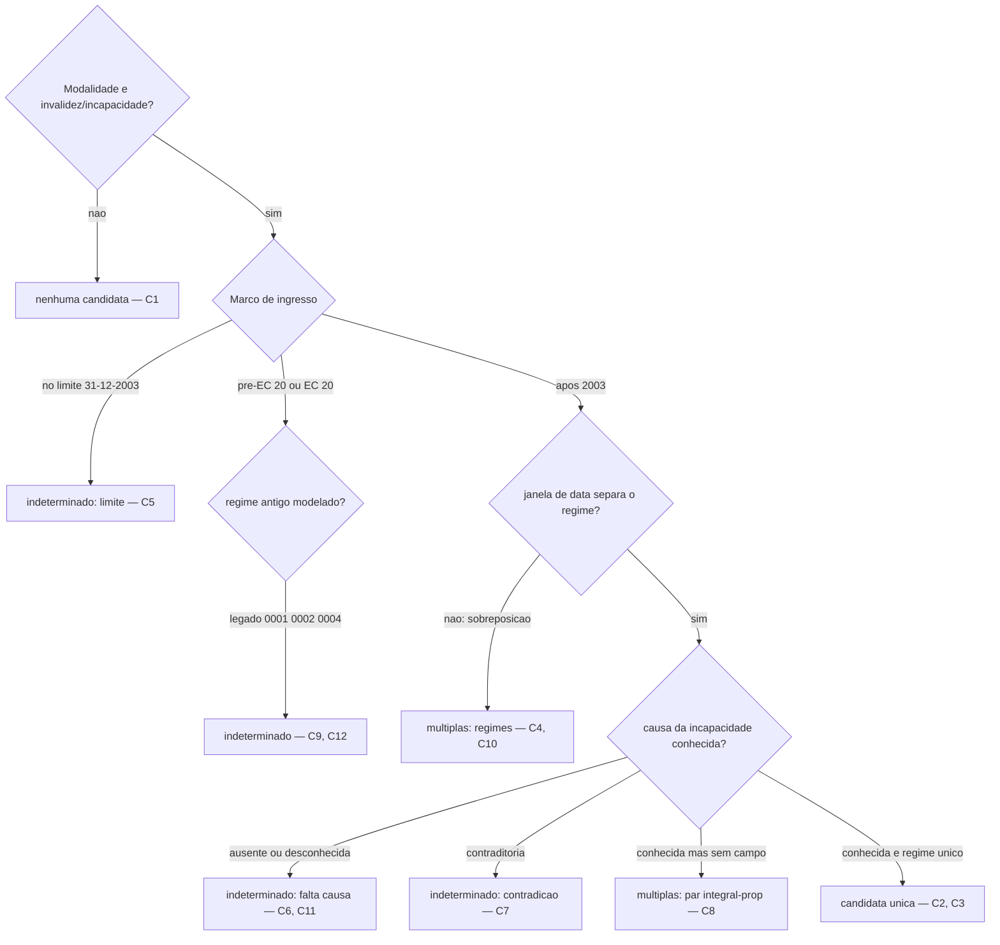
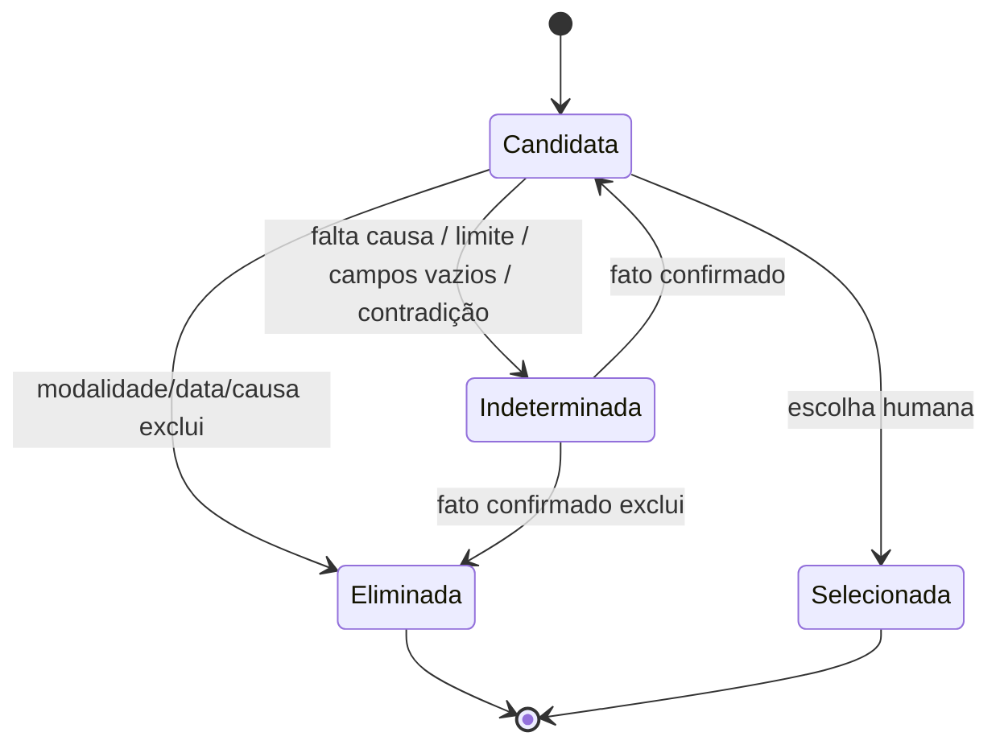

# Piloto executado — seleção explicável, invalidez / incapacidade permanente

> **Nota:** Relatório de apoio à decisão, gerado por IA. **Não é artefato
> oficial**, **não altera nenhuma regra/achado/dado/CSV** e **não implementa
> motor**. Executa à mão o modelo da
> [RFC 0002](../rfc/0002-selecao-explicavel-pos-anamnese.md) sobre **casos
> inteiramente sintéticos**, para testar se o modelo se sustenta. Onde a
> semântica (Q1/Q2/Q6) ou o predicado (causa da incapacidade) **não** está
> confirmado, o resultado correto do experimento é **`indeterminado`** —
> nunca uma conclusão jurídica.

## 1. O que é confrontado

- **11 regras as-is** (invalidez/incapacidade): 0001, 0002, 0004, 0006, 0007,
  0008, 0009, 0019, 0020, 0021, 0022.
- **8 hipóteses PGE** (to-be): P1–P7 e P9 — ver
  [`reconciliacao-invalidez-incapacidade.md`](reconciliacao-invalidez-incapacidade.md).

Cada caso é processado **separadamente** contra os dois conjuntos. A lógica é
trivalente (`compatível` / `incompatível` / `indeterminado`); `indeterminado`
**nunca** é convertido em `compatível`.

Distinção usada: **múltiplas candidatas** = o filtro chegou a 2+ regras reais
que um humano separa por um fato **conhecido** (a causa, exposta no nome);
**indeterminado** = falta um fato, falta semântica confirmada, há contradição,
ou a regra candidata tem campos vazios.

## 2. Corpus sintético (12 casos)

> **Volumes sintéticos.** As contagens abaixo e os Sankeys contam apenas estes
> 12 casos inventados. **Não** representam frequência real de requerimentos.

| Caso | Fatos do requerente (sintéticos)                                                            | Candidatas as-is                    | Hipóteses PGE           | Regras eliminadas + motivo                                                                                                 | Fatos/verificações pendentes                                                                  | Resultado trivalente                       | Interpretação                                                  | Confiança | Lacuna revelada                             |
| ---- | ------------------------------------------------------------------------------------------- | ----------------------------------- | ----------------------- | -------------------------------------------------------------------------------------------------------------------------- | --------------------------------------------------------------------------------------------- | ------------------------------------------ | -------------------------------------------------------------- | --------- | ------------------------------------------- |
| C1   | benefício = **pensão por morte**                                                            | —                                   | —                       | todas as 11 por **modalidade** (não é invalidez)                                                                           | —                                                                                             | **nenhuma candidata**                      | pedido fora da modalidade; catálogo de invalidez não se aplica | alta      | —                                           |
| C2   | invalidez; ingresso 2010; direito 2015; causa **comum não catalogada**                      | 0007                                | P2                      | 0006 (causa comum → proporcional); 0021/0022 (direito < 2021); 0008/0009 (ingresso > 2003); 0001/0002/0004 (regime antigo) | confirmar regra data-limite (Q2); que 0007 = "doença não catalogada"                          | **candidata única (0007)**                 | proporcional/LCE 432 após 2003                                 | média     | causa usada como fato, mas não é campo      |
| C3   | invalidez; ingresso 2001; direito 2015; causa **acidente em serviço**                       | 0008                                | P4                      | 0009 (causa qualificada → integral); 0019/0020 (direito < 2021); 0006/0007 (ingresso ≤ 2003 exclui LCE 432 após 2003?)     | citação suspeita III 2ª parte (§4 recon.); `Remuneração de Contribuição` ↔ última remuneração | **candidata única (0008)**                 | integral/6º-A EC 41, com paridade                              | média     | idem C2 + tensão da base P4                 |
| C4   | invalidez; ingresso 2010; direito 2023; causa acidente                                      | 0006, 0007, 0021, 0022              | P1/P2, P6/P7/P9         | 0008/0009 (ingresso > 2003); antigos (data)                                                                                | **as janelas de data não separam regime EC 41 de EC 103** (Q1/Q2)                             | **múltiplas candidatas**                   | dois regimes sobrepostos para o mesmo caso                     | baixa     | janela de data as-is não codifica o regime  |
| C5   | invalidez; ingresso **exatamente 31/12/2003**; causa qualificada                            | 0008/0019 (até) ou 0006/0021 (após) | P3–P7                   | — (depende da inclusividade)                                                                                               | **limite inclusivo × exclusivo (Q1/Q2)**                                                      | **indeterminado** (limite de data)         | não se sabe se ingresso "até" inclui a própria data            | baixa     | semântica de limite não confirmada          |
| C6   | invalidez; ingresso 2015; direito 2023; **causa não informada**                             | 0021, 0022                          | P6/P7/P9                | 0006–0009 (data); antigos (data)                                                                                           | **falta a causa** → integral (0022) vs proporcional (0021)                                    | **indeterminado** (falta causa)            | sem a causa não há como escolher a metade                      | alta      | causa não é campo do catálogo               |
| C7   | invalidez; ingresso 2015; direito 2023; laudo diz **acidente** mas ficha marca proporcional | 0021, 0022                          | P6/P7/P9                | 0006–0009 (data); antigos                                                                                                  | **contradição** causa × cálculo declarado                                                     | **indeterminado** (contradição)            | dados internos se contradizem                                  | alta      | dado contraditório precisa resolução humana |
| C8   | invalidez; ingresso 2020; direito 2024; causa **doença grave**                              | 0021, 0022                          | P6, P7                  | 0006–0009 (data); 0019/0020 (ingresso > 2003); antigos                                                                     | causa conhecida (doença grave) mas sem campo → sistema não elimina 0021                       | **múltiplas candidatas** (0021, 0022)      | humano escolhe 0022 pela causa; 0022 agrupa P6+P7              | média     | causa não é campo; 0022 esconde P6/P7       |
| C9   | invalidez; ingresso 1995 (pré-EC 20); incap. 2022; causa doença grave                       | 0001, 0002                          | — (sem contraparte PGE) | 0004+ (regime posterior); LC 1.100 (data)                                                                                  | **regime antigo ainda alcança alguém? (§3, pergunta jurídica)**                               | **indeterminado** (predicado/semântica)    | aplicabilidade do regime antigo não confirmada                 | baixa     | to-be da PGE não modela o legado            |
| C10  | invalidez; ingresso 2001; direito 2023; causa qualificada                                   | 0008, 0019                          | P4, P5                  | 0009/0020 (causa → integral); 0006/0007 (ingresso ≤ 2003); antigos                                                         | **qual regime rege ingresso ≤ 2003 com direito recente: 6º-A EC 41 ou LC 1.100?**             | **múltiplas candidatas** (0008, 0019)      | dois regimes integrais candidatos                              | baixa     | regra de transição de regime não codificada |
| C11  | invalidez; ingresso 2010; direito 2016; **doença catalogada = desconhecida**                | 0006, 0007                          | P1, P2                  | 0021/0022 (direito < 2021); 0008/0009 (ingresso > 2003); antigos                                                           | **doença é "grave/contagiosa/incurável"? (predicado)** → integral vs proporcional             | **indeterminado** (falta predicado)        | sem saber a qualificação da doença não há metade               | média     | "doença catalogada" não é campo             |
| C12  | invalidez; ingresso 2000; direito 2001 (regime EC 20)                                       | 0004                                | — (sem contraparte PGE) | 0001/0002 (pré-EC 20); demais (data)                                                                                       | **0004 tem `sexo`/`integral`/`tipo_calculo` vazios (achado-0008)**                            | **indeterminado** (campos da regra vazios) | a própria regra candidata não tem critérios avaliáveis         | baixa     | dado faltante na regra bloqueia a avaliação |

**Contagem do corpus:** nenhuma candidata = **1** (C1); candidata única = **2**
(C2, C3); múltiplas candidatas = **3** (C4, C8, C10); indeterminado = **6**
(C5 limite; C6/C9/C11/C12 falta causa/predicado; C7 contradição).

## 3. Leitura do experimento

- O desfecho mais comum é **`indeterminado`** (6/12) — e isso é o **sucesso**
  do experimento, não a falha: o modelo se recusa a inventar decisão quando o
  catálogo não representa a **causa da incapacidade**, quando a **semântica de
  data** (Q1/Q2) não está confirmada, quando há **contradição**, ou quando a
  própria regra tem **campos vazios**.
- As **candidatas únicas** (C2, C3) só aparecem quando a causa é usada como
  fato conhecido **e** um único regime sobra por data — e mesmo assim com
  confiança média, porque a causa não é campo e a base da P4 é suspeita.
- As **múltiplas candidatas** (C4, C8, C10) expõem duas lacunas distintas: a
  causa não separa a metade integral da proporcional (C8), e as **janelas de
  data as-is não separam regimes** (C4, C10).
- Contra as **8 hipóteses PGE** o quadro é o mesmo: a PGE *nomeia* a causa
  (acidente / doença grave / comum), mas isso vive na descrição textual, não
  num campo — então mapear um caso a P1–P9 reproduz o mesmo `indeterminado`
  quando a causa falta ou é ambígua (C6, C11), e o mesmo agrupamento em C8
  (P6 doença grave × P7 acidente).

## 4. Nomes propostos (derivados dos cenários)

Os cenários confirmam que os nomes atuais falham (5 pares de nome idêntico,
distinguíveis só pela causa). Exemplos de nome **para decisão humana** — não
alterações:

| Regra | Nome atual (resumido)                                    | Nome proposto (exemplo)                                                                                   | Fato discriminante    | Confundível com | Informação que o catálogo **não** representa    |
| ----- | -------------------------------------------------------- | --------------------------------------------------------------------------------------------------------- | --------------------- | --------------- | ----------------------------------------------- |
| 0001  | "Invalidez Anterior E.C 20/1998"                         | Invalidez — regime anterior à EC 20/1998 — causa qualificada — integral, com paridade                     | causa qualificada     | 0002            | causa; se o regime ainda alcança alguém         |
| 0002  | idem 0001                                                | Invalidez — regime anterior à EC 20/1998 — causa comum — proporcional, com paridade                       | causa comum           | 0001            | idem                                            |
| 0004  | "Invalidez - Redação da EC 20/1998"                      | Invalidez — regime EC 20/1998 — (causa e cálculo a definir)                                               | regime EC 20          | 0001, 0002      | `sexo`/`integral`/`tipo_calculo` vazios         |
| 0006  | "Invalidez - Art. 40 §1 I EC 41/2003 + LC 432"           | Invalidez — ingresso após 31/12/2003 — acidente/doença grave — integral (média), sem paridade             | causa qualificada     | 0007            | causa                                           |
| 0007  | idem 0006                                                | Invalidez — ingresso após 31/12/2003 — doença não catalogada — proporcional, sem paridade                 | doença não catalogada | 0006            | causa; qualificação da doença                   |
| 0008  | "Invalidez - 6º-A EC 41/2003 + LC 432"                   | Invalidez — ingresso até 31/12/2003 — acidente/doença grave — integral (última remuneração), com paridade | causa qualificada     | 0009            | causa; base legal (III 2ª parte?)               |
| 0009  | idem 0008                                                | Invalidez — ingresso até 31/12/2003 — causa comum — proporcional, com paridade                            | causa comum           | 0008            | causa                                           |
| 0019  | "Incapacidade Perm. EC 103 c/c LC 1100 - Até 31/12/2003" | Incapacidade — ingresso até 31/12/2003 — acidente/doença grave — integral (totalidade), com paridade      | causa qualificada     | 0020            | causa; regra de transição de regime             |
| 0020  | idem 0019                                                | Incapacidade — ingresso até 31/12/2003 — causa comum — proporcional, com paridade                         | causa comum           | 0019            | causa; célula sem contraparte PGE               |
| 0021  | "Incapacidade Perm. ... - Após 31/12/2003"               | Incapacidade — ingresso após 31/12/2003 — causa comum — proporcional, sem paridade                        | causa comum           | 0022            | causa; contradição flag×texto                   |
| 0022  | idem 0021                                                | Incapacidade — ingresso após 31/12/2003 — acidente/doença grave — integral (média), sem paridade          | causa qualificada     | 0021            | causa; agrupa P6 (doença grave) + P7 (acidente) |

## 5. Diagramas do piloto (concordantes com §2)

### 5.1 Árvore de seleção da modalidade (flowchart)



### 5.2 Estados de uma candidata (concorda com a RFC §5.3)



### 5.3 Sankey de cenários (corpus **sintético**)

> Contagens deste corpus de 12 casos. **Não** é distribuição real.

```mermaid
sankey-beta
Corpus sintético,Candidata única,2
Corpus sintético,Múltiplas candidatas,3
Corpus sintético,Nenhuma candidata,1
Corpus sintético,Indeterminado,6
Indeterminado,Falta causa/predicado,4
Indeterminado,Contradição de dados,1
Indeterminado,Limite de data ambíguo,1
Múltiplas candidatas,Regimes sobrepostos,2
Múltiplas candidatas,Par integral/proporcional,1
```

*(Renderização de `sankey-beta`: ver a ressalva na RFC 0002 §5.6 — a fonte é
mantida; SVG estático como fallback se o GitHub não renderizar.)*

## 6. Conclusão do piloto

O experimento sustenta a RFC 0002: um filtro **honesto** sobre o catálogo
atual produz muito mais `indeterminado` do que decisão, porque **falta o
predicado "causa da incapacidade"** e a **semântica das datas** (Q1/Q2) não
está confirmada. Isso indica o que precisa ser resolvido **antes** de um
avaliador real e de um formato de cenários legível por máquina valerem a pena:

1. decidir se a "causa da incapacidade" entra como campo (ou como verificação
   manual registrada) — Q6;
2. confirmar a inclusividade dos limites de data e a regra de transição de
   regime — Q1/Q2;
3. resolver os dados já contraditórios/vazios das próprias regras (0021, 0004).

Codificar o motor antes disso apenas esconderia essas suposições dentro de
Python.
