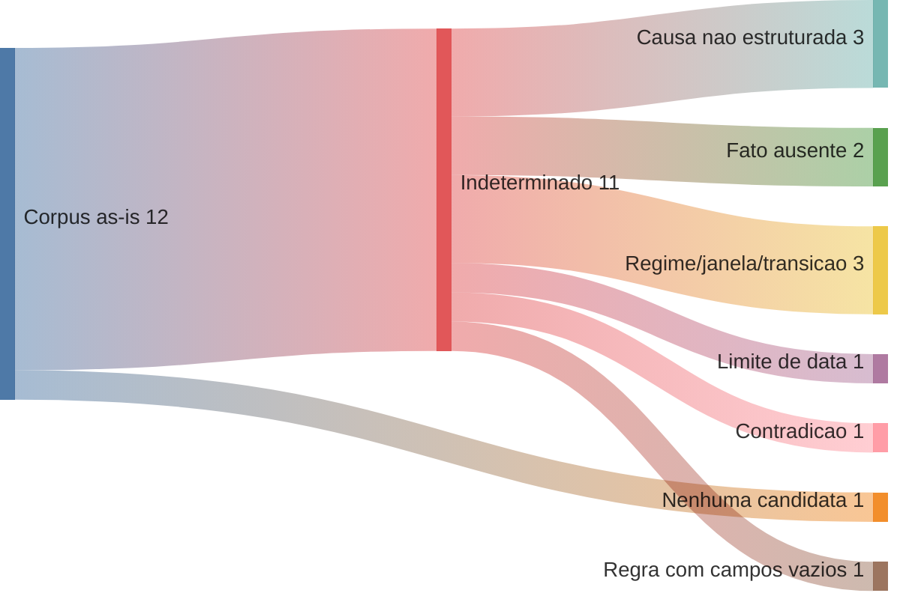
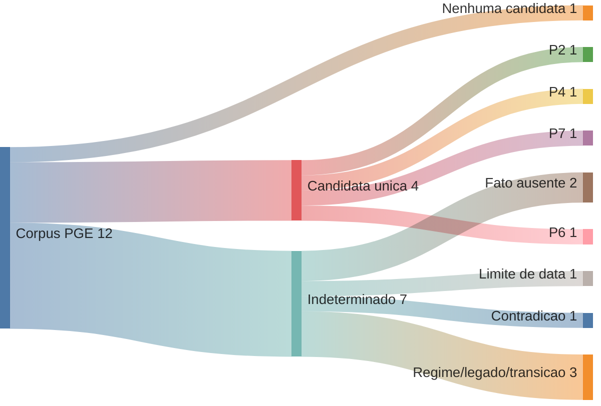
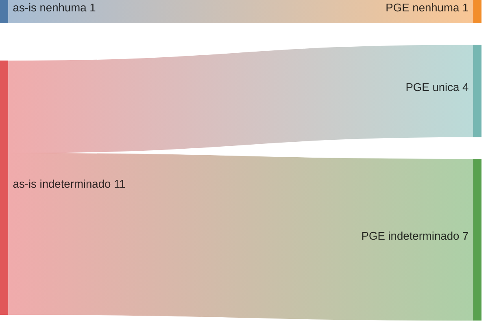

# Piloto executado — seleção explicável, invalidez / incapacidade permanente

> **Nota:** Relatório de apoio à decisão, gerado por IA. **Não é artefato
> oficial**, **não altera nenhuma regra/achado/dado/CSV** e **não implementa
> motor**. Executa à mão o modelo da
> [RFC 0002](../rfc/0002-selecao-explicavel-pos-anamnese.md) sobre **casos
> inteiramente sintéticos**. Cada caso é processado **em separado** contra o
> as-is e contra a PGE. Onde há pendência capaz de mudar a seleção (causa não
> estruturada, semântica de data Q1/Q2, mapeamento ou verificação), o
> resultado correto do experimento é **`indeterminado`** — nunca uma
> conclusão jurídica.

## 1. Regra de decisão (formal, RFC 0002 §4)

- **`compatível`** — todos os critérios relevantes conhecidos e satisfeitos,
  **sem** desconhecido capaz de mudar a seleção.
- **`incompatível`** — critério confirmado exclui.
- **`indeterminado`** — há pendência (fato/semântica/mapeamento/verificação)
  capaz de alterar o resultado. Listar candidatas provisórias **não** promove
  o desfecho a "única" nem a "múltiplas".

Confrontado: **11 regras as-is** (0001, 0002, 0004, 0006–0009, 0019–0022) e as
**8 hipóteses PGE** (P1–P7, P9 — ver
[`reconciliacao-invalidez-incapacidade.md`](reconciliacao-invalidez-incapacidade.md)).

## 2. Corpus sintético (12 casos), as-is × PGE em separado

> **Volumes sintéticos.** As contagens e Sankeys contam apenas estes 12 casos
> inventados. **Não** representam frequência real de requerimentos.

| Caso | Fatos do requerente (sintéticos)                                                  | Candidatas provisórias as-is        | Resultado as-is   | Rastro as-is                                                                                              | Hipóteses PGE        | Resultado PGE     | Rastro PGE                                                             | Comparação / interpretação                         | Lacuna revelada                                    |
| ---- | --------------------------------------------------------------------------------- | ----------------------------------- | ----------------- | --------------------------------------------------------------------------------------------------------- | -------------------- | ----------------- | ---------------------------------------------------------------------- | -------------------------------------------------- | -------------------------------------------------- |
| C1   | benefício = **pensão por morte**                                                  | —                                   | **nenhuma**       | modalidade exclui as 11 (critério confirmado)                                                             | —                    | **nenhuma**       | modalidade exclui as 8                                                 | ambos nenhuma — fora da modalidade                 | —                                                  |
| C2   | invalidez; ingresso 2010; direito 2015; causa **comum não catalogada**            | 0006, 0007                          | **indeterminado** | causa (que separa 0006/0007) não é campo; Q2 limite; 0007↔"não catalogada" não confirmado                 | P2                   | **única (P2)**    | modelo PGE tem o eixo causa: comum não catalogada → P2                 | PGE decide o que o as-is não decide                | causa não é campo no as-is                         |
| C3   | invalidez; ingresso 2001; direito 2015; causa **acidente em serviço**             | 0008, 0009                          | **indeterminado** | causa não é campo; `Remuneração de Contribuição` ↔ última remuneração não confirmado                      | P4                   | **única (P4)**    | causa qualificada → P4 (com tensão da citação III 2ª parte, §4 recon.) | idem C2 + tensão na base P4                        | causa; equivalência de cálculo                     |
| C4   | invalidez; ingresso 2010; direito 2023; causa acidente                            | 0006, 0007, 0021, 0022              | **indeterminado** | janelas de data não separam EC 41 de EC 103 (Q1/Q2) — multiplicidade por critério não avaliável           | P7                   | **única (P7)**    | regime LC 1.100 (direito pós-2019) + causa acidente → P7               | as-is indeterminado; PGE resolve por regime+causa  | janela as-is não codifica regime                   |
| C5   | invalidez; ingresso **exatamente 31/12/2003**; causa qualificada                  | 0008/0019 (até) ou 0006/0021 (após) | **indeterminado** | limite inclusivo × exclusivo (Q1/Q2)                                                                      | P3/P4 ou P1          | **indeterminado** | mesmo limite ambíguo no to-be                                          | ambos indeterminado (limite)                       | semântica de limite (Q1/Q2)                        |
| C6   | invalidez; ingresso 2015; direito 2023; **causa não informada**                   | 0021, 0022                          | **indeterminado** | falta o fato causa → integral (0022) vs proporcional (0021)                                               | P6/P7/P9             | **indeterminado** | PGE tem o eixo, mas o **fato** causa está ausente                      | ambos indeterminado (fato ausente)                 | fato ausente (não é lacuna do modelo)              |
| C7   | invalidez; ingresso 2015; direito 2023; laudo **acidente** mas ficha proporcional | 0021, 0022                          | **indeterminado** | contradição causa × cálculo declarado                                                                     | P6/P7/P9             | **indeterminado** | mesma contradição                                                      | ambos indeterminado (contradição)                  | dado contraditório                                 |
| C8   | invalidez; ingresso 2020; direito 2024; causa **doença grave**                    | 0021, 0022                          | **indeterminado** | causa não é campo; **0021 é contraditória** (int=N com texto "integrais")                                 | P6, P7               | **única (P6)**    | doença grave → P6 (base copiada da P5, ressalva §4 recon.)             | as-is indeterminado; PGE aponta P6                 | causa; 0021 contraditória; P6 base copiada         |
| C9   | invalidez; ingresso 1995 (pré-EC 20); incap. 2022; causa doença grave             | 0001, 0002                          | **indeterminado** | regime antigo ainda alcança alguém? (§3, jurídico) + causa                                                | — (nenhuma hipótese) | **indeterminado** | to-be da PGE **não modela** o legado                                   | ambos indeterminado — legado                       | PGE não modela regimes antigos                     |
| C10  | invalidez; ingresso 2001; direito 2023; causa qualificada                         | 0008, 0019                          | **indeterminado** | transição 6º-A EC 41 × LC 1.100 (ingresso ≤2003, direito recente) não codificada                          | P4, P5               | **indeterminado** | mesma transição: P4 (6º-A) vs P5 (LC 1.100), ambos integrais           | ambos indeterminado (transição de regime)          | regra de transição não codificada em nenhum modelo |
| C11  | invalidez; ingresso 2010; direito 2016; **doença catalogada = desconhecida**      | 0006, 0007                          | **indeterminado** | falta o fato "doença catalogada" → integral vs proporcional                                               | P1, P2               | **indeterminado** | PGE tem o eixo (P1×P2), mas o fato está ausente                        | ambos indeterminado (fato ausente)                 | fato ausente                                       |
| C12  | invalidez; ingresso 2000; direito 2001 (regime EC 20)                             | 0004                                | **indeterminado** | **0004 tem `sexo`/`integral`/`tipo_calculo` vazios** (achado-0008) — a regra não tem critérios avaliáveis | — (nenhuma hipótese) | **indeterminado** | PGE não modela o regime EC 20                                          | ambos indeterminado (dado faltante / não modelado) | 0004 vazia (as-is); EC 20 fora do to-be (PGE)      |

## 3. Contagens — **separadas por modelo**

A contagem única "1/2/3/6" da versão anterior **não representa** nenhum dos
dois modelos e foi eliminada. As contagens corretas são:

| Desfecho             | **as-is** | **PGE**            |
| -------------------- | --------- | ------------------ |
| candidata única      | 0         | 4 (P2, P4, P7, P6) |
| múltiplas candidatas | 0         | 0                  |
| nenhuma candidata    | 1 (C1)    | 1 (C1)             |
| indeterminado        | **11**    | 7                  |

**Leitura:** sobre o catálogo **as-is**, um filtro honesto **quase nunca
decide** (11/12 `indeterminado`; o único desfecho firme é a exclusão por
modalidade em C1). A **PGE** decide 4 casos — exatamente aqueles em que a
**causa** é conhecida e mapeia para uma hipótese. A diferença entre os dois
modelos **é o eixo causa**. Nenhum dos dois resolve limite de data (C5),
transição de regime (C10), fato ausente (C6, C11), contradição (C7) nem o
legado (C9, C12).

## 4. Diagramas do piloto (derivados da §2 e da §3)

### 4.1 Sankey de resultados **as-is** (12 casos)

### 4.2 Sankey de resultados **PGE** (12 casos)

### 4.3 Sankey de divergência as-is → PGE

*(Renderização de `sankey-beta`: **verificado em 2026-07-21 — renderiza no
GitHub deste repo**; ver RFC 0002 §5.6.)*

## 5. Nomes propostos (derivados dos cenários)

Os cenários confirmam que os nomes atuais falham: 5 pares de **nome idêntico**
(0001≡0002, 0006≡0007, 0008≡0009, 0019≡0020, 0021≡0022), distinguíveis só pela
causa. Exemplos **para decisão humana** — não alterações:

| Regra | Nome atual (resumido)                                    | Nome proposto (exemplo)                                                                                   | Fato discriminante    | Confundível com | Informação que o catálogo **não** representa    |
| ----- | -------------------------------------------------------- | --------------------------------------------------------------------------------------------------------- | --------------------- | --------------- | ----------------------------------------------- |
| 0001  | "Invalidez Anterior E.C 20/1998"                         | Invalidez — regime anterior à EC 20/1998 — causa qualificada — integral, com paridade                     | causa qualificada     | 0002            | causa; se o regime ainda alcança alguém         |
| 0002  | idem 0001                                                | Invalidez — regime anterior à EC 20/1998 — causa comum — proporcional, com paridade                       | causa comum           | 0001            | idem                                            |
| 0004  | "Invalidez - Redação da EC 20/1998"                      | Invalidez — regime EC 20/1998 — (causa e cálculo a definir)                                               | regime EC 20          | 0001, 0002      | `sexo`/`integral`/`tipo_calculo` vazios         |
| 0006  | "Invalidez - Art. 40 §1 I EC 41/2003 + LC 432"           | Invalidez — ingresso após 31/12/2003 — acidente/doença grave — integral (média), sem paridade             | causa qualificada     | 0007            | causa                                           |
| 0007  | idem 0006                                                | Invalidez — ingresso após 31/12/2003 — doença não catalogada — proporcional, sem paridade                 | doença não catalogada | 0006            | causa; qualificação da doença                   |
| 0008  | "Invalidez - 6º-A EC 41/2003 + LC 432"                   | Invalidez — ingresso até 31/12/2003 — acidente/doença grave — integral (última remuneração), com paridade | causa qualificada     | 0009            | causa; base legal (III 2ª parte?)               |
| 0009  | idem 0008                                                | Invalidez — ingresso até 31/12/2003 — causa comum — proporcional, com paridade                            | causa comum           | 0008            | causa                                           |
| 0019  | "Incapacidade Perm. EC 103 c/c LC 1100 - Até 31/12/2003" | Incapacidade — ingresso até 31/12/2003 — acidente/doença grave — integral (totalidade), com paridade      | causa qualificada     | 0020            | causa; transição de regime                      |
| 0020  | idem 0019                                                | Incapacidade — ingresso até 31/12/2003 — causa comum — proporcional, com paridade                         | causa comum           | 0019            | causa; célula sem contraparte PGE               |
| 0021  | "Incapacidade Perm. ... - Após 31/12/2003"               | Incapacidade — ingresso após 31/12/2003 — causa comum — proporcional, sem paridade                        | causa comum           | 0022            | causa; contradição flag×texto                   |
| 0022  | idem 0021                                                | Incapacidade — ingresso após 31/12/2003 — acidente/doença grave — integral (média), sem paridade          | causa qualificada     | 0021            | causa; agrupa P6 (doença grave) + P7 (acidente) |

## 6. Conclusão do piloto

O experimento sustenta a RFC 0002 e é mais duro que a versão anterior: sobre o
**as-is**, o filtro honesto retorna `indeterminado` em **11 de 12** casos —
porque a **causa da incapacidade** não é um campo e a **semântica das datas**
(Q1/Q2) não está confirmada. A **PGE** decide 4 casos **por ter o eixo causa**
— visível na diferença entre os dois Sankeys estruturais da RFC (§5.5 sem
causa; §5.6 com causa). O que precisa ser resolvido **antes** de um avaliador
real e de cenários legíveis por máquina:

1. se a "causa da incapacidade" entra como **campo**, como **verificação
   manual** registrada, ou é **lacuna** do modelo — Q6;
2. inclusividade dos limites de data e a **regra de transição de regime** —
   Q1/Q2;
3. os dados já **contraditórios/vazios** das próprias regras (0021, 0004).

Codificar o motor antes disso apenas esconderia essas suposições dentro de
Python.
