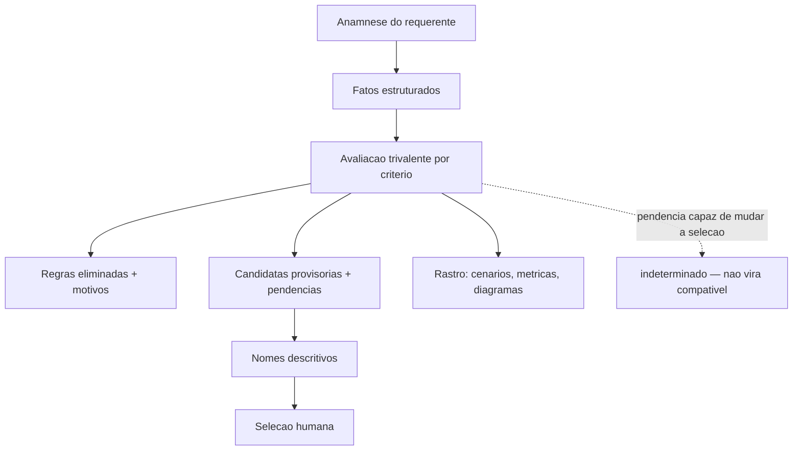
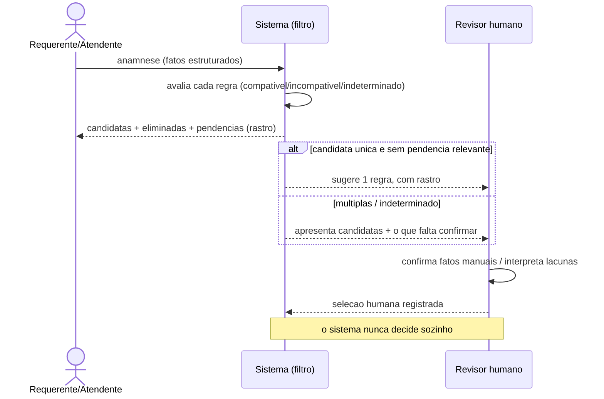
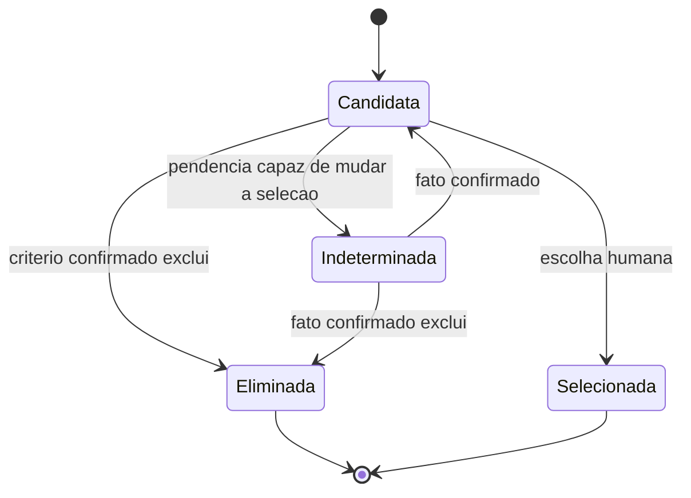
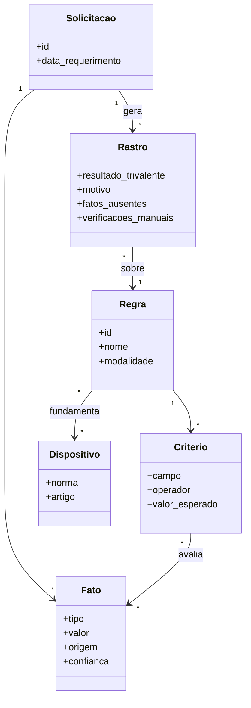
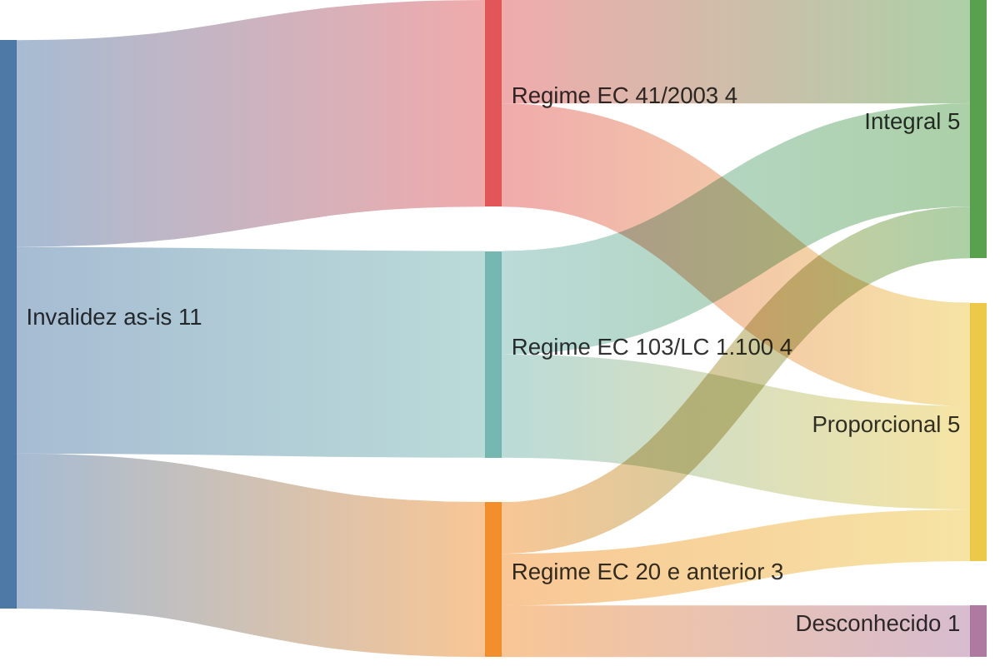
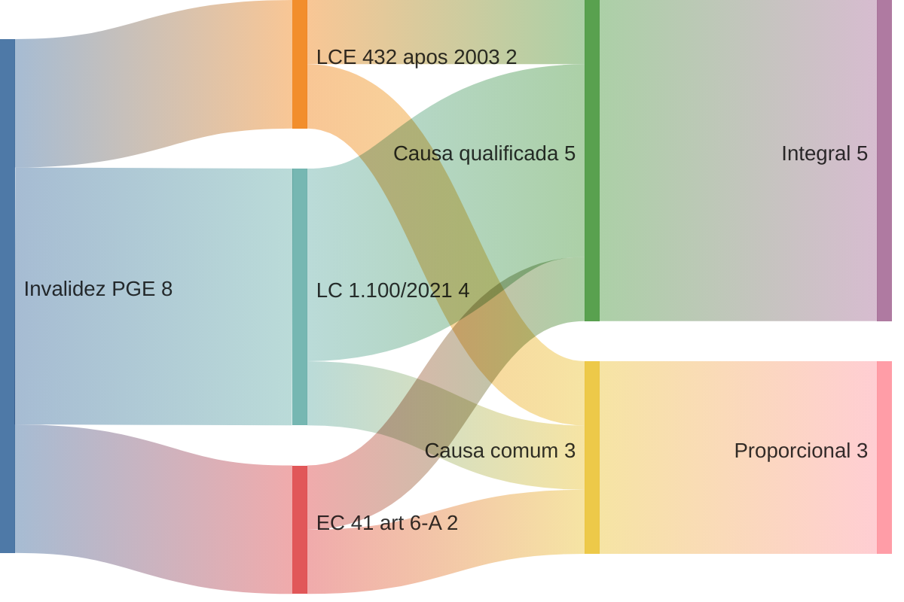

# RFC 0002 — Seleção explicável de regras após a anamnese

- **Status**: proposta (2026-07-21); o filtro explicável de §1 foi
  implementado no site (`/simulador/`, §7) — o **avaliador de decisão**
  continua não implementado, e nenhuma das questões P13 abaixo foi fechada
  por essa implementação. Não altera regras; define o modelo conceitual e
  um piloto executado à mão
  (`docs/analysis/piloto-selecao-invalidez-incapacidade.md`) para testar se o
  modelo se sustenta antes de codificar qualquer avaliador.
- **Parte de / depende de**: [RFC 0001](0001-criterios-de-validacao-das-regras.md)
  (critérios de auditoria, semântica adiada, P13) e da spec
  [`docs/spec/regra.md`](../spec/regra.md) (P13.1). Esta RFC **não** fecha as
  questões P13 (Q1–Q12); ela mostra por que um simulador honesto precisa
  conviver com elas em aberto.
- **Não-objetivo**: decidir o benefício automaticamente; converter
  interpretação provisória em gate de CI; fixar uma gramática de nomes ou um
  esquema de dados definitivo; **confirmar** qualquer das questões P13.

## 1. Papel do sistema

O sistema **não concede** o benefício e **não decide** sozinho qual regra se
aplica. Depois da anamnese do requerente, ele:

1. **reduz o universo** de regras candidatas, eliminando as incompatíveis;
2. **explica** cada eliminação e cada pendência (o *rastro*, §4);
3. **apresenta** as candidatas restantes com nomes compreensíveis (§2) para
   **seleção humana**.

O resultado do processamento **nunca** é apenas "regra-0022". É um rastro:
quais regras caíram e por quê, quais permaneceram, quais fatos faltaram,
quais verificações são manuais, se há candidata única / múltiplas / nenhuma /
indeterminado, e qual interpretação é possível com que confiança.

Isso mantém a linha da RFC 0001: **detecção ≠ conclusão**. O sistema é um
filtro explicável, não um juiz.

## 2. Papel do nome

> O nome deve ser a menor descrição, em linguagem humana, capaz de distinguir
> a regra das demais que ainda podem ser aplicáveis depois da anamnese do
> requerente.

Três campos, três papéis (ver `docs/spec/regra.md` › "O papel do campo
`nome`"):

- **`id`** — identidade técnica **estável** (`regra-NNNN`); nunca muda.
- **`nome`** — resumo operacional **mutável**, orientado à seleção; é o que o
  usuário lê para escolher entre candidatas.
- **`fundamentacao*`** e **`dispositivos`** — suporte jurídico; **não**
  substituem o nome. Se é preciso abrir a fundamentação para diferenciar duas
  regras, o nome falhou.

## 3. Modelo de fatos

Os fatos abaixo são o **insumo** da avaliação — o que se sabe do requerente
após a anamnese. A tabela **propõe** o conjunto; **não** afirma semântica
ainda não confirmada. A coluna "uso" registra a **hipótese** de uso, sempre
atada à questão P13 que a deixaria confirmada — nada aqui é `auto` de fato
enquanto a P13 correspondente estiver aberta. "Possível ausência" = o fato
pode não ter representação no catálogo atual (as 27 colunas).

| Fato                                                                   | Origem na anamnese | Campo atual correspondente                | Uso (hipótese, ainda não confirmado)                                          | Questão P13 aberta | Possível ausência no modelo   |
| ---------------------------------------------------------------------- | ------------------ | ----------------------------------------- | ----------------------------------------------------------------------------- | ------------------ | ----------------------------- |
| Modalidade / benefício                                                 | tipo do pedido     | `tipo_de_beneficio`, `tipo`               | candidato a predicado (auto?)                                                 | Q3                 | não                           |
| Data de ingresso no serviço                                            | RH / anamnese      | `data_adm_ate` / `data_adm_apos` (janela) | temporal — **Q1/Q2 abertas** (inclusividade, marco)                           | Q1/Q2              | não                           |
| Data do evento / incapacidade                                          | laudo médico       | — (sem campo direto)                      | temporal — **Q1/Q2 abertas** (rege o regime?)                                 | Q1/Q2              | **provável**                  |
| Data de aquisição do direito                                           | derivada           | `data_direito_ate` / `data_direito_apos`  | temporal — **Q1/Q2 abertas**                                                  | Q1/Q2              | não                           |
| Data do requerimento                                                   | protocolo          | — (sem campo)                             | manual / apresentação?                                                        | Q9                 | possível                      |
| Sexo                                                                   | anamnese           | `sexo`                                    | candidato a predicado quando relevante                                        | Q3/Q10             | não (mas Q10: AMBOS × vazio)  |
| **Causa da incapacidade** (acidente / moléstia / doença grave / comum) | laudo médico       | **— (sem campo)**                         | a definir: **código/tabela externa, verificação manual, ou lacuna do modelo** | Q6                 | **provável — achado central** |
| Doença catalogada em lei?                                              | laudo + lei        | — (sem campo)                             | a definir (idem causa)                                                        | Q6                 | possível                      |
| Integralidade dos proventos                                            | resultado?         | `integral`                                | **resultado candidato** (hipótese, Q6)                                        | Q6                 | não                           |
| Forma de cálculo                                                       | resultado?         | `tipo_calculo`                            | **resultado candidato** (hipótese, Q6)                                        | Q6                 | não                           |
| Paridade                                                               | resultado?         | `paridade`                                | **resultado candidato** (hipótese, Q6)                                        | Q6                 | não                           |
| Requisitos documentais / verificações manuais                          | anamnese + docs    | — (seções P13.1 do corpo)                 | manual?                                                                       | Q11/Q12            | possível                      |

**Consequência-chave (relação proposta, não estabelecida):** a planilha da
PGE **propõe** que a **causa da incapacidade** separa a metade integral da
proporcional (causa qualificada → integral; causa comum → proporcional) — e o
piloto (documento irmão) **observa** essa relação nos dados. Isso é uma
relação **proposta pela PGE e observada no experimento, sujeita a confirmação
jurídica (Q6)** — não uma regra jurídica estabelecida por este documento. O
que é fato objetivo: essa causa **não é um campo** das 27 colunas; as regras
carregam o `integral` (candidato a resultado), não a causa. Um simulador
honesto, sem esse predicado confirmado, **não pode** escolher a metade —
retorna `indeterminado` (§4).

## 4. Avaliação trivalente e rastro

Cada regra, confrontada com os fatos, recebe um de três valores — nunca um
"verdadeiro/falso" forçado. A definição é **formal**:

**Por hipótese (cada regra)** — a avaliação trivalente opera aqui, em três
valores:

| Valor (por hipótese) | Definição formal                                                                                                                  |
| -------------------- | --------------------------------------------------------------------------------------------------------------------------------- |
| `compatível`         | **todos** os critérios relevantes estão **conhecidos e satisfeitos**, e **não** há critério desconhecido capaz de mudar a seleção |
| `incompatível`       | existe um critério **confirmado** que **exclui** a regra                                                                          |
| `indeterminada`      | existe **fato, semântica, mapeamento ou verificação pendente** capaz de alterar o resultado                                       |

Consequências diretas dessa definição:

- **Não existe** "candidata única com pendência relevante" — se há pendência
  capaz de mudar a seleção, o desfecho é `indeterminado`.
- **Não existe** "múltiplas candidatas" quando a multiplicidade decorre
  **apenas** da incapacidade de avaliar um critério desconhecido (p.ex. a
  causa, que não é campo). Nesse caso o desfecho do conjunto é
  `indeterminado`, **ainda que** se possam listar as candidatas provisórias.
- **Regra de ouro:** `desconhecido`/`indeterminado` **nunca** vira
  `compatível`.

A avaliação de **uma regra** retorna: critérios satisfeitos; critérios que a
eliminaram (com motivo); fatos ausentes; verificações manuais; contradições;
o valor por hipótese acima.

**Por solicitação (o conjunto)** — o **desfecho agregado** é um de quatro
(distinto dos valores por hipótese; `nenhuma` **não** é um valor trivalente,
é um agregado): **`nenhuma`** (todas as hipóteses `incompatível`), **`única`**
(uma `compatível`, **sem** indeterminação relevante), **`múltiplas`** (mais de
uma `compatível`, distinguíveis por fatos **conhecidos**), ou
**`indeterminado`** (sobra pendência capaz de mudar o resultado — o desfecho
mais comum sobre o catálogo atual).

O piloto processa cada caso **separadamente** contra o as-is (11 regras) e
contra as hipóteses da PGE (8) — porque os dois modelos divergem justamente
onde a causa importa.

**Correspondência tabular ≠ avaliação trivalente.** Encontrar uma **única
linha** correspondente na planilha da PGE (correspondência tabular) **não** é o
mesmo que avaliá-la como `compatível`. Uma hipótese pode ter correspondência
única e ainda ser trivalentemente **`indeterminado`** — por pendência temporal
(inclusividade de limite e transição de regime, Q1/Q2), jurídica (a própria
relação causa→cálculo, Q6) ou por não estar validada (`Validação PGE` /
`Validação Presidência` seguem `False` em toda a planilha). Logo, o ganho da
PGE onde ela estreita casos é de **estreitamento**, não de **decisão**: a
avaliação trivalente permanece aberta. As duas etapas são reportadas em
colunas distintas no piloto.

## 5. Visualizações

Funções distintas; a lógica está no texto (§4). Os diagramas devem concordar
com as tabelas do piloto.

### 5.1 Flowchart — o processo de seleção

### 5.2 Sequence diagram — interação usuário / sistema / revisor

### 5.3 State diagram — estados de uma candidata

### 5.4 Class/ER diagram — Solicitação, Fato, Regra, Critério, Dispositivo, Rastro

### 5.5 Sankey estrutural **as-is** — só o que o catálogo tem

Usa **apenas** campos que existem nas 27 colunas: as 11 regras, os regimes
(3/4/4) e o campo `integral` (integral/proporcional/desconhecido). **Não há
nó de causa** — o catálogo as-is não a representa. Contagens derivadas do
campo `integral` das 11 regras.

### 5.6 Sankey estrutural **PGE** — o modelo com o eixo causa

Usa as **8 hipóteses** da PGE, com o **nó de causa** que só o modelo PGE tem.
Regimes: LCE 432 após 2003 = 2 (P1, P2); EC 41 art. 6º-A = 2 (P3, P4); LC
1.100/2021 = 4 (P5, P6, P7, P9). Causa e cálculo conforme as linhas P1–P7/P9.

**O achado principal, visualmente:** o Sankey PGE tem a coluna **Causa** entre
regime e cálculo; o Sankey as-is **não tem** — pula direto do regime para
`integral`. É exatamente o predicado que falta no catálogo.

### Nota sobre renderização de `sankey-beta`

**Verificado em 2026-07-21:** o `sankey-beta` **renderiza** no visualizador do
GitHub deste repositório (conferido na branch do PR, junto com o flowchart, o
sequence, o state e o class diagram). A fonte é mantida acima (diffável).
*Fallback* de contingência, caso uma mudança futura do renderizador do GitHub
deixe de suportá-lo: gerar um SVG estático a partir desta mesma fonte, sem
adicionar dependência pesada só para isso.

## 6. Critérios de sucesso desta RFC

- O piloto roda os 12 casos **separadamente** contra as-is e PGE, com rastros
  trivalentes coerentes com §4 — retornando `indeterminado` sempre que houver
  pendência capaz de mudar a seleção (causa não estruturada, semântica de
  data Q1/Q2, mapeamento ou verificação pendente).
- Fica evidente **o que precisa ser resolvido** — se a causa entra como
  campo, verificação manual, ou é lacuna do modelo (Q6); a inclusividade dos
  limites e a transição de regime (Q1/Q2) — **antes** de valer a pena um
  avaliador real. Codificar o motor antes disso só esconderia essas
  suposições dentro de Python.

## 7. Implementação (site, `/simulador/`)

O modelo acima foi implementado como página do site (`site/src/pages/ simulador.astro`, motor em `site/src/lib/simulador.ts`) — o **filtro
explicável de §1**, nunca o "avaliador real" que o piloto
(`docs/analysis/piloto-selecao-invalidez-incapacidade.md` §6) recomenda
adiar. Usa exclusivamente os campos parametrizados que **já existem** no
catálogo hoje (`tipo_de_beneficio`, `sexo`, `apos_especial`,
`data_adm_ate/apos`, `data_direito_ate/apos`); nenhum campo novo foi criado
e nenhuma das pendências abaixo foi fechada:

- **Q6 continua aberta.** `integral`/`tipo_calculo`/`paridade` aparecem no
  resultado só como "resultado candidato, não verificado" — quando duas
  regras só se distinguem por esses campos (o caso 0006/0007 do piloto), o
  simulador mostra as duas como candidatas, nunca escolhe.
- **Q1/Q2 continuam abertas.** Uma data informada que coincide exatamente
  com um limite de janela vira `indeterminada`, não `compatível`.
- **Q9 (semântica de `simulavel`) continua em aberto** — o simulador usa o
  flag pragmaticamente (só regras `simulavel = S` entram no universo), mas
  isso é uma leitura do flag do sistema de origem, não uma confirmação da
  sua semântica. As regras `simulavel = N` (e as inativas) ficam listadas
  numa seção "fora do escopo" da mesma página, para nunca sumirem
  silenciosamente.
- **Q10 continua aberta.** `sexo` vazio numa regra vira pendência
  (`indeterminada`), nunca é lido como "AMBOS".
