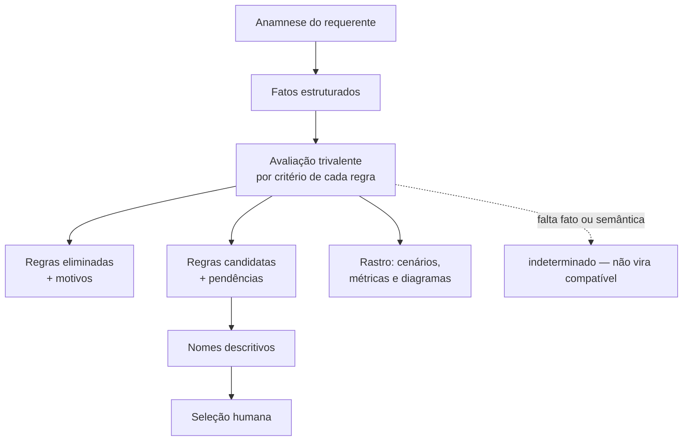
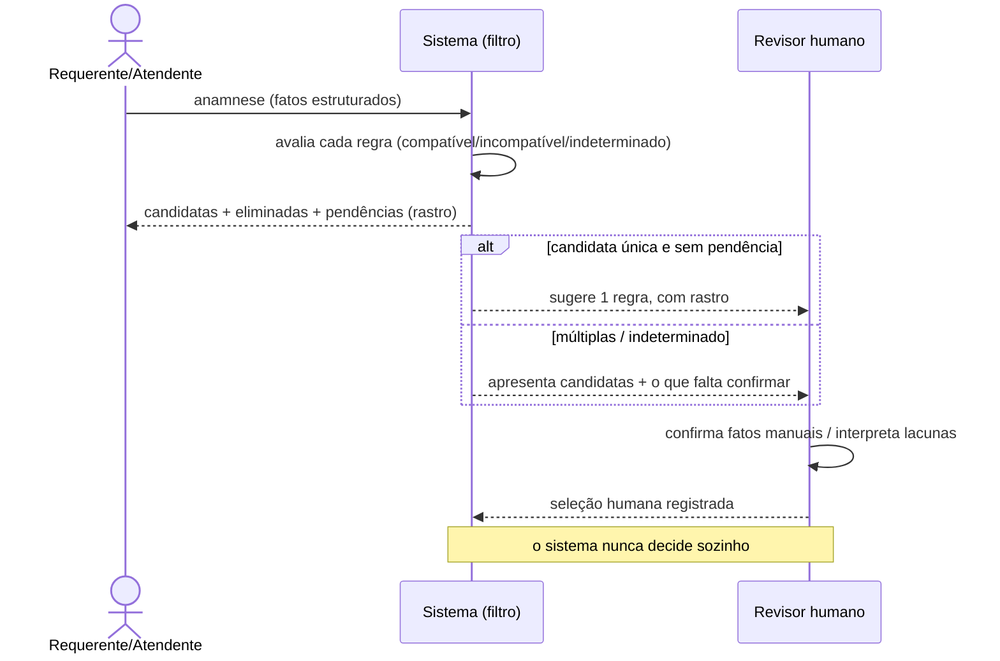
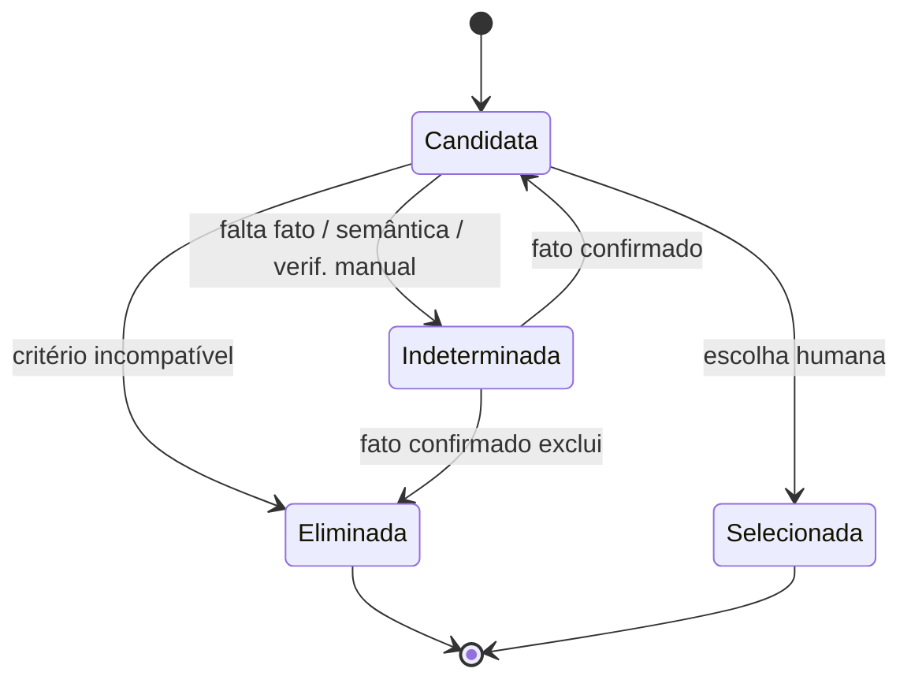
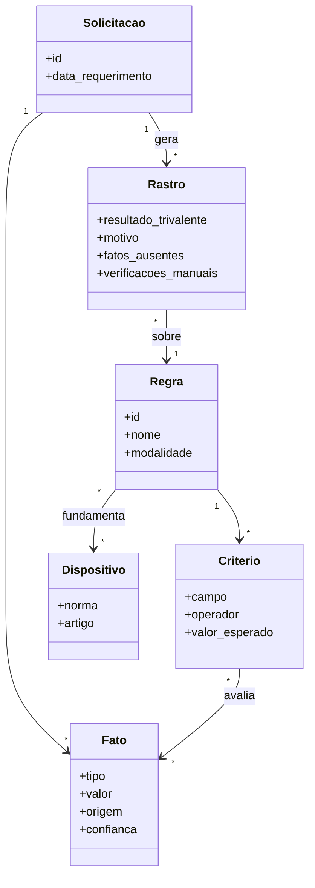
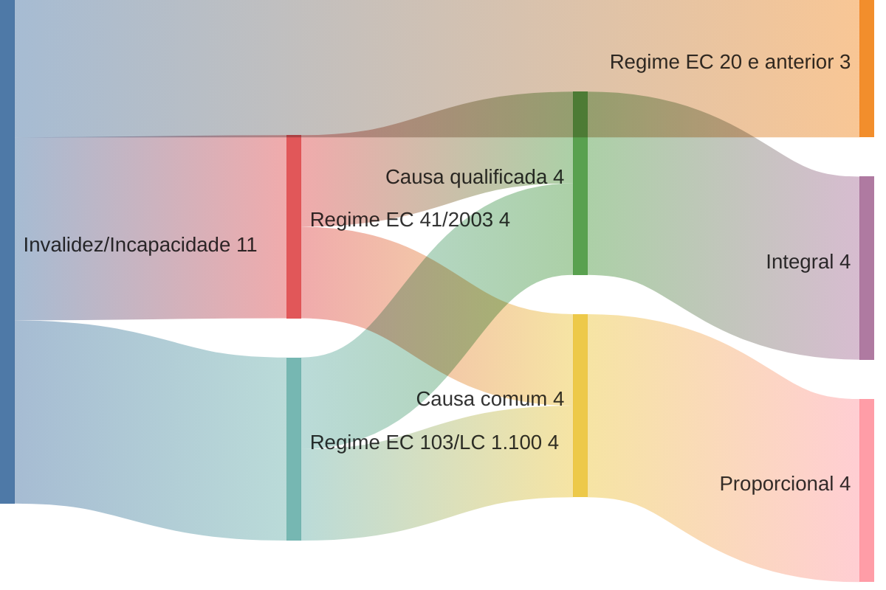

# RFC 0002 — Seleção explicável de regras após a anamnese

- **Status**: proposta (2026-07-21). Não implementa motor nem altera regras;
  define o modelo conceitual e um piloto executado à mão
  (`docs/analysis/piloto-selecao-invalidez-incapacidade.md`) para testar se o
  modelo se sustenta antes de codificar qualquer avaliador.
- **Parte de / depende de**: [RFC 0001](0001-criterios-de-validacao-das-regras.md)
  (critérios de auditoria, semântica adiada, P13) e da spec
  [`docs/spec/regra.md`](../spec/regra.md) (P13.1). Esta RFC **não** fecha as
  questões Q1–Q12; ela mostra por que um simulador honesto precisa conviver
  com elas em aberto.
- **Não-objetivo**: decidir o benefício automaticamente; converter
  interpretação provisória em gate de CI; fixar uma gramática de nomes ou um
  esquema de dados definitivo.

## 1. Papel do sistema

O sistema **não concede** o benefício e **não decide** sozinho qual regra se
aplica. Depois da anamnese do requerente, ele:

1. **reduz o universo** de regras candidatas, eliminando as incompatíveis;
2. **explica** cada eliminação e cada pendência (o *rastro*, §4);
3. **apresenta** as candidatas restantes com nomes compreensíveis (§2) para
   **seleção humana**.

O resultado do processamento **nunca** é apenas "regra-0022". É um rastro:
quais regras caíram e por quê, quais permaneceram, quais fatos faltaram,
quais verificações são manuais, se há candidata única / múltiplas / nenhuma /
contradição, e qual interpretação é possível com que confiança.

Isso mantém a linha da RFC 0001: **detecção ≠ conclusão**. O sistema é um
filtro explicável, não um juiz.

## 2. Papel do nome

> O nome deve ser a menor descrição, em linguagem humana, capaz de distinguir
> a regra das demais que ainda podem ser aplicáveis depois da anamnese do
> requerente.

Três campos, três papéis (ver `docs/spec/regra.md` › "O papel do campo
`nome`"):

- **`id`** — identidade técnica **estável** (`regra-NNNN`); nunca muda.
- **`nome`** — resumo operacional **mutável**, orientado à seleção; é o que o
  usuário lê para escolher entre candidatas.
- **`fundamentacao*`** e **`dispositivos`** — suporte jurídico; **não**
  substituem o nome. Se é preciso abrir a fundamentação para diferenciar duas
  regras, o nome falhou.

## 3. Modelo de fatos

Os fatos abaixo são o **insumo** da avaliação — o que se sabe do requerente
após a anamnese. A tabela **propõe** o conjunto; não afirma semântica ainda
não confirmada (as colunas "uso" e "P13" marcam o que permanece aberto).
"Possível ausência" = o fato pode não ter representação no catálogo atual (as
27 colunas).

| Fato                                                                   | Origem na anamnese | Campo atual correspondente                | Uso (auto / manual / desconhecido)                | Questão P13 aberta | Possível ausência no modelo   |
| ---------------------------------------------------------------------- | ------------------ | ----------------------------------------- | ------------------------------------------------- | ------------------ | ----------------------------- |
| Modalidade / benefício                                                 | tipo do pedido     | `tipo_de_beneficio`, `tipo`               | auto (predicado)                                  | Q3                 | não                           |
| Data de ingresso no serviço                                            | RH / anamnese      | `data_adm_ate` / `data_adm_apos` (janela) | auto (elegibilidade temporal)                     | Q1                 | não                           |
| Data do evento / incapacidade                                          | laudo médico       | — (sem campo direto)                      | auto (rege o regime?)                             | Q1/Q2              | **provável**                  |
| Data de aquisição do direito                                           | derivada           | `data_direito_ate` / `data_direito_apos`  | auto                                              | Q2                 | não                           |
| Data do requerimento                                                   | protocolo          | — (sem campo)                             | manual / apresentação                             | Q9                 | possível                      |
| Sexo                                                                   | anamnese           | `sexo`                                    | auto quando juridicamente relevante               | Q3/Q10             | não (mas Q10: AMBOS × vazio)  |
| **Causa da incapacidade** (acidente / moléstia / doença grave / comum) | laudo médico       | **— (sem campo)**                         | deveria ser auto (separa integral × proporcional) | Q6                 | **provável — achado central** |
| Doença catalogada em lei?                                              | laudo + lei        | — (sem campo)                             | auto / manual                                     | Q6                 | possível                      |
| Integralidade dos proventos                                            | resultado          | `integral`                                | resultado (deriva da causa)                       | Q6                 | não                           |
| Forma de cálculo                                                       | resultado          | `tipo_calculo`                            | resultado                                         | Q6                 | não                           |
| Paridade                                                               | resultado          | `paridade`                                | resultado                                         | Q6                 | não                           |
| Requisitos documentais / verificações manuais                          | anamnese + docs    | — (seções P13.1 do corpo)                 | manual                                            | Q11/Q12            | possível                      |

**Consequência-chave:** o par integral × proporcional das regras de invalidez
é determinado pela **causa da incapacidade**, que **não é um campo** das 27
colunas. Hoje as regras carregam o *resultado* (`integral`), não o *fato* (a
causa). Um simulador honesto não pode escolher entre a metade integral e a
proporcional sem esse predicado — precisa retornar `indeterminado` (§4).

## 4. Avaliação trivalente e rastro

Cada **critério** de uma regra, confrontado com os fatos, resulta em um de
três valores — nunca em "verdadeiro/falso" forçado:

| Resultado       | Significado                                                     |
| --------------- | --------------------------------------------------------------- |
| `compatível`    | todos os critérios **conhecidos** da regra foram satisfeitos    |
| `incompatível`  | pelo menos um critério **exclui** a regra                       |
| `indeterminado` | falta fato, falta semântica confirmada, ou é verificação manual |

**Regra de ouro:** nunca converter `desconhecido`/`indeterminado` em
`compatível`. A ausência de um predicado (p.ex. "causa da incapacidade") não
pode virar um "sim" silencioso.

A avaliação de **uma regra** retorna:

- critérios **satisfeitos**;
- critérios que a **eliminaram** (com motivo);
- **fatos ausentes** que impediram decidir;
- **verificações manuais** pendentes;
- **contradições** (fato do requerente × campo da regra, ou flag × texto);
- **resultado agregado**.

A avaliação do **conjunto** retorna um destes desfechos:

- **candidata única** — exatamente uma regra `compatível`, nenhuma
  `indeterminado` relevante;
- **múltiplas candidatas** — mais de uma sobreviveu (seleção humana escolhe);
- **nenhuma candidata** — todas `incompatível`;
- **indeterminado** — sobra pelo menos uma `indeterminado` que a decisão
  depende de resolver (o desfecho mais comum enquanto Q6/causa não existir).

## 5. Visualizações

As figuras a seguir têm **funções distintas** — a lógica está no texto (§4);
os diagramas a ilustram, e devem concordar com a tabela de cenários do
piloto.

### 5.1 Flowchart — o processo de seleção



### 5.2 Sequence diagram — interação usuário / sistema / revisor



### 5.3 State diagram — estados de uma candidata



### 5.4 Class/ER diagram — Solicitação, Fato, Regra, Critério, Dispositivo, Rastro



### 5.5 Sankey estrutural — hipóteses por modalidade → regime → causa → cálculo/paridade

Mostra **volume de hipóteses** do modelo (não frequência real de casos), para
a modalidade invalidez/incapacidade, a partir das contagens do piloto.



### 5.6 Sankey de cenários — corpus **sintético** → caminhos → resultados

> **Corpus sintético.** Os volumes abaixo contam apenas os casos inventados do
> piloto (§ do piloto). **Não** representam frequência real de requerimentos.

```mermaid
sankey-beta
Corpus sintético,Candidata única,2
Corpus sintético,Múltiplas candidatas,3
Corpus sintético,Nenhuma candidata,1
Corpus sintético,Indeterminado,6
Indeterminado,Falta causa/predicado,4
Indeterminado,Contradição de dados,1
Indeterminado,Limite de data ambíguo,1
```

### Nota sobre renderização de `sankey-beta`

**Verificado em 2026-07-21:** o `sankey-beta` **renderiza** no visualizador do
GitHub deste repositório (conferido na branch do PR, junto com o flowchart, o
sequence, o state e o class diagram). A fonte é mantida acima (diffável).
*Fallback* de contingência, caso uma mudança futura do renderizador do GitHub
deixe de suportá-lo: gerar um SVG estático a partir desta mesma fonte, sem
adicionar dependência pesada de renderização só para isso.

## 6. Critérios de sucesso desta RFC

- O piloto executado (documento irmão) roda os casos e produz rastros
  trivalentes **coerentes** com esta RFC — em especial, retorna
  `indeterminado` sempre que a causa da incapacidade (ou outra semântica não
  confirmada) for necessária.
- Fica evidente **quando** um avaliador real e um formato de cenários
  legível por máquina valem a pena — e o que precisaria estar resolvido
  (Q6/causa, limites de data Q1/Q2) antes disso. Codificar o motor antes
  disso só esconderia suposições dentro de Python.
