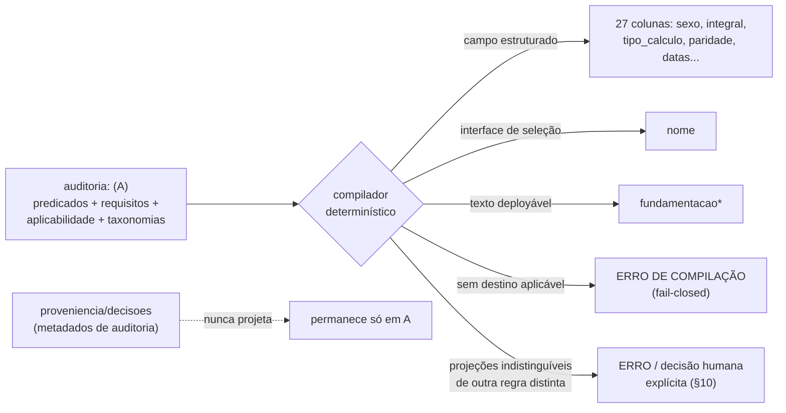

# RFC 0004 — Schema enriquecido da auditoria e compilador determinístico para o schema legado do Sisprev

- **Status**: proposta (2026-07-23). **Especificação revisável, sem
  implementação.** Não edita nenhum `regra-*.md`, não altera o schema de
  produção, o CSV, os dispositivos, os achados, os detectores, o simulador,
  o site nem os workflows. Entrega apenas o desenho: o que se pretende
  construir, confrontado com os parsers e geradores reais do repositório.
- **Parte de / depende de**: [RFC 0001](0001-criterios-de-validacao-das-regras.md)
  (semântica adiada, autoria humana, P2/P2.1/P3/P5/P7/P13, as 27 colunas),
  [RFC 0002](0002-selecao-explicavel-pos-anamnese.md) (seleção explicável,
  papel do `nome`, avaliação trivalente), a spec P13.1
  ([`docs/spec/regra.md`](../spec/regra.md)), o dossiê Q6
  ([`docs/analysis/q6-causa-incapacidade.md`](../analysis/q6-causa-incapacidade.md))
  e a reconciliação invalidez/incapacidade
  ([`docs/analysis/reconciliacao-invalidez-incapacidade.md`](../analysis/reconciliacao-invalidez-incapacidade.md)).
- **Não-objetivo**: implementar a migração; responder qualquer das questões
  Q1–Q12; fechar Q6-S; redigir `fundamentacao*` definitiva para qualquer
  regra; fixar a gramática de `nome`; transformar interpretação provisória
  em gate de CI (princípio da semântica adiada, RFC 0001).

## 0. Decisão de arquitetura que motiva esta RFC

> O schema atual do Sisprev **deixa de ser o limite da análise**. Ele passa
> a ser um **formato-alvo legado** para o qual as regras auditadas serão
> **compiladas**.

Hoje, o frontmatter das 27 colunas **é** a regra deployável (RFC 0001,
P13.2): o auditor edita diretamente `integral`, `tipo_calculo`,
`fundamentacao*`, e o `okf_to_csv.py` projeta isso na CSV derivada. O
problema estrutural, já documentado, é que **a semântica jurídica que
distingue duas regras muitas vezes não cabe em nenhuma das 27 colunas** — o
caso central é a **causa da incapacidade**, pela qual a PGE separa hipóteses
que o catálogo não tem como campo (reconciliação §2, o cruzamento
`0022 × P6/P7`; Q6 §2). O `integral`/`tipo_calculo` são o **resultado já
pré-computado** da causa, nunca o **predicado** que diz *quais* causas o
produzem.

Esta RFC formaliza a separação entre:

- **(A) o schema enriquecido da auditoria** — onde vivem os predicados
  jurídicos estruturados, a classe da causa, os requisitos não
  parametrizáveis, o meio e o responsável pela constatação, a aplicabilidade
  temporal, os dispositivos vinculados, as taxonomias e vigências, e os
  metadados de auditoria (evidência, proveniência, confiança, decisões); e
- **(B) o schema legado do Sisprev, com as 27 colunas** — o formato-alvo,
  para o qual (A) é **compilado** por um passo determinístico.

E define o **contrato do compilador A → B**: toda semântica operacional
necessária à seleção e aplicação de uma regra tem de ser projetável para as
27 colunas, com destino declarado, ou a compilação **falha** — nunca
descarta em silêncio.

## 1. Qual artefato é a fonte canônica

A fonte autoral continua sendo **um único arquivo por regra**:
`okf/regras-sisprev/regras/regra-*.md` (RFC 0001, "autoria humana"; nada
aqui reintroduz um segundo arquivo por regra nem um banco paralelo).

O que muda é o que, **dentro** desse arquivo, é canônico:

- Hoje: o frontmatter das 27 colunas é a única semântica; o corpo é análise
  autoral livre.
- Proposta: acrescenta-se **uma única chave nova de frontmatter**,
  `auditoria:` (um mapa aninhado), que passa a carregar a **semântica
  operacional canônica** de uma regra **auditada**. As 27 colunas dessa
  regra tornam-se a **projeção compilada** de `auditoria:`.

Consequência precisa, confrontada com os parsers reais:

| Camada                            | Efeito de acrescentar `auditoria:`                                                                                                                                   |
| --------------------------------- | -------------------------------------------------------------------------------------------------------------------------------------------------------------------- |
| `concept.py::parse_concept_doc`   | Nenhum — o parser é *shape-only*, um mapa aninhado carrega normalmente.                                                                                              |
| `okf_to_csv.py::_rows_from_docs`  | Nenhum — lê apenas as chaves em `columns` (as 27). `auditoria:` **não** vai para a CSV das 27 colunas por construção. Round-trip legado intacto.                     |
| `regra_schema.py::COLUMNS`        | Nenhum — o mapa das 27 colunas não muda; `auditoria:` é namespace separado (P13.2: campos novos "em namespace separado, jamais confundidos com a origem congelada"). |
| `detectors/igualdade_material.py` | **Precisa de um ajuste** (§10/§11): `auditoria` entra na denylist de chaves ignoradas do P2, que opera **pós-projeção** sobre as 27 colunas.                         |
| `site/` (Zod `.loose()`)          | Nenhum para quebrar — a chave extra passa; `emit_site_data.py` emite só os campos de estado que já emite (§12).                                                      |

A **CSV derivada** (`data/regras-sisprev.csv`) e a **projeção nas 27
colunas** são, ambas, **alvos de compilação** — nunca fonte. A CSV congelada
(`data/raw/regras-sisprev.csv`) permanece imutável para sempre (RFC 0001,
regra da estrada; job `original-raw-immutable`).

## 2. A fronteira entre semântica operacional e metadados de auditoria

A fronteira é o eixo desta RFC, e ela **não** coincide com "tudo que está em
`auditoria:`". Dentro de `auditoria:` há dois sub-mundos com regras opostas:

**Semântica operacional (tem de projetar para B, ou a compilação falha).**
É tudo que o Sisprev precisa para **selecionar e aplicar** a regra:

- predicados jurídicos de seleção (classe da causa da incapacidade, regime,
  marco de ingresso, sexo quando relevante);
- requisitos não parametrizáveis (a condição que diferencia a regra, quem
  verifica, por que meio, e a afirmação de que o IPERON a constatou —
  §7);
- aplicabilidade temporal (janelas, e o marco que rege a versão da norma);
- dispositivos vinculados (P3 — já existe como `dispositivos:`);
- a parte **discriminante** das taxonomias e suas vigências (a *classe*, não
  cada item da lista).

**Metadados de auditoria (podem viver só no catálogo enriquecido).** Não são
necessários à aplicação da regra pelo Sisprev, então **não** precisam
projetar:

- evidências, proveniência, URL consultada, MD5/Wayback, fonte;
- confiança (alta/média/baixa);
- histórico e decisões de auditoria (quem decidiu o quê, quando, por quê);
- notas de reconciliação e as perguntas em aberto.

> "Completamente conversível" **não** significa colocar todo metadado de
> auditoria nas 27 colunas. Evidência, URL, confiança, histórico e decisão
> podem permanecer apenas no catálogo enriquecido, **desde que não sejam
> necessários à aplicação da regra pelo Sisprev**.

Esta é exatamente a distinção Q6-R × Q6-S × Q6-T já registrada no dossiê Q6
(§1): o **predicado da regra** (Q6-R, catálogo — semântica operacional) vs. o
**fato do requerente** (Q6-S, solicitação — fora do escopo desta RFC e **não
resolvido** por ela) vs. a **classificação médico-jurídica versionada** (Q6-T
— taxonomia/dispositivos, evidência citável).

## 3. O schema enriquecido mínimo

Forma **sugerida** (a validar contra a implementação; ver §9 sobre por que
nada disso quebra o round-trip). Um único bloco `auditoria:` no frontmatter,
com `schema_version` explícito:

```yaml
auditoria:
  schema_version: 1

  # --- semântica operacional (projeta para B — §5) ---
  predicados:
    causa_incapacidade: acidente_em_servico   # classe MATERIAL (Q6-R), enum fechado
    regime: lc-1100-2021
    marco_ingresso: apos-2003
  requisitos_nao_parametrizaveis:
    - condicao: nexo entre a incapacidade e o acidente em serviço
      verificador: IPERON
      meio: perícia oficial no processo concessório
      constatado_no_concessorio: true
      destino: fundamentacao_integral          # §5, item 3
  aplicabilidade_temporal:
    janela_ingresso: { de: 2004-01-01, ate: null }
    marco_que_rege_a_norma: pendente           # Q6-T-vigência / Q1-Q2 (aberto)
  taxonomias:
    - ref: /dispositivos/lce-1100-2021/art-30-p5.md   # P3
      papel: nexo-acidente

  # --- metadados de auditoria (NÃO projetam — permanecem só aqui) ---
  proveniencia:
    fontes_consultadas: ["https://..."]
    evidencias: ["laudo pericial oficial (descrição)"]
    confianca: alta
  decisoes:
    - data: 2026-07-23
      quem: <auditor>
      o_que: "classe de causa = acidente em serviço; ver reconciliação §2 (P7)"
```

Princípios do schema enriquecido:

- **`schema_version` obrigatório** — todo bloco `auditoria:` o declara; sem
  ele, a compilação falha (§14). É o que permite migração e rollback (§8).
- **Enumerações fechadas para predicados** — `causa_incapacidade` usa as
  classes materiais de Q6 §10.A: `acidente_em_servico`, `molestia_profissional`,
  `doenca_catalogada`, `causa_comum`. **Uma linha por classe material, não
  por doença** (Q6 direção A — §6). A lista de doenças **não** vira valor de
  enum nem linha de catálogo: fica em Q6-T (taxonomia versionada / dispositivos).
- **Requisitos não parametrizáveis são estruturados**, não prosa — cada um
  com `condicao`, `verificador`, `meio`, `constatado_no_concessorio` e um
  `destino` declarado (§7).
- **Metadados de auditoria são livres** e nunca material para nenhum controle
  de igualdade/colisão (§2, §10).

Confronto com o código real: `auditoria:` é **uma** chave; `concept.py`
valida só forma; nenhum campo de domínio das 27 colunas se move ou se
renomeia. Um documento com `auditoria:` mal-formado ainda **carrega** — a
validação do bloco é *on demand* (o mesmo padrão de contrato tipado de
`Regra.admin`/`Achado._validation`), e um erro no bloco enriquecido nunca
pode esconder um `status_regra`/`status_auditoria` bem-formado das junções
P7/P14 (RFC 0001; regressão documentada em `test_estado_auditoria.py`).

## 4. O schema legado de destino (B)

O alvo é **exatamente** o que já existe, sem uma coluna nova: as 27 colunas
de `regra_schema.py::COLUMNS`, na ordem congelada, mais os campos
administrativos (P12) que o `okf_to_csv.py` já anexa. Esta RFC **não**
propõe coluna nova no Sisprev — o ponto inteiro é que o alvo é **fixo e
legado**.

Os três destinos "aplicáveis" que uma semântica operacional pode ocupar em B
são:

1. um **campo estruturado já existente** (ex.: `sexo`, `integral`,
   `tipo_calculo`, `paridade`, as datas, `tipo_de_beneficio`);
2. o **`nome`**, como interface humana de seleção (RFC 0002 / spec P13.1 —
   §6);
3. a **`fundamentacao`**, `fundamentacao_integral` ou
   `fundamentacao_proporcional` (o campo deployável de texto).

E o quarto desfecho possível não é um destino, é uma parada:

4. **erro de compilação**, quando o requisito não puder ser preservado de
   forma aplicável em nenhum dos três acima.

## 5. O contrato do compilador (A → B)



**Regras do contrato:**

- **Destino único e declarado.** Cada requisito operacional tem **exatamente
  um** destino entre os quatro do §4, **declarado no schema enriquecido**
  (não inferido pelo compilador). O conjunto desses `destino:` é o
  **manifesto de mapeamento** (§5.1).
- **Nada descartado em silêncio.** Todo campo/predicado operacional presente
  em `auditoria:` tem de aparecer no manifesto com um destino, ou a
  compilação falha com `P_COMPILA_SEM_DESTINO`. A ausência de destino nunca é
  tratada como "não importa".
- **Determinístico e idempotente.** Mesma entrada A ⇒ mesma saída B, byte a
  byte (a saída passa por `md_format.write_markdown`/`okf_to_csv`, já
  idempotentes — §9). Sem `Date.now()`/aleatoriedade.
- **Fail-closed.** Qualquer ambiguidade — destino ausente, predicado sem
  proveniência normativa, colisão pós-projeção (§10), versão de taxonomia
  indefinida sem redação que a difira explicitamente — **para** a compilação
  em vez de adivinhar.

### 5.1 Manifesto de mapeamento campo/predicado → destino

O manifesto é a tabela normativa que o compilador consome (análoga ao papel
que `regra_schema.py::COLUMNS` já tem para as 27 colunas). Forma:

| Predicado / requisito (em A)            | Destino (em B)                         | Como projeta                                                     |
| --------------------------------------- | -------------------------------------- | ---------------------------------------------------------------- |
| `predicados.sexo`                       | campo `sexo`                           | cópia direta (enum)                                              |
| `predicados.causa_incapacidade`         | `fundamentacao*` + (efeito) `integral` | a *classe* entra na redação; o *resultado* já vive em `integral` |
| `predicados.regime` / `marco_ingresso`  | datas (`data_adm_*`, `data_direito_*`) | janela estrutural (P5) — semântica de limite é Q1/Q2 (aberta)    |
| `requisitos_nao_parametrizaveis[]`      | `fundamentacao*` (§7)                  | redação de constatação-IPERON (§7), destino declarado por item   |
| `taxonomias[].ref`                      | `dispositivos:` (P3)                   | link canônico; texto verbatim vive no dispositivo                |
| `proveniencia`, `decisoes`, `confianca` | — (nenhum)                             | **não projeta** — permanece só em A (§2)                         |

O manifesto é **fonte única** usada pelo compilador, não tabela editorial
duplicada — mesmo princípio de P13.2. Um predicado novo no schema enriquecido
sem linha no manifesto é `P_COMPILA_SEM_DESTINO`, não um default silencioso.

### 5.2 Modo de operação do compilador (por fase — ver §15)

- **Modo verificação (Fase 1).** As 27 colunas **continuam autoradas**. O
  compilador projeta A e **confere** que a projeção bate com as colunas já
  escritas; divergência é `P_COMPILA_DIVERGE` (fail-closed). Nada vira
  derivado ainda: round-trip e `derived-csv-in-sync` intactos.
- **Modo geração (Fase 2, por regra, ato humano).** Quando uma regra é de
  fato auditada, suas 27 colunas passam a ser **geradas** por
  `gerar_indices.py` a partir de `auditoria:` (como a CSV já é hoje), e o
  compilador é o gerador. Nunca em massa — é o mesmo princípio de autoria
  humana das seções P13.1, dos achados e da vinculação de dispositivos.

## 6. Regras de geração de `nome` e `fundamentacao*`

**`nome`** (RFC 0002 §2; spec P13.1 "O papel do campo `nome`"):

- O `nome` é a **principal interface humana** para localizar a regra após a
  anamnese — descritivo, claro, discriminativo. Deve ser "a menor descrição,
  em linguagem humana, capaz de distinguir a regra das demais que ainda podem
  ser aplicáveis".
- Ao gerar `nome` a partir de A: **fatos discriminantes primeiro** (modalidade,
  marco de ingresso, **causa relevante**, integral/proporcional, paridade),
  citação legal por último ou só na fundamentação.
- **`nome` não é discriminante material sozinho** (§10). O compilador pode
  usar `nome` como destino de *apresentação* de um predicado, mas a distinção
  jurídica **também** tem de aparecer nos campos materiais (`fundamentacao*`,
  flags, datas, cálculo). Se dois `nome` diferentes forem a *única* diferença
  entre duas regras, isso não as torna materialmente distintas — é o
  comportamento correto do P2 (Q6 §10.B), não um defeito.

**`fundamentacao*`** (para requisitos não parametrizáveis — §7): a redação
gerada deve **explicitar a condição diferenciadora**, **identificar quem
verifica**, **indicar o meio de verificação** e **afirmar a constatação pelo
IPERON no processo concessório**. A redação é gerada a partir da estrutura de
`requisitos_nao_parametrizaveis[]`, nunca escrita à mão de forma divergente
do bloco estruturado (senão A e B contradizem-se, e `P_COMPILA_DIVERGE`
dispara).

## 7. Tratamento de requisitos constatados pelo IPERON

Quando um requisito **não** puder ser representado por campo estruturado das
27 colunas, a `fundamentacao*` gerada é o destino (§4, item 3), e deve conter
os quatro elementos. A base normativa e a redação já foram **validadas contra
fonte primária** no relatório do PR #27
(`docs/analysis/base-normativa-invalidez-incapacidade.md`, §4) — esta RFC as
cita como **exemplos validados**, não as inventa:

- **Nexo com acidente em serviço** (validado, PR #27 §4):
  > "Aplicável quando o IPERON houver constatado, mediante perícia oficial, o
  > nexo entre a incapacidade e o acidente em serviço (ou hipótese equiparada,
  > art. 30 §6º) no processo concessório."
- **Existência de incapacidade / impossibilidade de readaptação** (validado):
  > "Aplicável quando o IPERON houver constatado o requisito com base em
  > perícia médica oficial do Estado (regime LCE 432/2008) ou em perícia
  > médica oficial por ele indicada (regime LCE 1.100/2021), realizada no
  > processo concessório."
- **Doença catalogada, com rol de versão temporal pendente** (validado —
  exemplo 2, §13):
  > "Aplicável quando o IPERON, mediante perícia oficial, houver constatado
  > que o requerente está acometido por doença enquadrada no rol
  > juridicamente aplicável ao caso, permanecendo pendente a definição da
  > versão temporal desse rol."

Ressalvas, importadas do PR #27:

- O nome **"IPERON"** só existe a partir da LCE 1.100/2021; a LCE 432/2008
  fala em "perícia médica oficial do Estado". A redação gerada respeita o
  regime da regra — o compilador não atribui "IPERON" retroativamente.
- Nem toda redação está pronta: **moléstia profissional** depende de resolver
  a pendência **P-6** (dispositivo `art-30 §6º III` não confirmado) — nesse
  caso o compilador **falha** (proveniência normativa ausente), não gera texto.
- Esta RFC **não** trata essas frases como decididas para nenhuma regra
  específica: elas tornam explícita, para revisão humana, a condição e sua
  forma de constatação. Editar `regra-*.md` com elas é ato humano futuro,
  fora do escopo desta PR.

## 8. Versionamento e migração

- **`schema_version`** no bloco `auditoria:` (inteiro, começa em `1`). O
  compilador conhece as versões que sabe compilar; versão desconhecida é
  erro, nunca best-effort.
- **Migração é por regra e humana** (autoria humana). Não há backfill em
  massa. Uma regra sem `auditoria:` é uma regra **ainda não auditada** (§13)
  — permanece 100% legado, intocada.
- **Nenhuma linha da importação some ou é renumerada** (RFC 0001, P2/P2.1):
  enriquecer uma regra é acrescentar `auditoria:` ao seu `regra-*.md`
  existente; nunca criar/remover/fundir documentos.
- **Compatibilidade de esquema**: uma bump de `schema_version` exige um
  compilador que saiba ler a versão anterior (para migração determinística)
  ou uma migração de dados explícita e revisável — o mesmo rigor de P12
  ("o formato do derivado evolui junto com o bundle").

## 9. Compatibilidade com round-trip e geração idempotente

Esta é a checagem contra os geradores reais (não uma suposição):

- **Round-trip legado intacto na Fase 1.** `okf_to_csv.py` lê apenas as
  chaves em `columns` (as 27); `auditoria:` não entra na CSV das 27 colunas.
  O teste de round-trip do bootstrap (`test_roundtrip.py`) compara só as 27
  colunas originais — inalterado.
- **`bundle-imports-original`** (contagem de docs == linhas do CSV): não
  muda; `auditoria:` não cria nem remove documentos.
- **Idempotência.** A saída do compilador (frontmatter e CSV) passa pelos
  mesmos `md_format.write_markdown`/`okf_to_csv` já byte-idempotentes. O
  compilador é uma função pura das fontes autorais → cabe sob `gerar_indices`
  ("derivar", P10) e sob `derived-csv-in-sync` quando (Fase 2) as colunas de
  uma regra auditada virarem derivadas.
- **`derived-csv-in-sync` na Fase 2.** Quando as 27 colunas de uma regra
  auditada passam a ser geradas, elas entram no conjunto derivado conferido
  por `git diff --exit-code` — exatamente como a CSV hoje. O compilador tem
  de ser idempotente ou esse gate falha; é a prova mecânica da determinística.

## 10. Detectores de equivalência e colisão — dois controles distintos

O `nome` **não deve, sozinho, tornar duas regras materialmente distintas**
(RFC 0001, P1/P2). Mas a distinção jurídica também não pode viver só no
`nome`. Isso exige **dois controles separados**, em dois níveis:

**Controle 1 — equivalência semântica no schema enriquecido (A).** Um
**novo** detector, sobre os campos **operacionais** de `auditoria:`
(`predicados`, `requisitos_nao_parametrizaveis`, `aplicabilidade_temporal`,
`taxonomias`) — **nunca** sobre `proveniencia`/`decisoes`/`confianca` (§2).
Reporta grupos de regras **semanticamente equivalentes em A**. É informativo
(camada 2/3, RFC 0001) — abre achado, não decide.

**Controle 2 — colisão depois da projeção para B.** É o **P2 atual**
(`igualdade_material.py`), que opera pós-projeção sobre as 27 colunas (menos
`nome`/`id`/admin). Reporta regras que **compilam para combinações
indistinguíveis**.

O caso que esta RFC existe para não esconder:

> Se duas regras forem **semanticamente diferentes em A**, mas **compilarem
> para combinações indistinguíveis em B**, o compilador **falha** ou **exige
> decisão humana explícita**. Não se esconde a perda de expressividade.

Mecanismo (reaproveitando o que já existe, sem inventar): a decisão humana
explícita é um achado `situacao: resolvido` com
**`efeito_deteccao: pode_persistir`** (`achado_schema.py`) — exatamente o
mecanismo que Q6 §10.B já prevê para a contingência B, **sem alterar o P2 e
sem tornar `nome` material**. Sem esse achado, a colisão pós-projeção entre
duas regras semanticamente distintas é `P_COMPILA_COLISAO` (fail-closed).

Este é o `0022 × P6/P7` da reconciliação (§2), e o Q8 do RFC 0001 ("em pares
como `regra-0006`/`0007`, o critério que distingue os resultados está
parametrizado em outro lugar ou é decisão manual?"): a causa separa
hipóteses que, sem o predicado em A, projetariam para o mesmo B.

## 11. Impacto no P2/P3

- **P2 (`igualdade_material.py`).** Uma linha muda: `auditoria` entra em
  `_IGNORED_FRONTMATTER_KEYS`. Razão: P2 é o **controle 2** (colisão
  pós-projeção sobre as 27 colunas); a semântica de A é do **controle 1**. Se
  `auditoria` **não** fosse ignorado, o P2 passaria a tratar todo o bloco
  enriquecido — inclusive `proveniencia`/`confianca` — como material, o que
  contraria "metadados de auditoria não são material" (§2) e a decisão Q6
  §10.B. O `VERSION` do P2 sobe (invalidando fingerprints antigos de forma
  controlada, como já se fez em v4).
- **P3 (`dispositivos:`).** Sem mudança de infraestrutura — `taxonomias[].ref`
  e os dispositivos vinculados usam o `dispositivos:` e o
  `okf/dispositivos/` que já existem (`check_p3_dispositivos`). A quinta
  pergunta P13.1 ("quais dispositivos justificam cada critério e efeito")
  ganha, no schema enriquecido, um lugar estruturado — mas sua
  **obrigatoriedade** para `revisada` continua adiada (P7), não é fixada aqui.
- **P7.** Nenhuma mudança de invariante nesta RFC. No futuro, `revisada`
  poderá exigir `auditoria:` presente e compilável — mas isso é decisão de
  uma fase posterior, com invariante novo verificável (regra do catraca de
  P7), não deste documento.

## 12. Impacto no simulador e no site

**Simulador** (RFC 0002; PR #28):

> O simulador deve trabalhar com os **campos estruturados da auditoria**. Ele
> **não** deve deduzir predicados interpretando `nome` ou `fundamentacao*`.

- Hoje o simulador honesto retorna `indeterminado` quando falta o predicado
  da causa, porque a causa "não é campo" (RFC 0002 §3). O schema enriquecido
  **fornece** esse predicado (`predicados.causa_incapacidade`) — para regras
  **auditadas**, o simulador pode finalmente avaliá-lo.
- Regras **não auditadas** (sem `auditoria:`) continuam sem o predicado — o
  simulador segue retornando `indeterminado` para elas (honestidade
  preservada; §13). O ganho é incremental, regra a regra.
- Invariante duro: o simulador lê `auditoria.predicados`, **nunca** faz
  parsing de `nome`/`fundamentacao*`. Deduzir predicado de prosa é
  precisamente o que esta arquitetura elimina.

**Site** (RFC 0003): permanece projeção derivada e read-only. As Zod schemas
são `.loose()` para campos de domínio, então `auditoria:` passa sem quebrar;
`emit_site_data.py` emite só os campos de estado que já emite. Um painel
futuro que exponha os predicados estruturados é aditivo e opcional — fora do
escopo desta RFC.

## 13. Estratégia para regras atuais ainda não auditadas

- Uma regra **sem** `auditoria:` é "ainda não auditada": permanece
  **integralmente legado**, com as 27 colunas autoradas, intocada. Nenhuma
  das 112 regras importadas é modificada por esta RFC (idem à spec P13.1, que
  também não backfilla as seções obrigatórias).
- O compilador **só roda** (modo verificação) sobre regras que **têm**
  `auditoria:`. Ausência do bloco não é erro — é o estado default.
- O enriquecimento avança **por família**, aproveitando o trabalho já feito:
  a família invalidez/incapacidade tem a reconciliação (§2) e os dispositivos
  do PR #27 como base; é a candidata natural ao piloto.
- Nenhum enriquecimento é gerado por comando: o compilador projeta e confere;
  **escrever** `auditoria:` é ato humano (autoria humana).

## 14. Testes e gates necessários

- **Determinismo/idempotência**: mesma entrada A ⇒ mesma saída B, byte a byte
  (property test; reaproveita a idempotência de `md_format`/`okf_to_csv`).
- **Sem destino silencioso** (`P_COMPILA_SEM_DESTINO`): todo predicado/requisito
  operacional em A aparece no manifesto com destino; predicado órfão falha.
- **Modo verificação** (`P_COMPILA_DIVERGE`): projeção de A bate com as 27
  colunas autoradas; divergência falha (Fase 1). Fail-closed.
- **Colisão pós-projeção** (`P_COMPILA_COLISAO`): reusa o P2; duas regras
  semanticamente distintas em A que projetam para B indistinguível falham,
  salvo achado `pode_persistir` explícito (§10).
- **Equivalência em A** (controle 1): novo detector informativo; achado, não
  bloqueio (camada 2/3).
- **`schema_version`** presente e conhecida; ausente/desconhecida falha.
- **Proveniência normativa**: predicado/requisito sem dispositivo/fonte que o
  sustente falha (condição de parada — §16). Ex.: moléstia profissional
  enquanto P-6 estiver aberta.
- **Gates documentais existentes** continuam valendo sem mudança:
  `md_format`, `ruff`, `ty`, `pytest`, `derived-csv-in-sync`,
  `original-raw-immutable`, `validar-regras`.

## 15. Plano incremental de implementação e rollback

| Fase   | Entrega                                                                                                                                                                                                                           | Rollback                                                                                                             |
| ------ | --------------------------------------------------------------------------------------------------------------------------------------------------------------------------------------------------------------------------------- | -------------------------------------------------------------------------------------------------------------------- |
| **0**  | Esta RFC (spec revisável). Nenhum código, nenhuma regra.                                                                                                                                                                          | Fechar a PR.                                                                                                         |
| **1**  | Módulo do schema enriquecido + compilador em **modo verificação** (aditivo, opt-in por regra). Ajuste do P2 (§11). Detector do controle 1. Simulador lê `auditoria.predicados` quando presente. **Nenhuma coluna vira derivada.** | Remover o bloco `auditoria:` de uma regra reverte-a ao estado legado **sem perda** (as 27 colunas seguem autoradas). |
| **2**  | Virar a canonicidade **por regra auditada** (colunas compiladas/derivadas), uma família por vez, começando por invalidez.                                                                                                         | Re-materializar as 27 colunas autoradas a partir da última saída compilada, antes de remover o bloco.                |
| **3+** | Eventual exigência de `auditoria:` para `revisada` (P7) — invariante novo, decisão de fase própria.                                                                                                                               | Reverter o invariante de P7.                                                                                         |

Cada fase é uma PR revisável e independente; nada nesta RFC autoriza pular
para a Fase 1 sem aprovação.

## 16. Exemplos completos de projeção

### 16.1 Exemplo 1 — incapacidade por acidente em serviço

Baseado na hipótese **P7** da PGE (LC 1.100/2021, ingresso > 2003, causa =
acidente em serviço; reconciliação §1) — a face de `0022` que hoje colide com
`0006(P1)` na dimensão do nexo.

**Representação enriquecida (A):**

```yaml
auditoria:
  schema_version: 1
  predicados:
    causa_incapacidade: acidente_em_servico
    regime: lc-1100-2021
    marco_ingresso: apos-2003
    sexo: ambos
  requisitos_nao_parametrizaveis:
    - condicao: nexo entre a incapacidade e o acidente em serviço
      verificador: IPERON
      meio: perícia oficial no processo concessório
      constatado_no_concessorio: true
      destino: fundamentacao_integral
  aplicabilidade_temporal:
    janela_ingresso: { de: 2004-01-01, ate: null }
  taxonomias:
    - ref: /dispositivos/lce-1100-2021/art-30-p5.md
      papel: nexo-acidente
  proveniencia:
    fontes_consultadas: ["ALE-RO/SAPL LCE 1.100/2021"]
    confianca: alta
  decisoes:
    - data: 2026-07-23
      quem: <auditor>
      o_que: "face acidente-em-serviço de 0022 (P7); ver reconciliação §2"
```

**Projeção nas 27 colunas (B):** `tipo_de_beneficio: APOSENTADORIA POR INVALIDEZ`; `sexo: AMBOS`; `integral: S`; `tipo_calculo: Valor Médio`
(média art. 24); `paridade: N` (RGPS); janelas de data conforme regime
(estrutural, P5). O predicado da causa **não** vira coluna — vira efeito
(`integral: S`) + redação.

**`nome` gerado:** `Invalidez por acidente em serviço — ingresso após 2003 (LC 1.100/2021), integral por média, sem paridade`. (Fatos discriminantes
primeiro; a causa aparece porque é o que separa esta regra da face
"doença grave" — §6.)

**`fundamentacao_integral` gerada:** contém a redação-IPERON validada do §7:
"Aplicável quando o IPERON houver constatado, mediante perícia oficial, o
nexo entre a incapacidade e o acidente em serviço … no processo concessório."

**Informação que permanece só na auditoria:** `proveniencia`,
`confianca: alta`, `decisoes`, o `ref` de taxonomia (o texto verbatim do
dispositivo vive em P3, não na regra).

**Situação que faria a compilação falhar:** se a face "doença grave" (P6) da
**mesma** `0022` — mesmo regime, `integral: S`, `Valor Médio`, `paridade: N`,
mesmas datas — projetasse para as 27 colunas com `fundamentacao*` idêntica,
as duas faces seriam **indistinguíveis em B** apesar de distintas em A (causa
diferente). `P_COMPILA_COLISAO` dispara: ou a redação difere a causa
explicitamente (§7), ou é preciso um achado `pode_persistir` com decisão
humana (§10). O compilador **não** escolhe a metade sozinho — é exatamente o
`indeterminado` honesto de RFC 0002.

### 16.2 Exemplo 2 — doença catalogada em lei, com taxonomia temporal ainda pendente

Baseado na classe `doenca_catalogada` (Q6 §10.A) sob o requisito 4 do PR #27
§4: o rol mudou entre LCE 432/2008 (14 doenças) e LCE 1.100/2021 (16, com
"esclerose múltipla"), e **qual rol rege cada fato gerador** é Q6-T-vigência
— **aberto**.

**Representação enriquecida (A):**

```yaml
auditoria:
  schema_version: 1
  predicados:
    causa_incapacidade: doenca_catalogada
    regime: lc-1100-2021
    marco_ingresso: apos-2003
  requisitos_nao_parametrizaveis:
    - condicao: doença enquadrada no rol de doença grave/contagiosa/incurável
      verificador: IPERON
      meio: perícia oficial no processo concessório
      constatado_no_concessorio: true
      destino: fundamentacao_integral
  aplicabilidade_temporal:
    marco_que_rege_a_norma: pendente      # Q6-T-vigência (aberto)
  taxonomias:
    - ref: /dispositivos/lce-1100-2021/art-30-p8.md   # rol 2021 (16 incisos)
      papel: rol-doencas
      versao_temporal: pendente
  proveniencia:
    confianca: media
    notas: "rol pré-2021 = art-30-p9 (14 doenças); qual versão rege o caso é Q6-T"
```

**Projeção nas 27 colunas (B):** a **classe** projeta normalmente
(`integral: S`, `tipo_calculo: Valor Médio`), porque o *resultado* da classe
"doença catalogada" não depende de *qual* doença. O que fica pendente é a
**versão do rol**, e ela **não** é campo das 27 colunas — vai para a redação.

**`nome` gerado:** `Invalidez por doença catalogada em lei — ingresso após 2003 (LC 1.100/2021), integral por média`.

**`fundamentacao_integral` gerada** (redação validada, §7, que **defere** a
versão em vez de fixá-la): "Aplicável quando o IPERON, mediante perícia
oficial, houver constatado que o requerente está acometido por doença
enquadrada no rol juridicamente aplicável ao caso, **permanecendo pendente a
definição da versão temporal desse rol**."

**Informação que permanece só na auditoria:** as duas versões do rol
(`art-30-p8` vs. `art-30-p9`), a nota de que a escolha é Q6-T, `confianca: media`. A **lista de doenças** nunca vira linha de catálogo nem enum — é
taxonomia Q6-T versionada (Q6 §10.A, "custos honestos" item 1).

**Situação que faria a compilação falhar:** se A tentasse **fixar** a versão
do rol (ou, pior, criar **uma linha por doença** — contingência B de Q6, não
adotada) **sem proveniência normativa** que dissesse qual data rege a versão,
o compilador **falha** por proveniência ausente (§14; condição de parada
§17). A saída aplicável correta, enquanto Q6-T-vigência estiver aberta, é a
redação que **defere** explicitamente — nunca uma versão adivinhada.

## 17. Condições de parada honradas por esta RFC

Registradas como pendências, **sem inventar decisão**:

- **Round-trip**: a semântica do round-trip atual **está clara** (lida
  diretamente em `okf_to_csv.py`/`regra_schema.py`); `auditoria:` não a
  altera na Fase 1. Sem bloqueio aqui.
- **Conversibilidade sem perda operacional**: definida via manifesto + os
  quatro destinos + fail-closed (§5). O que **não** é operacional (evidência,
  confiança, histórico) fica só em A por decisão explícita (§2), não por
  descarte.
- **Conflito com decisões anteriores**: nenhum introduzido — a RFC preserva
  P1/P2/P2.1/P3/P5/P7/P13, a semântica adiada, a autoria humana, e Q6 direção
  A. O único ajuste de código (P2 ignora `auditoria`) é **necessário para
  preservar** "metadado de auditoria não é material", não para contrariá-lo.
- **Campo do simulador sem proveniência normativa**: tratado como **erro de
  compilação** (§14/§16.2), não como default. O simulador nunca recebe um
  predicado sem base.
- **`nome` como único discriminante material**: **rejeitado** — §10 mantém os
  dois controles e o P2 pós-projeção; `nome` nunca é, sozinho, material.
- **Q6-S permanece aberta.** Esta RFC enriquece o lado do **catálogo** (Q6-R,
  o predicado da regra). **Não** decide onde/quando o fato da causa do
  **requerente** é obtido e registrado no Sisprev real (Q6-S, perguntas 1–4
  do dossiê Q6 §9). Selecionar por `nome`/predicado ≠ obter/registrar o fato.
  Nada aqui declara Q6-S resolvida.

## 18. O que esta RFC não decide (resumo)

Não responde Q1–Q12; não fecha Q6-S; não redige `fundamentacao*` definitiva
para nenhuma regra; não fixa a gramática de `nome`; não escolhe a versão
temporal de nenhum rol; não resolve as pendências P-1..P-6 do PR #27; não
exige `auditoria:` para `revisada`; não edita `regra-*.md`, schema, CSV,
dispositivos, achados, detectores, simulador, site ou workflows. Entrega a
**fronteira e o contrato** — a implementação é decisão de fases posteriores,
cada uma revisável e reversível.
