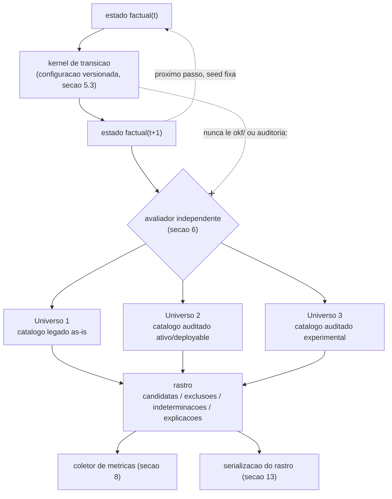
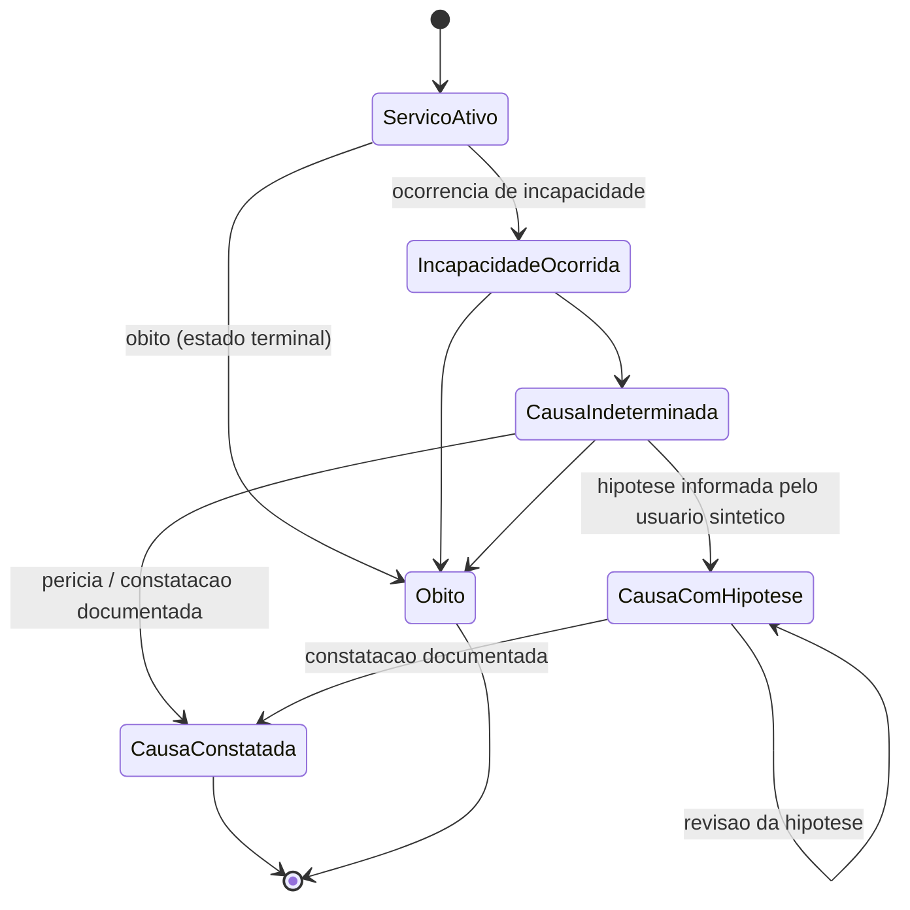
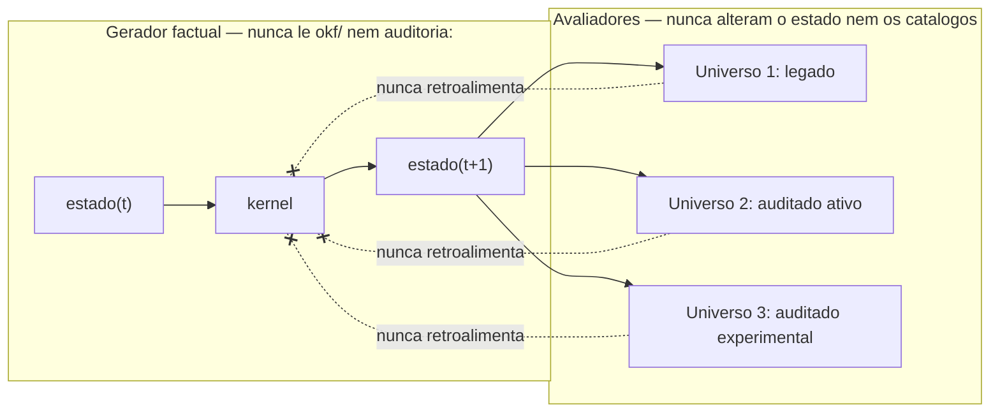

# RFC 0005 — Simulação estocástica de trajetórias para stress test das regras (piloto invalidez/incapacidade)

- **Status**: proposta (2026-07-23). **Especificação revisável, sem
  implementação.** Não cria diretório, schema, kernel, gerador, avaliador,
  coletor de métricas ou runner. Não edita nenhum `regra-*.md`, achado,
  dispositivo, detector, o simulador existente (`site/src/lib/simulador.ts`,
  RFC 0002) ou qualquer workflow. Entrega apenas o desenho: o modelo
  estatístico escolhido e por quê, o schema de cenário proposto, o contrato
  do kernel, os três universos de avaliação, as métricas de stress test e o
  plano incremental — tudo sujeito a revisão em PRs de implementação
  posteriores.
- **Parte de / depende de**:
  [RFC 0001](0001-criterios-de-validacao-das-regras.md) (semântica adiada,
  autoria humana, P2/P13, Q1–Q12),
  [RFC 0002](0002-selecao-explicavel-pos-anamnese.md) (avaliação trivalente,
  papel do `nome`, o piloto executado à mão),
  [RFC 0004](0004-schema-enriquecido-e-compilador-para-o-sisprev.md) (schema
  enriquecido `auditoria:`, os três universos do simulador exploratório —
  §12.2 —, o modelo de cinco partes do requisito de verificação humana —
  §7 —, e `base_avaliacao`), a spec [`docs/spec/regra.md`](../spec/regra.md)
  (P13.1), o piloto executado
  [`docs/analysis/piloto-selecao-invalidez-incapacidade.md`](../analysis/piloto-selecao-invalidez-incapacidade.md),
  a reconciliação
  [`docs/analysis/reconciliacao-invalidez-incapacidade.md`](../analysis/reconciliacao-invalidez-incapacidade.md)
  e a base normativa
  [`docs/analysis/base-normativa-invalidez-incapacidade.md`](../analysis/base-normativa-invalidez-incapacidade.md).
- **Não-objetivo**: implementar qualquer parte do motor de simulação;
  responder Q1–Q12 ou Q6-S; fixar probabilidades reais de incidência;
  estimar a população do IPERON; decidir mérito jurídico de qualquer regra;
  alterar o simulador exploratório existente (`/simulador/`, RFC 0002/0004
  §12.2) ou seu pipeline; criar campo novo em `okf/regras-sisprev/`,
  `okf/dispositivos/` ou no schema enriquecido de RFC 0004; produzir
  qualquer resultado numérico como se fosse experimento executado.

## 0. Escopo desta frente e terminologia

Esta RFC é **exclusivamente arquitetural e documental**. Ela propõe um
**harness de simulação estocástica de trajetórias sintéticas** — distinto do
**simulador exploratório** já existente (`/simulador/`, RFC 0002,
implementado no PR #28; pipeline de três universos especificado em RFC 0004
§12.2). Os dois nomes soam parecidos e não devem ser confundidos:

| Termo                                            | O que é                                                                                                                                               | Estado                                                                                                   | Público                                                                      |
| ------------------------------------------------ | ----------------------------------------------------------------------------------------------------------------------------------------------------- | -------------------------------------------------------------------------------------------------------- | ---------------------------------------------------------------------------- |
| **simulador exploratório** (RFC 0002/0004 §12.2) | filtro/avaliador **interativo**, um requerimento por vez, digitado por um humano no site                                                              | parcialmente implementado (filtro de RFC 0002 §7 no site; pipeline completo de RFC 0004 §12.2 ainda não) | usuário do site pessoal                                                      |
| **harness de simulação estocástica** (esta RFC)  | gerador **automatizado** de muitas trajetórias factuais **sintéticas**, cada uma avaliada nos mesmos três universos, para **stress test** do catálogo | não implementado — só a spec desta RFC                                                                   | auditor/desenvolvedor (ferramenta de auditoria, não user-facing na Fase 0–3) |

Os dois podem, no futuro (Fase 4, §18), compartilhar o **avaliador** — a
lógica que confronta um estado factual com um catálogo e produz
candidatas/exclusões/indeterminações. Essa reutilização é uma decisão de
implementação revisável, não algo que esta RFC decide ou assume.

## 1. Tese central: o estado factual não pode ser "regra atualmente aplicável"

> A simulação evolui o **estado factual** de requerentes sintéticos ao longo
> do tempo. O avaliador de regras **observa** cada estado e produz
> candidatas, exclusões, indeterminações e explicações. A sequência é:
>
> ```text
> estado factual(t) → kernel de transição → estado factual(t+1)
>                                          → avaliação independente nos catálogos
>                                          → métricas e rastros
> ```

**Por que "regra atualmente aplicável" não pode ser o estado primário da
cadeia (circularidade).** Se o estado que evolui no tempo fosse "qual regra
se aplica agora", a cadeia estaria descrevendo transições *entre regras*
diretamente — e as próprias regras (o objeto que este stress test pretende
auditar) passariam a determinar a geração dos casos usados para testá-las.
Um bug de cobertura no catálogo (uma lacuna, uma regra nunca alcançável, uma
colisão) nunca apareceria como anomalia, porque o gerador já teria
"resolvido" a seleção antes de o avaliador rodar — o motor testaria a si
mesmo, não o catálogo. Isso repete, num nível diferente, exatamente o erro
que a primeira versão do simulador cometeu ao reivindicar "compatível" sem
poder sustentar essa alegação de completude (RFC 0002 §7) — aqui a versão
estocástica desse mesmo erro seria "a cadeia sabe qual regra se aplica",
quando é precisamente **isso** que o avaliador existe para descobrir, e o
próprio catálogo pode não saber (`indeterminado` é o desfecho mais comum
hoje — piloto §3.2).

**A separação exigida** (ver §14.3 para o diagrama):

- o **gerador factual** nunca lê `okf/regras-sisprev/`, o catálogo
  enriquecido de RFC 0004, nem qualquer `fundamentacao*`/`nome` — ele evolui
  fatos do mundo (idade, tempo de contribuição, ocorrência de incapacidade,
  ...), nunca "que regra bate";
- o **avaliador** lê o estado factual e os catálogos, mas nunca escreve de
  volta no estado nem retroalimenta o gerador — a avaliação de t não pode
  influenciar como t+1 é gerado (isso reintroduziria a circularidade por
  outra porta);
- a **matriz de transição entre regras** (regra anterior → regra posterior
  ao longo de uma trajetória) pode ser **derivada depois**, como resultado
  analítico agregado sobre muitos rastros — nunca como o gerador (§11).

## 2. Comparação de modelos estocásticos — honestidade matemática

**Não presumimos que uma cadeia de Markov finita simples seja adequada.**
Cinco alternativas foram comparadas para o kernel de transição do estado
factual:

| #   | Modelo                                                                                                                                        | Preserva memória de idade/tempo de contribuição/serviço/duração da incapacidade/vigência normativa?                                                                                                                                                                                                                         | Adequação aqui                                                                                   |
| --- | --------------------------------------------------------------------------------------------------------------------------------------------- | --------------------------------------------------------------------------------------------------------------------------------------------------------------------------------------------------------------------------------------------------------------------------------------------------------------------------- | ------------------------------------------------------------------------------------------------ |
| 1   | **Monte Carlo independente** (cada instante sorteado do zero)                                                                                 | **Não** — reamostrar idade/tempo acumulado a cada passo produz trajetórias fisicamente impossíveis (idade pode "recuar", tempo de contribuição não é monotônico)                                                                                                                                                            | Rejeitada como gerador principal; útil só como bootstrap de estados iniciais independentes (t=0) |
| 2   | **Cadeia de Markov em tempo discreto, estado = "regra atualmente aplicável"**                                                                 | **Não** — viola a tese central (§1): é circular, e mesmo ignorando a circularidade, "regra aplicável" colapsa muitos estados factuais distintos (inclusive `indeterminado`) num único rótulo, perdendo exatamente a informação de que a transição seguinte depende (idade real, causa real)                                 | Rejeitada                                                                                        |
| 3   | **Cadeia de Markov em tempo discreto, estado = fatos correntes sem acumuladores** (p.ex. só idade e causa, sem tempo de contribuição/serviço) | **Parcial** — a idade sozinha não basta: tempo de contribuição pode ter gaps (mudança de vínculo), tempo de serviço público pode divergir de tempo de contribuição, e a duração da incapacidade e o tempo de espera por constatação (dois acumuladores distintos, §4.1) afetam a probabilidade de a próxima perícia ocorrer | Insuficiente sem aumento de estado                                                               |
| 4   | **Semi-Markov** (tempo de permanência num estado, com distribuição própria, influencia a próxima transição)                                   | Sim, por desenho — mas com custo: kernel deixa de ser uma matriz de transição simples; exige distribuições de sojourn time por estado, versionadas e justificadas como qualquer outra probabilidade (§6.3)                                                                                                                  | Não descartado — ver §2.3                                                                        |
| 5   | **Markov com estado aumentado** (acumuladores como coordenadas do próprio estado)                                                             | Sob a **hipótese de suficiência dos acumuladores** — contrato confrontável, não presumido (§2.2)                                                                                                                                                                                                                            | **Escolhida como kernel principal** (§2.1)                                                       |
| 6   | **Geração dirigida a fronteiras/metamorphic testing**                                                                                         | N/A — não é um modelo probabilístico de transição, é uma **estratégia de amostragem** complementar (mutar um fato por vez, concentrar em limites de data, ...)                                                                                                                                                              | **Adotada como complemento obrigatório**, não substituto (§10)                                   |

### 2.1 Decisão: cadeia de tempo discreto, estado aumentado, mensal como granularidade inicial

O kernel principal é uma **cadeia de Markov em tempo discreto** cujo
**estado é aumentado** com os acumuladores explicitamente listados no vetor
de estado (§4.1): idade (derivável de nascimento + instante, mas mantida
como coordenada calculável, não redundante — ver nota), tempo de
contribuição acumulado, tempo de serviço público acumulado, duração desde a
ocorrência da incapacidade e tempo de espera por constatação (dois
acumuladores distintos, não um só — §4.1), e a referência de vigência da
taxonomia de doenças relevante em cada data — que a simulação pode
deliberadamente deixar `pendente`, já que Q6-T não está resolvida (§4.1).
**A granularidade inicial é mensal** — fina o bastante para
capturar mudanças de estado funcional e a passagem de marcos legais (janelas
de data), grossa o bastante para manter o espaço de estados tratável num
piloto.

Isso é a "direção preferencial" que a missão desta RFC já indicava:

- cadeia em tempo discreto, mensal;
- estado aumentado com os acumuladores necessários;
- kernels sintéticos e versionados (§6.3);
- geração dirigida a fronteiras complementando a amostragem aleatória (§10);
- semi-Markov como extensão futura possível, não descartada (§2.3).

### 2.2 Suficiência dos acumuladores — contrato confrontável, não prova por definição

Uma cadeia é Markoviana quando `P(estado(t+1) | estado(t), estado(t-1), ...) = P(estado(t+1) | estado(t))` — o futuro depende só do presente, não do
histórico completo. O **contrato formal do kernel** é: `estado(t+1) = kernel(estado(t), rng)` — a função recebe exatamente o estado atual e uma
fonte de aleatoriedade (a seed, §11), **nunca** o histórico de estados
anteriores nem qualquer valor fora de `estado(t)`. Esse contrato é
verificável na implementação (a assinatura da função nunca aceita um
histórico) e é o que a propriedade de Markov exige.

O que **não** é verdade por definição é que os acumuladores listados no
vetor de estado (§4.1) — idade, tempo de contribuição, tempo de serviço
público, duração da incapacidade, tempo de espera por constatação,
referência de vigência normativa — sejam de fato estatísticas suficientes
do histórico relevante para toda transição que a Fase 2 (piloto) venha a
precisar modelar. Essa é uma **hipótese de design, confrontável por
evidência**, não uma prova matemática: ela afirma que as regras jurídicas
(e portanto os kernels sintéticos que as testam) só precisam da quantidade
acumulada, nunca da trajetória detalhada de como ela foi composta — mas
essa afirmação só se sustenta enquanto nenhuma transição realmente
necessária depender de algo que os acumuladores atuais não capturam.

**O que fazer quando a hipótese falha.** Se, durante a Fase 2, um kernel
precisar condicionar uma transição em informação que nenhum acumulador do
estado atual expõe (por exemplo, *quando* dentro do intervalo acumulado um
evento ocorreu, não só *quanto* se acumulou), isso não é um bug a
contornar — é o sinal de que a hipótese de suficiência falhou para aquele
caso, e a resposta é uma de duas, nunca uma leitura de histórico por fora
do contrato:

- **aumentar o estado** — adicionar uma nova coordenada que capture
  explicitamente exatamente a dependência descoberta, restaurando a
  suficiência (o preço já reconhecido: espaço de estados maior, mitigado
  pela granularidade mensal e por horizontes temporais limitados — questão
  em aberto, §19); ou
- **migrar para semi-Markov** (§2.3) — quando a dependência não é
  representável como um acumulador discreto (uma distribuição de sojourn
  time contínua, ou uma dependência de renovação que multiplicaria
  acumuladores além do tratável).

Nenhuma outra saída é aceitável: um kernel que lê estado além de
`estado(t)` para decidir `estado(t+1)` viola o contrato desta seção e deixa
de ser, por definição, uma cadeia de Markov — passaria a ser um modelo não
declarado, sem a disciplina de versionamento e proveniência que §5.3 exige.

### 2.3 Quando semi-Markov seria necessário — não descartado, deixado em aberto

A duração da incapacidade e o tempo de espera por constatação **já são
acumuladores distintos do estado aumentado** (§4.1) — logo, uma
probabilidade de transição que dependa de "quantos meses já se passaram
desde a ocorrência da incapacidade" (`duracao_incapacidade_meses`) ou de
"quantos meses sem uma constatação documentada" (
`tempo_aguardando_constatacao_meses`) **continua sendo Markoviana** sobre o
estado aumentado (a dependência é do *valor atual* de cada acumulador, não
do histórico bruto). Isso cobre boa parte do que um leitor apressado
chamaria de "precisa de semi-Markov" — mas não cobre tudo:

- se o kernel precisar de uma **distribuição de sojourn time contínua** (não
  discretizável em buckets mensais sem perda), ou
- se a probabilidade de transição depender de uma renovação (o tempo desde
  a *última* mudança de um sub-estado específico, não desde um evento fixo
  como a ocorrência da incapacidade), de um jeito que exigiria multiplicar
  acumuladores além do que é tratável,

então a formalização correta deixa de ser "Markov aumentado" e passa a ser,
de fato, **semi-Markov**. Esta RFC **não decide essa questão agora** — ela
fica registrada como questão aberta (§19) e como gatilho explícito de
revisão: se a Fase 2 (piloto com kernels sintéticos, §18) revelar que a
granularidade mensal + acumuladores não bastam para representar uma
transição relevante à invalidez/incapacidade, a extensão para semi-Markov é
o caminho a avaliar primeiro, antes de qualquer solução ad hoc.

## 3. Escopo do piloto: só invalidez/incapacidade permanente

Esta RFC especifica o piloto **exclusivamente** para aposentadoria por
invalidez/incapacidade permanente — as 11 regras as-is (`regra-0001`,
`0002`, `0004`, `0006`–`0009`, `0019`–`0022`), as 8 hipóteses PGE (P1–P7,
P9), e a decomposição por classe de causa já especificada em RFC 0004 §3
(`causa_incapacidade`: `acidente_em_servico`, `molestia_profissional`,
`doenca_catalogada`, `causa_comum`). Esta família já tem:

- reconciliação as-is × PGE (documento irmão, com as classes de tensão
  E1–E8 herdadas de RFC 0001 e os cruzamentos 0022×P6/P7);
- base normativa (dispositivos coletados em `okf/dispositivos/`, pendências
  P-1 a P-6 categorizadas por tipo);
- 11 regras legadas identificadas e um piloto de seleção explicável já
  executado à mão (12 casos sintéticos, RFC 0002);
- o modelo do requisito de verificação humana em cinco partes (RFC 0004
  §7): predicado (Q6-R), fato da solicitação (Q6-S), protocolo de
  verificação (Q6-R), constatação concreta (Q6-S), avaliação;
- o problema Q6-R/Q6-S/Q6-T documentado (predicado × fato × taxonomia
  versionada).

**Fora de escopo desta RFC** (expansão futura possível, Fase 6, §18):
pensão por morte, aposentadoria voluntária, professor, compulsória, PCD. O
schema de cenário (§5) é desenhado para não impedir essa expansão, mas
nenhuma modalidade além de invalidez/incapacidade é modelada aqui.

## 4. Modelo de estado factual (schema de cenário)

O vetor de estado é um **schema próprio**, deliberadamente separado de três
outras representações com papéis distintos:

| Representação                                                | Papel                                                                                        | Onde vive (proposto ou existente)                             |
| ------------------------------------------------------------ | -------------------------------------------------------------------------------------------- | ------------------------------------------------------------- |
| **Schema de cenário** (este RFC)                             | fatos sintéticos de um requerente hipotético, evoluindo no tempo, usados só para stress test | proposto, não criado — §16                                    |
| **Schema enriquecido da auditoria** (`auditoria:`, RFC 0004) | predicados jurídicos estruturados **da regra**, não do requerente                            | `okf/regras-auditadas/` (proposto em RFC 0004)                |
| **27 colunas do Sisprev** (`regra_schema.py::COLUMNS`)       | formato-alvo legado, também da **regra**, nunca do requerente                                | `okf/regras-sisprev/`, `data/regras-sisprev.csv`              |
| **Registro institucional real da solicitação**               | o fato e a constatação de um requerimento **real**, no Sisprev de produção                   | fora deste repositório — não modelado nem tocado por esta RFC |

Misturar essas quatro camadas seria o mesmo erro que RFC 0004 §2 já evita
entre semântica operacional e metadado de auditoria — aqui a distinção
adicional é entre **fato do requerente** (o que este RFC modela) e
**predicado da regra** (o que RFC 0004 modela). Um cenário sintético nunca
edita `auditoria:` nem as 27 colunas, e nunca é confundido com um
requerimento real.

### 4.1 Vetor de estado mínimo

Cada coordenada abaixo é parte do estado aumentado (§2.2) — a lista é um
**mínimo**, não um teto; a implementação pode adicionar coordenadas
conforme a Fase 2 revelar necessidade, sempre com a mesma disciplina de
versionamento do kernel (§6.3).

| Coordenada                           | Papel                                                                                                                                                                                                                                                                                                                                                                                                                                                                                                                                                                                                                                                                                                                                                                                                                                                              | Nota                                                                                                                                                                                                                |
| ------------------------------------ | ------------------------------------------------------------------------------------------------------------------------------------------------------------------------------------------------------------------------------------------------------------------------------------------------------------------------------------------------------------------------------------------------------------------------------------------------------------------------------------------------------------------------------------------------------------------------------------------------------------------------------------------------------------------------------------------------------------------------------------------------------------------------------------------------------------------------------------------------------------------ | ------------------------------------------------------------------------------------------------------------------------------------------------------------------------------------------------------------------- |
| `instante_simulado`                  | relógio da cadeia (mês/ano na granularidade inicial)                                                                                                                                                                                                                                                                                                                                                                                                                                                                                                                                                                                                                                                                                                                                                                                                               | avança monotonicamente — invariante (§6.2)                                                                                                                                                                          |
| `nascimento`                         | data de nascimento sintética                                                                                                                                                                                                                                                                                                                                                                                                                                                                                                                                                                                                                                                                                                                                                                                                                                       | idade é **derivada** de `nascimento` + `instante_simulado`, não duplicada como coordenada independente (evita duas fontes divergentes)                                                                              |
| `data_ingresso_servico_publico`      | marco de ingresso no serviço público                                                                                                                                                                                                                                                                                                                                                                                                                                                                                                                                                                                                                                                                                                                                                                                                                               | fato de entrada usado **pelo avaliador** (nunca pelo gerador) para derivar `marco_ingresso`/regime previdenciário aplicável (RFC 0004 §3) — ver nota após a tabela                                                  |
| `data_ingresso_cargo`                | marco de ingresso no cargo específico (pode divergir do ingresso no serviço público em casos de mudança de cargo)                                                                                                                                                                                                                                                                                                                                                                                                                                                                                                                                                                                                                                                                                                                                                  | acumulador próprio                                                                                                                                                                                                  |
| `tempo_contribuicao_acumulado`       | meses de contribuição efetivamente computados                                                                                                                                                                                                                                                                                                                                                                                                                                                                                                                                                                                                                                                                                                                                                                                                                      | **acumulador** — só cresce enquanto `tipo_vinculo_funcional`/`estado_funcional` estão em estado que conta como contribuição; ver invariante de monotonicidade (§6.2)                                                |
| `tempo_servico_publico_acumulado`    | meses de serviço público efetivo                                                                                                                                                                                                                                                                                                                                                                                                                                                                                                                                                                                                                                                                                                                                                                                                                                   | acumulador distinto de `tempo_contribuicao_acumulado` (podem divergir — não presumidos iguais)                                                                                                                      |
| `tipo_vinculo_funcional`             | natureza **factual** do vínculo funcional corrente: estatutário / celetista / comissionado / outro (enum a fechar na implementação)                                                                                                                                                                                                                                                                                                                                                                                                                                                                                                                                                                                                                                                                                                                                | um fato administrativo puro — nunca inferido de `nome`/`fundamentacao*` (gate §17); **não** codifica qual regime previdenciário (pré-EC20, EC20, EC41+LCE432, EC103+LC1100, ...) se aplica — ver nota após a tabela |
| `estado_funcional`                   | ativo / afastado / aposentado / exonerado / outro (enum a fechar na implementação)                                                                                                                                                                                                                                                                                                                                                                                                                                                                                                                                                                                                                                                                                                                                                                                 | transições restritas (§6.1)                                                                                                                                                                                         |
| `incapacidade_ocorreu`               | booleano                                                                                                                                                                                                                                                                                                                                                                                                                                                                                                                                                                                                                                                                                                                                                                                                                                                           | uma vez `true`, nunca volta a `false` (invariante)                                                                                                                                                                  |
| `data_ocorrencia_incapacidade`       | data do evento, quando `incapacidade_ocorreu = true`                                                                                                                                                                                                                                                                                                                                                                                                                                                                                                                                                                                                                                                                                                                                                                                                               | nunca posterior a `instante_simulado`                                                                                                                                                                               |
| `classe_causa`                       | `acidente_em_servico` \| `molestia_profissional` \| `doenca_catalogada` \| `causa_comum` \| `indeterminada` (mesmo enum de RFC 0004 §3, com o valor adicional `indeterminada` para representar o fato ainda não classificado)                                                                                                                                                                                                                                                                                                                                                                                                                                                                                                                                                                                                                                      | nunca preenchido antes de `incapacidade_ocorreu = true`                                                                                                                                                             |
| `duracao_incapacidade_meses`         | acumulador: meses desde `data_ocorrencia_incapacidade`, medindo a persistência do fato médico/funcional em si                                                                                                                                                                                                                                                                                                                                                                                                                                                                                                                                                                                                                                                                                                                                                      | cresce enquanto `incapacidade_ocorreu = true`, **independente de constatação** — nunca zera, a certificação não desfaz o fato de a incapacidade ter ocorrido (§6.2)                                                 |
| `tempo_aguardando_constatacao_meses` | acumulador **distinto**: meses desde `data_ocorrencia_incapacidade` sem uma entrada `constatacao_documentada` em `fatos_verificacao_humana[]` — mede o atraso procedimental, não a duração médica                                                                                                                                                                                                                                                                                                                                                                                                                                                                                                                                                                                                                                                                  | congela (não zera) no valor atingido quando a primeira `constatacao_documentada` ocorre; o valor congelado permanece no rastro (§13), nunca é descartado                                                            |
| `diagnostico_classificacao`          | classificação médico-jurídica, quando aplicável (referencia a taxonomia versionada — próxima linha)                                                                                                                                                                                                                                                                                                                                                                                                                                                                                                                                                                                                                                                                                                                                                                | opcional; `null` até informado                                                                                                                                                                                      |
| `data_referencia_versao_rol`         | qual data serve de referência para localizar a versão do rol de doenças vigente — deliberadamente **não fixada** por esta RFC (candidatas plausíveis incluem a data da ocorrência da incapacidade, da constatação, ou do requerimento; Q6-T não decide qual é a correta)                                                                                                                                                                                                                                                                                                                                                                                                                                                                                                                                                                                           | pode ser `pendente` — nesse caso o gerador não escolhe uma data sozinho, é uma coordenada válida de estado que representa a própria abertura de Q6-T                                                                |
| `versoes_rol_candidatas`             | **conjunto** (nunca um único valor) de versões do rol de doenças compatíveis com o estado atual — quando `data_referencia_versao_rol` está `pendente` ou o mapeamento data→versão é ele próprio controverso, o conjunto contém todas as versões conhecidas (LCE 432/2008: 14 doenças; LCE 1.100/2021: 16), nunca uma escolhida arbitrariamente                                                                                                                                                                                                                                                                                                                                                                                                                                                                                                                     | o avaliador consome o conjunto inteiro por universo — nunca colapsa para uma versão só fora do que Q6-T já resolveu (RFC 0004 §16.2)                                                                                |
| `fatos_verificacao_humana`           | lista de `{predicado, base_avaliacao, avaliacao, responsavel?, data?, referencia?}` — espelha as cinco partes de RFC 0004 §7; é aqui, e só aqui, que o estado registra o fato de uma solicitação sobre um requisito específico (nexo com acidente, moléstia profissional, enquadramento no rol, ...) — nunca em coordenadas dedicadas por predicado, que colapsariam num único rótulo genérico requisitos cujo protocolo de verificação (RFC 0004 §7, parte 1/3) só existe no catálogo, pode variar por universo, e não é papel do gerador antecipar; **nota**: a base normativa (§3.3.3 do documento irmão) já registra que nenhum dos dois regimes estaduais lidos define "moléstia profissional" (P-6) — a simulação pode gerar esse predicado como `indeterminado`/`sem_informacao` estruturalmente, sem que isso implique que a lacuna jurídica foi resolvida | ver §7 desta RFC                                                                                                                                                                                                    |
| `contradicoes_e_dados_ausentes`      | lista estruturada de contradições detectadas dentro do próprio estado (p.ex. uma entrada de `fatos_verificacao_humana[]` com `predicado: "nexo com acidente em serviço"`, `avaliacao: satisfeito` mas `classe_causa = causa_comum`)                                                                                                                                                                                                                                                                                                                                                                                                                                                                                                                                                                                                                                | usada pela estratégia de geração de contradições deliberadas (§10)                                                                                                                                                  |
| `estado_terminal`                    | `null` \| `obito` \| outro estado terminal a fechar na implementação                                                                                                                                                                                                                                                                                                                                                                                                                                                                                                                                                                                                                                                                                                                                                                                               | uma vez preenchido, a trajetória não gera mais transições (§6.2)                                                                                                                                                    |

**Todo requisito verificável por humano é modelável** (princípio herdado de
RFC 0004 §7): o que pode faltar é a **informação** ou a **constatação**
(representadas por `base_avaliacao = sem_informacao`), nunca a
**possibilidade de representação**. Um campo `pendente`/`indeterminado` é
sempre uma coordenada válida do estado — nunca a ausência de uma coordenada.

**Por que nenhum predicado de requisito (nexo de acidente, moléstia
profissional, enquadramento no rol, ...) vira uma coordenada dedicada do
estado.** Uma versão anterior deste desenho incluía `nexo_acidente_servico`,
`nexo_molestia_profissional` e `enquadramento_rol_doenca` como coordenadas
próprias, cada uma já carregando `satisfeito`/`não satisfeito`/`indeterminado`.
Isso confundia duas coisas que §4.2 mantém deliberadamente separadas: o
**fato da solicitação** (item 2 do modelo de cinco partes — o que o
requerente/perícia sintética efetivamente informou) e a **avaliação**
(item 5 — `satisfeito`/`não satisfeito`/`indeterminado`, que RFC 0004 §7
define como **derivada por regra fixa a partir do predicado lido do
catálogo**, portanto uma saída do avaliador, específica de cada universo e
de cada regra que declara aquele predicado — nunca um fato genérico do
requerente). Um estado que já chega com `nexo_acidente_servico = satisfeito`
estaria pré-computando essa avaliação fora do avaliador, e faria isso de um
jeito genérico que nem sequer sabe se algum universo declara esse predicado.
A representação correta do fato é sempre uma entrada em
`fatos_verificacao_humana[]` (§4.2) — o avaliador, não o gerador, decide o
que fazer com ela em cada universo.

**Por que `tipo_vinculo_funcional` é factual e "regime previdenciário
aplicável" não é uma coordenada do estado.** O tipo de vínculo funcional
(estatutário, celetista, comissionado, ...) é um fato administrativo puro,
independente de interpretação jurídica — por isso é coordenada do estado.
Já "qual regime previdenciário está em vigor para este vínculo" (pré-EC20,
EC20, EC41+LCE432, EC103+LC1100, ...) só se resolve cruzando
`data_ingresso_servico_publico`/`data_ingresso_cargo` com as janelas de
vigência documentadas em `okf/dispositivos/` — exatamente o tipo de
classificação derivada e potencialmente controversa (janelas de emenda se
sobrepõem, há regras de transição) que este RFC não pode assumir como fato
bruto sem reintroduzir, num nível diferente, o mesmo erro de pré-computar
uma conclusão jurídica dentro do gerador (§1). O avaliador deriva o regime
aplicável a partir dos fatos de ingresso, por universo, podendo produzir
mais de um regime candidato ou `pendente` — nunca lê um valor único
pré-resolvido do estado.

### 4.2 `base_avaliacao` e os cinco componentes do requisito de verificação humana

Reaproveita **integralmente** o modelo de RFC 0004 §7 e §12.2, sem
reabri-lo:

1. **predicado da regra** (Q6-R) — não vive no estado do requerente; é lido
   do catálogo (`auditoria.requisitos_verificacao_humana[].predicado`) pelo
   avaliador, nunca gerado pelo kernel.
2. **fato da solicitação** (Q6-S) — é o que o kernel gera/evolui em
   `fatos_verificacao_humana[]` (§4.1).
3. **protocolo de verificação** (Q6-R) — idem ao item 1, lido do catálogo.
4. **constatação concreta** (Q6-S) — gerada pelo kernel quando a transição
   "constatação documentada" (§6.1) ocorre; carrega `responsavel`, `data`,
   `referencia` sintéticos.
5. **avaliação** — `satisfeito`/`não satisfeito`/`indeterminado`, derivada
   por regra fixa (nunca livre) a partir dos itens 2+3+4, exatamente como
   RFC 0004 §7 define.

`base_avaliacao` tem os três valores já ratificados por RFC 0004 §12.2:

- **`hipotese_informada`** — o "usuário sintético" da simulação preenche uma
  resposta ao protocolo, **sem** constatação real por trás; nunca pode
  aparecer, em nenhum universo, rotulada como constatação do IPERON.
- **`constatacao_documentada`** — um "avaliador sintético" registra
  resultado, responsável, data e referência — a única base que pode ser
  lida como equivalente a uma constatação de fato (ainda que sintética e
  fora do processo real).
- **`sem_informacao`** — nenhuma das duas ocorreu; avaliação
  `indeterminado`, **nunca** "não avaliável".

**Invariante que esta RFC adiciona, específico da simulação**: o kernel
**nunca** reclassifica `hipotese_informada` como `constatacao_documentada`
retroativamente — a transição "constatação documentada" (§6.1) sempre
*acrescenta* uma nova entrada com `base_avaliacao: constatacao_documentada`,
preservando a entrada anterior com `hipotese_informada` intacta no rastro
(§13). Perder essa distinção a jusante é o gate `P_SIM_BASE_AVALIACAO_PERDIDA`
(§17).

## 5. Kernel de transição

### 5.1 Transições propostas

Cada tick mensal (`estado(t) → estado(t+1)`) aplica, **nesta ordem fixa**,
duas camadas distintas — nunca uma mistura implícita das duas, e nunca em
ordem invertida.

#### 5.1.1 Camada 1 — avanço determinístico (sempre aplicado, probabilidade 1)

Aplicada a **todo** tick, para todo estado com `estado_terminal = null`, sem
nenhuma amostragem — é uma função pura de `estado(t)`, não uma linha do
kernel probabilístico, e por isso não participa da soma "probabilidades
válidas" do §5.2:

| Coordenada                           | Regra do avanço                                                                                                                                           |
| ------------------------------------ | --------------------------------------------------------------------------------------------------------------------------------------------------------- |
| `instante_simulado`                  | `+= 1` (mês)                                                                                                                                              |
| `tempo_contribuicao_acumulado`       | `+= 1` se `tipo_vinculo_funcional`/`estado_funcional` contam como contribuição nesse mês                                                                  |
| `tempo_servico_publico_acumulado`    | `+= 1` sob a mesma condição — pode divergir do anterior (§4.1)                                                                                            |
| `duracao_incapacidade_meses`         | `+= 1` se `incapacidade_ocorreu = true`, **independente de constatação** (§4.1)                                                                           |
| `tempo_aguardando_constatacao_meses` | `+= 1` se `incapacidade_ocorreu = true` **e** ainda não há `constatacao_documentada`; congelado (deixa de incrementar) após a primeira constatação (§4.1) |

Nenhum desses incrementos é sorteado. Um kernel que tornasse qualquer um
deles probabilístico estaria violando o próprio contrato de acumulador do
§2.2 — o acumulador deixaria de ser função pura do estado anterior.

#### 5.1.2 Camada 2 — evento probabilístico (amostrado uma vez por tick, após a camada 1)

Depois do avanço determinístico, o kernel amostra **no máximo um** evento da
tabela abaixo, condicionado ao estado já avançado pela camada 1 — mais o
candidato implícito **"nenhum evento"** (o tick termina só com o avanço
determinístico, sem nenhum dos eventos abaixo). **É esta distribuição —
todo evento cuja pré-condição o estado pós-avanço satisfaz, mais "nenhum
evento" — que precisa somar exatamente 1** (invariante "probabilidades
válidas", §5.2); a camada 1 nunca entra nessa soma, por não ser amostrada.

| Evento                               | Efeito no estado                                                                                                                                                                                                                                                                                                                                                        | Pré-condição                                                                                                                                        |
| ------------------------------------ | ----------------------------------------------------------------------------------------------------------------------------------------------------------------------------------------------------------------------------------------------------------------------------------------------------------------------------------------------------------------------- | --------------------------------------------------------------------------------------------------------------------------------------------------- |
| acumulação de contribuição/serviço   | incremento adicional (p.ex. averbação de tempo)                                                                                                                                                                                                                                                                                                                         | `estado_funcional = ativo`                                                                                                                          |
| mudança de tipo de vínculo funcional | `tipo_vinculo_funcional` transita para outro valor do enum fechado (estatutário/celetista/comissionado/outro) — não implica, por si, nenhuma reclassificação de regime previdenciário aplicável (derivação do avaliador, §4.1)                                                                                                                                          | transições restritas ao enum fechado                                                                                                                |
| ocorrência de incapacidade           | `incapacidade_ocorreu: false → true`; fixa `data_ocorrencia_incapacidade = instante_simulado`; `classe_causa = indeterminada`                                                                                                                                                                                                                                           | `incapacidade_ocorreu = false`, `estado_funcional = ativo`                                                                                          |
| classificação inicial da causa       | `classe_causa: indeterminada → {acidente_em_servico, molestia_profissional, doenca_catalogada, causa_comum}`                                                                                                                                                                                                                                                            | `incapacidade_ocorreu = true`                                                                                                                       |
| realização de perícia                | produz uma entrada de constatação candidata (ainda não necessariamente favorável)                                                                                                                                                                                                                                                                                       | `incapacidade_ocorreu = true`                                                                                                                       |
| informação de hipótese pelo usuário  | adiciona entrada a `fatos_verificacao_humana[]` com `base_avaliacao: hipotese_informada`                                                                                                                                                                                                                                                                                | requisito correspondente ainda `sem_informacao` ou já `hipotese_informada` (pode ser substituída por nova hipótese, nunca vira constatação sozinha) |
| constatação documentada              | adiciona entrada com `base_avaliacao: constatacao_documentada`, `responsavel`/`data`/`referencia` preenchidos; **congela** `tempo_aguardando_constatacao_meses` no valor atingido (nunca decrementa — permanece no rastro, §13); `duracao_incapacidade_meses` segue incrementando normalmente na camada 1, pois mede a persistência do fato, não o atraso procedimental | `incapacidade_ocorreu = true`                                                                                                                       |
| revisão/correção de dado             | corrige um valor já registrado (p.ex. `classe_causa` reclassificada), sempre deixando o valor anterior no rastro                                                                                                                                                                                                                                                        | qualquer coordenada com valor anterior                                                                                                              |
| alteração de estado funcional        | `estado_funcional` transita conforme uma máquina de estados própria (a definir na implementação, análoga em rigor à P7 de RFC 0001)                                                                                                                                                                                                                                     | transições restritas ao enum fechado                                                                                                                |
| óbito ou outro estado terminal       | `estado_terminal` preenchido; nenhuma transição futura gerada                                                                                                                                                                                                                                                                                                           | sempre disponível (evento terminal pode ocorrer a qualquer momento)                                                                                 |

### 5.2 Invariantes [bloqueantes propostos]

- **Ordem temporal**: `instante_simulado` é estritamente não-decrescente;
  nenhuma data derivada (`data_ocorrencia_incapacidade`, datas de
  constatação) pode ser posterior a `instante_simulado`.
- **Sem redução espontânea**: `tempo_contribuicao_acumulado`,
  `tempo_servico_publico_acumulado` e idade (derivada) nunca decrescem
  entre `t` e `t+1`.
- **Constatação nunca antes do fato**: toda entrada de
  `base_avaliacao: constatacao_documentada` tem `data ≥ data_ocorrencia_incapacidade` (quando o predicado depende da
  incapacidade) e `data ≤ instante_simulado` da transição que a produziu.
- **Vigência normativa dentro do período**: quando `data_referencia_versao_rol`
  não é `pendente`, `versoes_rol_candidatas` só pode conter versões cuja
  janela de vigência (as mesmas janelas documentadas em `okf/dispositivos/`,
  base normativa §2) cobre essa data — nunca uma versão fora da janela.
  `tipo_vinculo_funcional` não tem janela de vigência própria (é fato
  administrativo, não classificação normativa, §4.1); a classificação de
  regime previdenciário aplicável, quando o avaliador a deriva de
  `data_ingresso_servico_publico`/`data_ingresso_cargo`, respeita a mesma
  disciplina de janelas, mas como responsabilidade do avaliador, fora do
  que este invariante do gerador cobre.
- **Estados mutuamente incompatíveis proibidos**: p.ex.
  `incapacidade_ocorreu = false` com `classe_causa ≠ indeterminada` e vazio,
  ou `estado_terminal ≠ null` com qualquer transição subsequente.
- **Probabilidades válidas**: a distribuição da camada de eventos
  probabilísticos (§5.1.2) — cada evento cuja pré-condição o estado
  pós-avanço determinístico satisfaz, mais o candidato implícito "nenhum
  evento" — soma exatamente 1 (tolerância de ponto flutuante a definir na
  implementação); nenhuma probabilidade negativa. O avanço determinístico
  da camada 1 (§5.1.1) nunca é amostrado — é aplicado com probabilidade 1,
  fora desta soma.
- **Proveniência obrigatória**: nenhuma transição é gerada sem que o kernel
  que a produziu tenha `versao`, `fonte` e `justificativa` registradas
  (§6.3) — uma transição "sem configuração" é erro, nunca default
  silencioso.

### 5.3 Onde vivem as probabilidades — nunca normas jurídicas

**As probabilidades não são normas jurídicas.** Elas vivem em
**configuração própria, versionada**, separada do vetor de estado e do
schema de cenário:

- **versão** — cada kernel é `kernel_version: N`, igual em espírito ao
  `schema_version` de RFC 0004 §3 e §8: versão desconhecida é erro, nunca
  best-effort.
- **fonte** — de onde vieram os números (nesta fase, sempre **sintéticos**,
  nunca dados reais de segurados — §12); a fonte é "kernel de stress
  estrutural", nunca "estimativa atuarial".
- **justificativa** — por que essa distribuição foi escolhida para essa
  transição (p.ex. "forçar cobertura da fronteira 31/12/2003 em 20% das
  trajetórias" é uma justificativa de **stress**, não de realismo
  demográfico).
- **possibilidade de substituição** — um kernel é um artefato de
  configuração substituível por outro sem alterar o schema de cenário, o
  avaliador ou o gerador (a mesma separação artefato/lógica que RFC 0001
  P10 já aplica entre detectores e dados).

## 6. Três universos obrigatórios

Cada estado gerado é avaliado **separadamente** contra os três universos já
especificados em RFC 0004 §12.2 — esta RFC não redefine os universos, só
formaliza que **cada estado de cada trajetória** passa pelos três, e que o
resultado registra qual universo produziu qual candidata:

1. **catálogo legado as-is** — as 112 linhas de `okf/regras-sisprev/`, sem
   enriquecimento; para a família de invalidez, as 11 regras as-is.
2. **catálogo auditado ativo/deployable** — exatamente o que o exportador
   real (RFC 0004 §12.1) também exportaria; hoje, para invalidez, ainda
   **vazio** (nenhum grupo de substituição está `estado_grupo: ativo` — RFC
   0004 §16 mostra os exemplos ainda em `preview`).
3. **catálogo auditado experimental** — inclui unidades em `elaboracao`,
   `preview`, e unidades de grupos `inativo` — a face completa de uma
   decomposição 1:N (p.ex. as duas faces de `regra-0022`, RFC 0004 §16)
   mesmo antes de qualquer grupo ativar.

**Invariante herdado, reafirmado para a simulação**: a simulação **nunca**
ativa grupos, altera manifesto, produz export Sisprev, ou transforma
unidade experimental em `deployable`. O avaliador **lê**; nunca escreve nos
bundles (`okf/regras-sisprev/`, `okf/regras-auditadas/` proposto) nem nos
artefatos derivados. Isso vale mesmo quando o universo 2 estiver vazio (como
hoje, para invalidez) — o avaliador registra "universo 2: nenhuma candidata"
honestamente, nunca promove uma candidata do universo 3 para preencher essa
lacuna.

O resultado de cada avaliação registra **qual universo** produziu cada
candidata/exclusão/indeterminação, permitindo comparação lado a lado — é
esse registro que alimenta a métrica de divergência entre universos (§9) e
o Sankey proposto (§14.4).

## 7. Avaliação dos requisitos humanos na simulação

Reafirma, sem alterar, os cinco componentes de RFC 0004 §7 (predicado, fato
da solicitação, protocolo de verificação, constatação concreta, avaliação)
e o vocabulário de `base_avaliacao` (§4.2 desta RFC). Duas regras adicionais
específicas do contexto de simulação:

- **Uma hipótese fornecida pelo "usuário sintético" pode ser usada pelo
  avaliador, mas não pode aparecer como constatação do IPERON** em nenhuma
  saída, rastro, métrica ou visualização — toda apresentação de um
  resultado que depende de uma entrada `hipotese_informada` carrega esse
  rótulo explicitamente, na mesma linha do resultado, nunca num rodapé
  genérico.
- **Sem informação → `indeterminado`**, nunca "não avaliável" — o
  protocolo de verificação (parte 3) sempre existe no catálogo para todo
  requisito modelado (RFC 0004 §7), então a avaliação é sempre
  *possível em princípio*; o que falta é o fato, não a capacidade de
  avaliar.

## 8. Métricas de stress test

Divididas entre as que verificam a **corretude estrutural** do motor
(devem valer para **qualquer** kernel válido — uma violação é bug do motor,
não característica do kernel) e as que medem o **comportamento de um
kernel específico** (variam conforme as probabilidades escolhidas, e por
isso nunca são lidas como "a taxa real" de nada):

| Métrica                                                            |                                                         Estrutural (motor)                                                         |                                                              Depende do kernel                                                              |
| ------------------------------------------------------------------ | :--------------------------------------------------------------------------------------------------------------------------------: | :-----------------------------------------------------------------------------------------------------------------------------------------: |
| frequência de nenhuma candidata                                    |                                                                                                                                    |                                                                      ✓                                                                      |
| frequência de candidatura única                                    |                                                                                                                                    |                                                                      ✓                                                                      |
| frequência de múltiplas candidatas                                 |                                                                                                                                    |                                                                      ✓                                                                      |
| frequência de indeterminação                                       |                                                                                                                                    |                                                                      ✓                                                                      |
| divergência entre os três universos                                |                                                                                                                                    | ✓ (frequência/magnitude); a **existência** de divergência estrutural (p.ex. universo 2 sempre vazio hoje) é fato do catálogo, não do kernel |
| churn do conjunto de candidatas entre t e t+1                      |                                                                                                                                    |                                                                      ✓                                                                      |
| transições inesperadas ou não monotônicas                          |                                             ✓ (deve ser sempre zero — violação é bug)                                              |                                                                                                                                             |
| sensibilidade a datas de fronteira                                 |                             ✓ (o comportamento — gerar pendência, nunca decidir — deve ser constante)                              |                                      ✓ (frequência de *atingir* a fronteira, sem amostragem dirigida)                                       |
| sensibilidade a fatos ausentes                                     |                                ✓ (ausência deve sempre virar pendência, nunca exclusão silenciosa)                                 |                                                                                                                                             |
| sensibilidade a hipóteses humanas                                  |                                       ✓ (rótulo `hipotese_informada` deve sempre sobreviver)                                       |                                                                                                                                             |
| dependência de requisito sem constatação                           |                               ✓ (deve sempre ficar `indeterminado`, nunca `satisfeito` por omissão)                                |                                                                                                                                             |
| colisão depois da projeção para as 27 colunas                      |                              ✓ (`P_COMPILA_COLISAO`, RFC 0004 §10/§11 — reportar sempre que ocorrer)                               |                                                                                                                                             |
| perda de expressividade A → B                                      |                                                   ✓ (mesma origem — RFC 0004 §5)                                                   |                                                                                                                                             |
| cobertura de estados e transições                                  |                                                                                                                                    |                                                                      ✓                                                                      |
| estados alcançáveis sem regra (universo 1/2/3 = nenhuma candidata) |                                                                                                                                    |                     ✓ (frequência); a *possibilidade estrutural* é informativa sobre o catálogo, independente do kernel                     |
| regras nunca alcançadas                                            |                                                                                                                                    |                                                                      ✓                                                                      |
| pares de regras frequentemente indistinguíveis                     | ✓ (quais pares são indistinguíveis pelos critérios conhecidos é estrutural — ver `simulador.ts`'s `assinaturaCriteriosConhecidos`) |                                          ✓ (a frequência de gerar casos nessa região é do kernel)                                           |
| estabilidade do ranking experimental                               |                                                                                                                                    |                                                                      ✓                                                                      |
| distribuição do tempo até mudança do resultado                     |                                                                                                                                    |                                                                      ✓                                                                      |

A distinção importa porque uma métrica "depende do kernel" nunca é lida
como um fato sobre o Sisprev real ou sobre segurados reais (§12) — ela mede
o comportamento do motor **sob aquela configuração sintética**, útil para
comparar kernels entre si ou para verificar que uma mudança no catálogo
alterou o comportamento esperado, nunca para estimar frequência real.

## 9. Stress dirigido, não apenas distribuição média

Amostragem puramente aleatória tende a sub-explorar exatamente as regiões
mais informativas (fronteiras, contradições, casos raros). Estratégias
dirigidas, complementares ao kernel probabilístico (nunca substitutas —
§2.1):

- **amostragem concentrada nos limites de datas** — gerar trajetórias cujo
  `instante_simulado` ou `data_ingresso_servico_publico` caem exatamente
  sobre um limite de janela conhecido (31/12/2003, a vigência da EC
  146/2021 em 14/09/2021, ...), testando o comportamento de pendência
  documentado no simulador existente (Q1/Q2);
- **mutação de um fato por vez** — a partir de um estado base, gerar uma
  família de estados que diferem numa única coordenada, isolando o efeito
  de cada fato sobre o resultado;
- **pares contrafactuais** — duas trajetórias idênticas exceto por um único
  discriminante jurídico (p.ex. `classe_causa`), testando exatamente o
  eixo que a reconciliação já identificou como o mais importante e o menos
  representado no as-is (0022 × P6/P7);
- **rare-event/importance sampling** — possibilidade **futura**, não
  implementada nesta fase: sobre-amostrar deliberadamente combinações raras
  (p.ex. `classe_causa = molestia_profissional`, cuja base normativa está
  em aberto — P-6) para garantir cobertura mesmo quando o kernel padrão as
  visitaria raramente;
- **geração de contradições deliberadas** — estados onde
  `fatos_verificacao_humana[]` contém uma entrada `{predicado: "nexo com acidente em serviço", avaliacao: satisfeito}` mas `classe_causa = causa_comum`, testando se o avaliador reporta a contradição em vez de
  escolher um lado silenciosamente;
- **remoção deliberada de fatos** — a partir de um estado completo, apagar
  uma coordenada (voltar a `sem_informacao`) para verificar que o resultado
  degrada para `indeterminado`, nunca permanece `satisfeito` por inércia;
- **variação da versão do rol** — gerar trajetórias sob cada valor conhecido
  de `data_referencia_versao_rol` (LCE 432/2008: 14 doenças; LCE 1.100/2021:
  16\) e também sob `data_referencia_versao_rol = pendente` — nesse caso
  `versoes_rol_candidatas` deve conter todas as versões conhecidas, nunca
  uma escolhida arbitrariamente — testando o comportamento fail-closed de
  RFC 0004 §5.3;
- **alternância entre hipótese informada e constatação documentada** — a
  mesma trajetória rodada duas vezes, uma só com hipótese, outra com
  constatação, comparando os rastros lado a lado (é exatamente o exemplo
  trabalhado, §15);
- **trajetórias que atravessam mudança normativa** — um `instante_simulado`
  que cruza a vigência de uma emenda durante a trajetória (não só um estado
  estático perto do limite), testando se `versoes_rol_candidatas` se
  restringe corretamente conforme `data_referencia_versao_rol` avança, e se
  a classificação de regime previdenciário que o avaliador deriva de
  `tipo_vinculo_funcional` + datas de ingresso muda no momento certo;
- **teste metamórfico — invariância**: alterar um fato **irrelevante** aos
  predicados conhecidos de uma regra (p.ex. `diagnostico_classificacao`
  quando nenhuma regra ainda usa esse campo como predicado) não deve mudar
  o resultado da avaliação — uma mudança seria sinal de acoplamento
  indevido;
- **teste metamórfico — sensibilidade explicável**: alterar um
  discriminante material conhecido (p.ex. `classe_causa` de
  `acidente_em_servico` para `causa_comum`) **deve** produzir mudança de
  resultado, e a explicação do rastro deve indicar exatamente qual fato
  mudou.

## 10. A matriz de transição entre regras é resultado analítico, nunca gerador

Reforça a tese central (§1): depois que muitas trajetórias tiverem rodado, é
possível **derivar** uma matriz "regra anterior → regra posterior" — quantas
vezes, ao longo de uma trajetória, a candidata predominante mudou de uma
regra para outra. Essa matriz é um **produto de análise** (alimenta o
heatmap proposto, §14.5), e existe **depois** da simulação, calculada sobre
os rastros já produzidos. Ela **nunca** é lida de volta pelo kernel de
transição do estado factual (§6) — fazer isso reintroduziria exatamente a
circularidade que §1 rejeita, só que numa etapa posterior do pipeline em vez
de na primeira.

## 11. Reprodutibilidade

Cada execução futura deve registrar, num **manifesto de execução**
(mesma disciplina de proveniência que RFC 0004 exige do manifesto de
substituição — §1.4):

- `seed` — o gerador de números pseudoaleatórios é sempre semeado
  explicitamente; nunca uma fonte de entropia implícita do sistema;
- `sha_catalogo` — o SHA do commit dos bundles usados em cada universo (§6),
  registrado por universo (podem divergir se um roda contra `HEAD` e outro
  contra um commit fixado para comparação);
- `universo` — qual(is) dos três (§6) essa execução avaliou;
- `versao_schema_cenario` — versão do schema de estado (§4);
- `versao_kernel` — versão do kernel de transição usado (§5.3);
- `configuracao_completa` — o kernel inteiro (todas as probabilidades,
  proveniência, justificativas), não só sua versão;
- `horizonte` e `granularidade_temporal` — quantos meses simulados, e a
  granularidade (mensal nesta fase — §2.1);
- `numero_trajetorias`;
- `premissas` — toda suposição assumida para preencher uma lacuna do
  kernel ou do avaliador;
- `data_da_execucao`;
- as **métricas e rastros** produzidos (§8, §13).

**Mesma entrada + mesma seed deve produzir resultado idêntico** — essa é a
própria definição de reprodutibilidade aqui, e é um gate (§17,
`P_SIM_SEED_NAO_REPRODUTIVEL`) verificável mecanicamente rodando a mesma
configuração duas vezes.

## 12. Markov não é previsão atuarial

Explícito, sem ambiguidade, para toda saída desta simulação, em qualquer
fase:

- **parâmetros sintéticos não estimam incidência real** — nenhum número do
  kernel (§5.3) representa a probabilidade real de um servidor sofrer
  incapacidade, nem a distribuição real de causas;
- **percentuais da simulação não representam segurados reais** — nenhuma
  métrica (§8) é uma estatística sobre o IPERON ou sobre qualquer população
  real;
- **o objetivo inicial é encontrar lacunas, ambiguidades, colisões,
  instabilidade e fronteiras defeituosas** no catálogo — não prever
  concessões nem dimensionar reservas;
- **eventual calibração com dados históricos é fase futura, com governança
  própria** (Fase 5, §18) — esta RFC não a autoriza nem a desenha em
  detalhe;
- **o simulador continua sendo experimental e hospedado em site pessoal**
  (mesmo rótulo institucional de RFC 0004 §12.2) — nada aqui produz uma
  ferramenta oficial do IPERON.

**Sem dados reais ou pessoais nesta fase.** Kernels iniciais são sintéticos
e servem para stress estrutural, nunca para previsão atuarial.

## 13. Serialização dos rastros

Cada trajetória produz um **rastro** — a sequência completa de estados,
transições aplicadas, avaliações nos três universos e métricas derivadas.
O rastro é o que torna uma trajetória **auditável depois** (é o que
alimenta a tabela de rastreabilidade, §14.7, e o exemplo trabalhado, §15).
Um rastro nunca descarta uma entrada anterior de `base_avaliacao` (§4.2) —
a evolução `sem_informacao → hipotese_informada → constatacao_documentada`
fica inteiramente visível, nunca só o valor final.

## 14. Visualizações propostas

Sem números fictícios apresentados como resultado de execução — os
diagramas abaixo são **esquema de pipeline/arquitetura** (14.1–14.3) ou
**proposta de estrutura de dados a preencher quando existirem execuções
reais** (14.4–14.6); só o exemplo trabalhado manual (§15/14.7) tem
conteúdo, porque é explicitamente um traçado à mão, não um experimento.

### 14.1 Diagrama Mermaid do pipeline



### 14.2 State diagram compacto — trajetória de incapacidade



### 14.3 Separação gerador factual × avaliadores



### 14.4 Proposta de Sankey derivado — sem números inventados

Estrutura de três colunas, a preencher **quando existirem execuções reais**
(Fase 3, §18) — **nenhum valor abaixo é um resultado**, é a proposta de
schema que o Sankey usaria:

| Coluna 1 (nós)                                                                                                                         | Coluna 2 (nós)                                                 | Coluna 3 (nós)                                                                                             | Medida da aresta                                                                                                                                          |
| -------------------------------------------------------------------------------------------------------------------------------------- | -------------------------------------------------------------- | ---------------------------------------------------------------------------------------------------------- | --------------------------------------------------------------------------------------------------------------------------------------------------------- |
| estado terminal da trajetória (agrupado por padrão relevante, p.ex. "incapacidade por acidente constatada", "indeterminado até o fim") | universo (1/legado, 2/auditado ativo, 3/auditado experimental) | desfecho agregado nesse universo (nenhuma / única / múltipla / indeterminado — vocabulário de RFC 0002 §4) | número de trajetórias que passam por essa combinação, na execução específica que gerou os dados (rotulado com `seed`/`sha_catalogo`/`versao_kernel`, §11) |

### 14.5 Proposta de matriz de calor — regra anterior × regra posterior

Linhas e colunas são ids de regra (as-is e/ou auditadas, por universo);
cada célula é a contagem de transições observadas entre rastros (§10) —
**derivada depois**, nunca usada como gerador. Estrutura proposta: uma
matriz por par de universos comparados (1↔1 dentro do mesmo universo ao
longo do tempo; 1↔3 para medir divergência entre legado e experimental).
Sem números até haver execuções reais.

### 14.6 Gráfico de churn/indeterminação ao longo do tempo

Proposta: série temporal (eixo x = `instante_simulado` agregado por mês
simulado através de todas as trajetórias de uma execução; eixo y = duas
séries, `frequência de indeterminação` e `churn do conjunto de candidatas`
— ambas métricas dependentes de kernel, §8) — útil para visualizar se a
indeterminação decresce conforme fatos se acumulam (esperado) ou permanece
alta mesmo tarde na trajetória (sinal de lacuna estrutural do catálogo).

### 14.7 Tabela de rastreabilidade de uma trajetória completa

Preenchida no exemplo trabalhado, §15.2.

## 15. Exemplo trabalhado obrigatório

### 15.1 Trajetória sintética manual, passo a passo

Requerente sintético "S" (nenhum dado real, nenhuma correspondência com
pessoa ou processo existente):

1. **t₀ = 2010-03** — ingresso no serviço público e no cargo (mesma data,
   sem mudança de cargo nesta trajetória); `tipo_vinculo_funcional = estatutário`;
   `estado_funcional = ativo`; `incapacidade_ocorreu = false`. Qual regime
   previdenciário essa data de ingresso implica (EC41+LCE432, EC103+LC1100,
   ...) não é assumido aqui — é o avaliador, ao consumir
   `data_ingresso_servico_publico`, que deriva isso por universo (§4.1),
   fora deste passo do gerador.
2. **t₁ = 2023-06** — passagem do tempo + acumulação de contribuição:
   `tempo_contribuicao_acumulado = tempo_servico_publico_acumulado = 159`
   meses; `estado_funcional` permanece `ativo`; `incapacidade_ocorreu`
   ainda `false`.
3. **t₂ = 2023-07** — **ocorrência de incapacidade**:
   `incapacidade_ocorreu: false → true`; `data_ocorrencia_incapacidade = 2023-07`; `classe_causa = indeterminada`; `duracao_incapacidade_meses = 0`;
   `tempo_aguardando_constatacao_meses = 0` (os dois acumuladores nascem
   juntos, mas evoluem de forma distinta a partir daqui, §5.1.1); todo
   `fatos_verificacao_humana[]` relevante começa `base_avaliacao: sem_informacao`, `avaliacao: indeterminado` — inclusive o requisito
   "doença enquadrada no rol aplicável" (face doença, §15.2), já que
   `diagnostico_classificacao` permanece `null` (§4.1) durante toda esta
   trajetória.
4. **t₃ = 2023-08** — **informação de hipótese pelo usuário sintético**:
   resposta "sim" à pergunta do protocolo de verificação "Há nexo entre a
   incapacidade e o acidente em serviço?" (RFC 0004 §3, exemplo);
   `fatos_verificacao_humana[]` ganha uma entrada `{predicado: "nexo com acidente em serviço", base_avaliacao: hipotese_informada, avaliacao: satisfeito}`. Nada disso é persistido em nenhum `regra-*.md` — é local a
   este caso sintético.
5. **t₄ = 2024-02** — **perícia / constatação documentada**:
   `{predicado: "nexo com acidente em serviço", base_avaliacao: constatacao_documentada, responsavel: "IPERON (sintético)", data: 2024-02-10, referencia: "laudo pericial sintético nº 1", avaliacao: satisfeito}` — **acrescentada** ao rastro, sem apagar a entrada
   anterior de `hipotese_informada` (§4.2). Nesse mesmo tick,
   `tempo_aguardando_constatacao_meses` **congela** no valor atingido em
   2024-02 (§5.1.1); `duracao_incapacidade_meses` continua incrementando
   normalmente nos ticks seguintes, porque mede a persistência do fato, não
   o atraso até a constatação. O requisito "doença enquadrada no rol
   aplicável" (face doença) permanece `sem_informacao`/`indeterminado`
   nesta trajetória — esta constatação é sobre nexo de acidente, um
   predicado distinto, e não fala nada sobre `diagnostico_classificacao`.

### 15.2 Comparação nos três universos, ao longo da trajetória

| t   | Estado (resumo)                            | Universo 1 (legado as-is)                                                                                                                                                                                                                              | Universo 2 (auditado ativo)                                                                          | Universo 3 (auditado experimental)                                                                                                                                                                                                                                                                                                                |
| --- | ------------------------------------------ | ------------------------------------------------------------------------------------------------------------------------------------------------------------------------------------------------------------------------------------------------------ | ---------------------------------------------------------------------------------------------------- | ------------------------------------------------------------------------------------------------------------------------------------------------------------------------------------------------------------------------------------------------------------------------------------------------------------------------------------------------- |
| t₂  | incapacidade ocorrida, causa indeterminada | `0021`/`0022` não excluídas pelos critérios conhecidos (tipo de benefício, datas), sem campo de causa — indistinguíveis; pendência explícita de indistinguibilidade (mesma lógica de `sinalizarDivergenciaEntreRegrasIndistinguiveis`, `simulador.ts`) | **vazio** — nenhum grupo de substituição de invalidez está `estado_grupo: ativo` hoje (RFC 0004 §16) | as duas faces de `origens_legacy: [regra-0022]` (acidente, RFC 0004 §16.1; doença, §16.2), cada uma com seu **próprio** requisito: face acidente — "nexo com acidente em serviço" `indeterminado` (`sem_informacao`); face doença — "doença enquadrada no rol aplicável", também `indeterminado` (`diagnostico_classificacao` ainda `null`, §4.1) |
| t₃  | + hipótese informada de acidente           | inalterado (o legado não tem esse predicado estruturado)                                                                                                                                                                                               | inalterado (vazio)                                                                                   | face acidente passa a `avaliacao: satisfeito` em seu requisito de nexo, rotulada **explicitamente** `hipotese_informada`; face doença **inalterada** em seu próprio requisito (rol) — nenhum fato sobre `diagnostico_classificacao` foi informado nesta trajetória                                                                                |
| t₄  | + constatação documentada                  | inalterado                                                                                                                                                                                                                                             | inalterado (vazio)                                                                                   | face acidente passa a `avaliacao: satisfeito` em seu requisito de nexo, rotulada `constatacao_documentada`; o rastro preserva as duas entradas anteriores (§4.2); face doença segue `indeterminado` — a constatação é sobre nexo de acidente, não sobre enquadramento no rol                                                                      |

**Nenhuma etapa altera o manifesto de substituição, `estado_grupo`,
`decisao_completude`, o exportador ou qualquer artefato deployable** — o
universo 2 permanece exatamente como estava antes da simulação (vazio, para
invalidez, até que um humano ative um grupo fora deste pipeline); a face
"acidente" do universo 3 nunca se torna elegível ao export só por ter sido
avaliada como `satisfeito` dentro da simulação.

### 15.3 Contrafactual — alterando só a constatação

Mesma trajetória até t₃; em t₄, ao invés de uma constatação positiva, a
perícia sintética produz `{predicado: "nexo com acidente em serviço", avaliacao: não satisfeito}` (nexo negado). O universo 3 diverge exatamente
nesse ponto: a face acidente passa a `excluída` em seu próprio requisito
(nexo confirmado não satisfeito). A face doença **não é afetada** por essa
constatação — o **seu** requisito é "doença enquadrada no rol aplicável",
nunca "nexo com acidente em serviço"; a perícia sintética deste
contrafactual só fala sobre nexo de acidente, então o requisito da face
doença permanece `indeterminado` pela mesma razão de sempre nesta
trajetória (nenhum fato sobre `diagnostico_classificacao` foi informado,
§4.1) — não porque "a mesma constatação" tenha deixado de alcançá-la, mas
porque é um predicado estruturalmente distinto que o avaliador nunca mistura
com o de nexo. O universo 1 continua **idêntico** em ambos os ramos do
contrafactual — ele não tem o predicado estruturado, então não tem como
reagir à mudança. Essa divergência (universo 3 muda, universo 1 não) é
precisamente o tipo de achado que a métrica "divergência entre universos"
(§8) foi desenhada para capturar, e ilustra por que os três universos
precisam ser comparados lado a lado em vez de reportados isoladamente.

## 16. Arquitetura futura, sem implementação

Nenhum destes é criado nesta RFC — os nomes e o layout ficam sujeitos a uma
implementação revisável (Fase 1 em diante, §18). Localizações **propostas**,
seguindo os padrões já estabelecidos no repositório (biblioteca pura +
CLI fina, RFC 0001 P10; separação schema/config/artefato derivado):

| Componente                       | Papel                                                                                                                                                                                          | Localização proposta                                                                                                                                                                     |
| -------------------------------- | ---------------------------------------------------------------------------------------------------------------------------------------------------------------------------------------------- | ---------------------------------------------------------------------------------------------------------------------------------------------------------------------------------------- |
| schema de cenário                | define o vetor de estado (§4) como modelo tipado (Pydantic ou equivalente, mesmo padrão de `achado_schema.py`/`regra_schema.py`)                                                               | `scripts/cenario_schema.py` (proposto)                                                                                                                                                   |
| kernel de transição versionado   | dados de configuração (probabilidades + proveniência, §5.3), não código                                                                                                                        | diretório de configuração versionado, p.ex. `simulacao/kernels/` (proposto — fora de `okf/`, porque não é um bundle OKF de conceitos, é configuração numérica)                           |
| gerador de trajetórias           | biblioteca pura que aplica o kernel a um estado e produz o próximo, sem ler catálogos (§1, §14.3)                                                                                              | `scripts/simulacao/gerador.py` (proposto)                                                                                                                                                |
| adaptador para os três universos | lê os bundles (`okf/regras-sisprev/`, o catálogo enriquecido de RFC 0004) e expõe uma interface comum aos três universos                                                                       | `scripts/simulacao/universos.py` (proposto)                                                                                                                                              |
| avaliador                        | confronta um estado com um universo e produz candidatas/exclusões/indeterminações/explicações — pode, no futuro, ser compartilhado com o simulador exploratório (§0), decisão de implementação | `scripts/simulacao/avaliador.py` (proposto)                                                                                                                                              |
| coletor de métricas              | calcula as métricas de §8 sobre um conjunto de rastros                                                                                                                                         | `scripts/simulacao/metricas.py` (proposto)                                                                                                                                               |
| serialização dos rastros         | formato de saída reprodutível (§13), inclui o manifesto de execução (§11)                                                                                                                      | formato e localização de saída a definir na implementação — provavelmente não versionado em git (mesmo padrão de `site/src/data/dados-do-site.json`, RFC 0003), regenerável por execução |
| visualizações                    | consome rastros/métricas serializados, produz os diagramas de §14 quando há execuções reais                                                                                                    | possivelmente `site/` numa fase futura (§16, Fase 4), nunca antes disso                                                                                                                  |
| runner reproduzível              | CLI fina, só leitura sobre os bundles, orquestra gerador → avaliador → métricas → serialização                                                                                                 | `scripts/simular_trajetorias.py` (proposto, mesmo padrão de CLI fina de `validar_regras.py`)                                                                                             |
| futura integração com o site     | painel que exiba métricas/visualizações agregadas, nunca o pipeline interativo do simulador exploratório                                                                                       | fora de escopo até Fase 4 (§18)                                                                                                                                                          |

## 17. Gates futuros propostos

| Código proposto                | O que verifica                                                                                                                                                                                                     |
| ------------------------------ | ------------------------------------------------------------------------------------------------------------------------------------------------------------------------------------------------------------------ |
| `P_SIM_SCHEMA_INVALIDO`        | o vetor de estado de uma trajetória não valida contra o schema de cenário (§4)                                                                                                                                     |
| `P_SIM_KERNEL_INVALIDO`        | linha do kernel não soma 1, probabilidade negativa, ou falta `versao`/`fonte`/`justificativa` (§5.2/§5.3)                                                                                                          |
| `P_SIM_INVARIANTE_TEMPORAL`    | qualquer violação da §5.2 (ordem, monotonicidade, constatação antes do fato, vigência fora do período)                                                                                                             |
| `P_SIM_SEED_NAO_REPRODUTIVEL`  | mesma seed + mesma configuração produz saída diferente entre execuções (§11)                                                                                                                                       |
| `P_SIM_MUTOU_CATALOGO`         | gerador ou avaliador escreveu em `okf/`, `data/` ou qualquer artefato derivado                                                                                                                                     |
| `P_SIM_EFEITO_MANIFESTO`       | qualquer alteração de `estado_grupo`, `decisao_completude`, manifesto de substituição ou export (RFC 0004 §1.4/§12.1)                                                                                              |
| `P_SIM_UNIVERSO_MISTURADO`     | avaliação de um universo vazou para outro (p.ex. usar candidata do universo 3 para preencher o universo 2)                                                                                                         |
| `P_SIM_BASE_AVALIACAO_PERDIDA` | uma entrada `hipotese_informada` foi sobrescrita em vez de complementada por `constatacao_documentada`, ou o rótulo desapareceu numa visualização/métrica (§4.2)                                                   |
| `P_SIM_RASTRO_INCOMPLETO`      | rastro não permite reconstruir a sequência completa de estados/transições/avaliações de uma trajetória (§13)                                                                                                       |
| `P_SIM_METRICA_NAO_DERIVAVEL`  | uma métrica reportada não pode ser recalculada a partir do rastro serializado (mesmo princípio de `bundle.covering_tests`, RFC 0001)                                                                               |
| `P_SIM_SEM_TESTE_METAMORFICO`  | uma mudança no gerador/avaliador não inclui teste metamórfico correspondente (§9, invariância e sensibilidade)                                                                                                     |
| `P_SIM_FRONTEIRA_AUSENTE`      | o conjunto obrigatório de casos de fronteira (§9) não está coberto por uma execução de referência                                                                                                                  |
| `P_SIM_PREDICADO_DE_NOME`      | o avaliador inferiu um predicado a partir de `nome` ou `fundamentacao*` em prosa, em vez de ler `auditoria.predicados` estruturado (mesmo princípio de RFC 0004 §12.2, "invariante que sobrevive à ambição maior") |

## 18. Plano incremental

Cada fase é uma PR revisável e independente; nenhuma fase autoriza pular
para a seguinte sem aprovação — mesmo padrão de RFC 0004 §15.

| Fase  | Entrega                                                                                                                                                                                                                                                        | Rollback                                                                                               |
| ----- | -------------------------------------------------------------------------------------------------------------------------------------------------------------------------------------------------------------------------------------------------------------- | ------------------------------------------------------------------------------------------------------ |
| **0** | Esta RFC. Nenhum código, nenhuma regra.                                                                                                                                                                                                                        | Fechar a PR.                                                                                           |
| **1** | Schema de cenário (§4) + gerador mínimo (kernel simplificado, sem stress dirigido ainda) — **sem site**, rodando só localmente/CI. Nenhum universo 2 real ainda (permanece vazio, como hoje).                                                                  | Remover o diretório/módulo novo; nenhum artefato existente é tocado.                                   |
| **2** | Piloto de invalidez com kernels sintéticos completos (§5), os três universos (§6), stress dirigido (§9), e os gates estruturais (§17) rodando em CI sobre execuções de referência fixas (seed fixada, §11).                                                    | Reverter a PR da Fase 2; a Fase 1 permanece funcional.                                                 |
| **3** | Métricas (§8) e visualizações (§14) com dados reais de execuções sintéticas — é aqui que os diagramas de §14.4–§14.6 ganham números pela primeira vez, sempre rotulados com o manifesto de execução (§11).                                                     | Remover o coletor de métricas/visualizações; o gerador/avaliador da Fase 2 continuam válidos sem eles. |
| **4** | Integração experimental no site — painel agregado (nunca o pipeline interativo do simulador exploratório, que permanece RFC 0002/0004 §12.2 intocado); decisão explícita se avaliador é compartilhado entre os dois pipelines (§0).                            | Remover a página/painel do site; o motor de simulação (Fases 1–3) continua existindo fora do site.     |
| **5** | Eventual calibração com dados reais — **somente mediante decisão e governança próprias**, fora do escopo desta RFC; exigiria uma RFC nova tratando de proveniência de dados reais, privacidade e o limite entre stress estrutural e estimativa atuarial (§12). | Reverter para kernels sintéticos; nenhuma Fase anterior depende de dados reais.                        |
| **6** | Expansão para outras modalidades (pensão, voluntária, professor, compulsória, PCD) — reaproveitando o schema de cenário (§4) generalizado, sob nova decisão de escopo.                                                                                         | Cada modalidade nova é aditiva; remover uma não afeta as demais.                                       |

## 19. Questões abertas

Listadas sem presunção de resposta — cada uma é trabalho de investigação ou
decisão humana futura, não desta RFC:

- **granularidade mensal ou por evento** — a granularidade fixa mensal
  (§2.1) é ponto de partida; um kernel orientado a evento (transições
  disparadas por ocorrência, não por tick de calendário) pode se mostrar
  mais adequado depois do piloto (Fase 2);
- **Markov aumentado ou semi-Markov** — deixado explicitamente em aberto em
  §2.3, com o gatilho de revisão já registrado;
- **fontes futuras das probabilidades** — hoje só sintéticas (§12); se e
  quando dados reais entrarem em consideração (Fase 5), a fonte, a
  governança e os limites éticos ainda precisam de decisão própria;
- **quais estados são terminais** — além de óbito, se `estado_funcional`
  admite outros estados terminais (exoneração definitiva? aposentadoria por
  outra via, encerrando a trajetória de invalidez?) não está decidido;
- **tratamento de correlações** — entre coordenadas do estado (p.ex.
  `classe_causa` e `estado_funcional` podem ser correlacionadas no mundo
  real) não modelado nesta RFC;
- **horizonte temporal** — quantos meses/anos simular por trajetória antes
  de considerar a simulação "completa" não está fixado;
- **volume mínimo de trajetórias** — quantas trajetórias são necessárias
  para as métricas de §8 serem informativas (não apenas ruído) não está
  decidido;
- **política para eventos raros** — se e quando adotar importance sampling
  (§9) de fato, e com qual critério de "raro", fica em aberto;
- **limites do ranking probabilístico** — se e como uma "estabilidade do
  ranking experimental" (§8) deveria influenciar qualquer decisão de
  auditoria (a resposta default, na ausência de decisão, é "não deveria" —
  mas isso não está formalmente fechado aqui);
- **eventual persistência de cenários no site** — se cenários sintéticos ou
  seus rastros deveriam ficar navegáveis publicamente (Fase 4) ou
  permanecer artefato interno de auditoria não está decidido.

## 20. Condições de parada honradas por esta RFC

- **RFC-only**: nenhum código foi escrito.
- **Nenhuma regra alterada**: nenhum `regra-*.md` foi tocado.
- **Nenhum campo novo nos schemas já implementados**: o schema de cenário
  (§4) é uma proposta separada, não uma extensão de `Regra`, `Achado`,
  `Dispositivo` ou do `auditoria:` de RFC 0004.
- **Nenhuma probabilidade apresentada como dado real**: todo número neste
  documento é rótulo de coluna/estrutura, nunca um valor executado (§12,
  §14.4–§14.6).
- **Nenhuma decisão jurídica nova**: as pendências P-1 a P-6 e Q1–Q12/Q6-S
  permanecem exatamente como a reconciliação e a base normativa as deixaram
  — esta RFC as usa como insumo de design, nunca as resolve.
- **Nenhum resultado fictício apresentado como experimento executado**: o
  único conteúdo com "resultado" é o exemplo trabalhado (§15), explicitamente
  rotulado como traçado manual, no mesmo espírito do piloto de RFC 0002.
- **Gates locais verdes**: `md_format`, `ruff format`/`check`, `ty check` e
  `pytest` seguem passando — esta PR altera só este arquivo de
  documentação.
- **PR draft, não mergeada**: aberta como rascunho para revisão.
